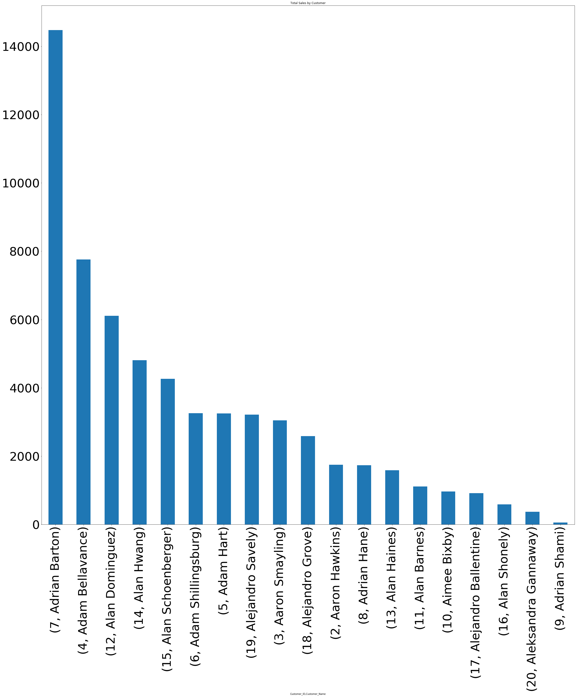

<div class="span5 alert alert-info">
<div style="float:left;margin:0 2px 2px 0" markdown="1">
     
</div>
<th><font size="6" color="blue" face="verdana">Using Machine Learning Algorithms to Predict Retail Purchase</font></th>

 ### $Springboard Data Science Intensive Program_$
 <th><font size="3" color="blue" face="verdana">Capstone Project</font></th>

### By Charlie Glover   |  June 27, 2017

---
## ABSTRACT <a class="anchor" id="1-bullet"></a>
[back to table of contents](#toc)

The possibilities of retailers embedding machine learning into their business for useful insights into customer behavior is endless. According to research by Accenture Analytics, 70 percent of retailers believe that big data is necessary to maintain competitiveness; 82 percent agreed that big data is changing how they interact with and relate to customers. While most retailers recognize that there is power in big data and analytics as it pertains to shoppers and their purchasing habits, few have unlocked the true potential of that data through machine learning.$^8$

To study a way retailers can use machine learning to enhance retail sales, this project analyze the abilities of three algorithms to predict the category from which a purchase was made, based on the purchase date. 

Basically, there are three ways to predict a customer’s purchase category: (1) Classification, (2) Regression and (3) Clustering.  Classification attempts to predict based on the past behavior; Regression is associated with estimating the relationships among purchases, while clustering is associated with identifying clusters of purchases. By analyzing the differences between clusters, you may infer preferences.$^9$ For this study, I will be using classification.

For example, knowing the purchase history, the purchase date, but not the current product purchased, the algorithm should predict which category from which the product was purchased from. The power in this prediction can allow retailers to possibly analyze sales simply based on sales dates. The three supervised learning algorithms under study are Random Forest, Logistic Regression and Support Vector Machines. While predicting the next product (instead of product category) purchase could be a goal, the difficulty with that consideration was associated with the limited number of purchases many customers made (one purchase) and limitations with the dataset (it was difficult to find a large retail transaction dataset).  In summary, the Logistic Regression algorithm had some preliminary prediction success at 60% with very little required tuning or adjustment. Random Forest Classifier initially show signs of over fitting on its training set and needed parameter adjustments to achieve results similar to Logistic Regression (59%).  A brief discussion of Random Forest Regression is included to compare tuning possibilities with Random Forest Classifier. Support Vector Machines presented a challenge due to the fact that category data had to be converted using One Hot Encoding (OHE).  The results appear to be non-conclusive and a discussion about this challenge is included. Another challenge discussed is perhaps considering data leakage from one of the variables, Days-To-Ship, which can cause the model to be too optimistic. This optimistic consideration could be related to how the variable is interpreted. Perhaps further study into enhancing the current selected algorithms or discovering other algorithms could be made if time permits to take this study further into research. 

My work on this project is considered an introductory effort to this hot topic. The study can be developed further into more complex algorithms to fit purchase predictions across a wide array of industries. Additionally comparisons of different ML algorithms used are considered as opportunity to learn and as a "springboard" to other learn machine learning algorithms.


----------

<th><font size="6" color="blue" face="verdana">Table of Contents</font></th><a class="anchor" id="toc"></a>
#### **Click to jump to a section**
* [Abstract](#1-bullet)
* [Motivation:  "Everybody is coming, but No One is Buying](#2-bullet)
* [Problem Statement](#3-bullet)
* [Background Discussion: How a Machine Learning Algorithm Works](#4-bullet)
* [ML Algorithms Used in this Project (Brief Descriptions)](#5-bullet)
    * [Logistic Regression](#6-bullet)
    * [Random Forest](#7-bullet)
    * [Support Vector Machine](#8-bullet)
* [Methods/Procedure](#9-bullet)
* [Section 1  Import Python Modules Needed ](#10-bullet)
* [Section 2  Import Data](#11-bullet)
* [Section 3  Summary Statistics of Imported Raw data](#12-bullet)
    * [List of Variable Descriptions](#13-bullet)
    * [Pick Relevant Fields](#14-bullet)
* [Section 4 Exploratory Data Analysis (Seeking patterns in purchasing](#15-bullet)
    * [Products Sold](#16-bullet)
    * [Product Category List](#17-bullet)
    * [Number Instances Each Customer made a Purchase](#18-bullet)
    * [Histogram of Purchase Frequency (Aggregated View of Instances Customers Made a Purchase)](#19-bullet)
    * [Sales per customer](#20-bullet)
    * [Deeper Exploratory Analysis: Detailed Information of Purchases](#21-bullet)
* [Section 5 Data Cleaning/Encoding/Preprocessing](#22-bullet)
    * [Preprocessing: Previous_Next Function with For-Loop](#23-bullet)
    * [Choosing Dependent and Independent Variables](#24-bullet)
    * [Discussion: Feature Selection and Data Leakage](#24a-bullet)
* [Section 6 Using Logistic Regression to Predict Purchase Category](#25-bullet)
    * [Logistic Regression (View Sample Predictions)](#26-bullet)
    * [Logistic Regression GridSearchCV](#26b-bullet)
    * [Logistic Model Brief Experiment Review](#27-bullet)
* [Section 7 Using Random Forest Classifier to Predict Purchase Category](#28-bullet)
    * [Tuning the Random Forest Classifier Model](#29-bullet)
    * [Random Forest Gridseach CV](#29b-bullet)
    * [Random Forest Classifier Brief Review](#30-bullet)
    * [Alternate Discussion: Tuning the Random Forest Regressor Model](#31-bullet)
* [Section 8 Using Support Vector Machine to Predict Purchase Category](#32-bullet)
    * [How to apply an SVM to categorical data?](#33-bullet)
    * [One-Hot-Encoding (OHE)](#34-bullet)
* [Section 9 Conclusion](#35-bullet)
* [Section 10 Next Steps/Proposed Research](#36-bullet)
* [References](#37-bullet)

---
## Motivation:  "Everybody is coming, but No One is Buying"<a class="anchor" id="2-bullet"></a>
[back to table of contents](#toc)
    
Having high foot or online traffic to your store is good, but every business needs customers to purchase products/services. Hence, the golden grail of any business is to try to figure out buying behaviors to convince customers to buy their business, product or service. This has created the biggest challenges for businesses who perform high volumes of data collecting about specific individuals or groups of customers that is both meaningful and actionable (affinity analysis). But the potential for using data collected is often limited either by “small data” (“data iceburg effect”) or is left unexplored. As a result, the intentions and reactions of individual customers can be overlooked.
        
Enter the world of machine learning, where algorithms evolve from the study of pattern recognition and computational learning. According to Lisa Burton, co-founder and chief scientist with AdMass Inc., advertisers and e-commerce businesses have the highest potential gain from machine learning because of the ease of measurement and quick feedback needed to train and improve machine learning algorithms.$^1$ This thought seem evident especially with Amazon, who announced on May 14, 2017 of there efforts to building an online tailor with machine learning. The purpose of that effort is help cut back on customer returns of apparel that doesn't fit.$^2$ 
        
The insight that we can learn from AdMass and Amazon is its not enough to just simply have an online presence. A business must find a way, quickly, information about customer behaviors to respond in the appropriate time and mental space. Unsatisfied customers often fade away quietly and don't complain or tell the business explicitly that they found somone else to purchase their products.  Many times customers may have had a problem with the the buying experience or they no longer benefit from the product or service.  Often, these issues can be addressed with machine learning to help preserve the customer-business relationship

# Problem Statement<a class="anchor" id="3-bullet"></a>
[back to table of contents](#toc)

For the purposes of this project,  we will try to answer the following questions predicting
customer purchases using the Random Forest, Logistic Regression and Support Vector algorithms as follows:
    
1. Given the transactional history of a customer, predict the product category that customer may purchase from.
2. Is possible to improve prediction accuracy of customer purchases by comparing/tuning different algorithms and discovering their capabilities with the dataset at hand?
  
    

# Background Discussion: How a Machine Learning Algorithm Works<a class="anchor" id="4-bullet"></a>
[back to table of contents](#toc)


Machine learning is a method of data analysis that automates analytical model building. Using algorithms that iteratively learn from data, machine learning allows computers to find hidden insights without being explicitly programmed where to look.$^3$ There are two basic  different learning styles in machine learning algorithms: Supervised and unsupervised learning:


Supervised learning is fairly common in classification problems because the goal is often to get the computer to learn a classification system that we have created. More generally, classification learning is appropriate for any problem where deducing a classification is useful and the classification is easy to determine.in the classification , the goal of the learning algorithm is to minimize the error with respect to the given inputs. These inputs, often called the "training set", are the examples from which the algorithm tries to learn. with machine learning algorithms, a common problem is over-fitting the data and essentially memorizing the training set rather than learning a more general classification technique.

Unsupervised learning seems much harder: the goal is to have the algorithm learn how to do something that we don't tell it how to do! There are actually two approaches to unsupervised learning. The first approach is to teach the algorithm not by giving explicit categorizations, but by using some sort of reward system to indicate success. Henc the goal is not to produce a classification but to make decisions that maximize rewards.

A second type of unsupervised learning is called clustering. In this type of learning, the goal is not to maximize a utility function, but simply to find similarities in the training data. The assumption is often that the clusters discovered will match reasonably well with an intuitive classification. Although the algorithm won't have names to assign to these clusters, it can produce them and then use those clusters to assign new examples into one or the other of the clusters. This is a data-driven approach that can work well when there is sufficient data; for instance, social information filtering algorithms, such as those that Amazon.com use to recommend books, are based on the principle of finding similar groups of people and then assigning new users to groups.$^4$

In this project, I will be focusing on supervising learning techiques, in particular, Random Forest, Logistic Regression and Support Vector Machines.


# ML Algorithms Used in this Project (Theory): 
### **Random Forest  \| Logistic Regression \| Support Vector Machines**<a class="anchor" id="5-bullet"></a>
[back to table of contents](#toc)


#### \[\] Logistic Regression<a class="anchor" id="6-bullet"></a>

[back to table of contents](#toc)


Logistic regression provides a method for modelling a binary response variable, which takes values 1 and 0. For example, we may wish to investigate how death (1) or survival (0) of patients can be predicted by the level of one or more metabolic markers.$^5$

Logistic regression is named for the function used at the core of the method, the logistic function. The logistic or logit function is an S-shaped curve that can take any real-valued number and map it into a value between 0 and 1, but never exactly at those limits.

The logit function is defined as the natural logarithm (ln)

$$y = f(x) = logit(x) = ln(\frac{x}{1-x})$$

A key difference from linear regression is that the output value being modeled is a binary values (0 or 1) rather than a numeric value. For example, the graph below show the regression of sex on height and displays a prediction on whether someone is male or female (DV, M=1, F=0) using height in inches (IV).:


Logistic regression models are used when the output is binary and cannot be represented by a linear model.$^6$,$^7$

#### \[\] Random Forest<a class="anchor" id="7-bullet"></a>
[back to table of contents](#toc)

Random Forest is a machine learning algorithm used for classsification, regression, and feature selection. The algorithm basically combines the predictions of mutiple decision trees by averaging decision tree output. It also ranks an individual tree's output, by comparing it to the known output from the training data, which allows it to rank features. With Random Forest, some of the decision trees will perform better. 

<table BORDERCOLOR="00FF00">
<th></th>
</table>Picture Obtained$_6$: https://www.analyticsvidhya.com/blog/2016/04/complete-tutorial-tree-based-modeling-scratch-in-python/

Therefore, the features wihtin those trees will be deemed more important. A Random Forest generalizes well will have a higher accuracy by each tree, and higher diversity among its trees.  For instance, a decision tree constructed baed on a small sample might be not be generalizable to future, large samples. To overcome this,mulitple decision trees could be constructed, by randomizing the combination and order of variables used. The aggregated result from these forest of trees would form an ensemble, known as random forest.

Types of decision tree is based on the type of target variable we have. It can be of two types:

* Categorical Variable Decision Tree: Decision Tree which has categorical target variable then it called as categorical variable decision tree.

* Continuous Variable Decision Tree: Decision Tree has continuous target variable then it is called as Continuous Variable Decision Tree.

#### \[\] Support Vector Machines<a class="anchor" id="8-bullet"></a>
[back to table of contents](#toc)

Support vector machine classifier is one of the most popular machine learning classification algorithm. Svm classifier mostly used in addressing multi-classification problems. Multi-classification problem means having more that 2 target classes to predict. The algorithm is defined by a separating hyperplane. As result, given labeled training data (supervised learning), the algorithm outputs an optimal hyperplane which categorizes new examples.
ref: http://docs.opencv.org/2.4/doc/tutorials/ml/introduction_to_svm/introduction_to_svm.html

ref: https://dataaspirant.com/2017/01/25/svm-classifier-implemenation-python-scikit-learn/


As simplication to understand the concept, the picture below and this discussion uses lines and points in the Cartesian plane instead of hyperplanes and vectors in a high dimensional space. The operation of the SVM algorithm is based on finding the hyperplane that gives the largest minimum distance to the training examples. Twice, this distance receives the important name of margin within SVM’s theory. Therefore, the optimal separating hyperplane maximizes the margin of the training data.

<table BORDERCOLOR="00FF00">
<th></th>
</table>

However, the same concepts apply to tasks where the examples to classify lie in a space whose dimension is higher than two.

# Methods/Procedure<a class="anchor" id="9-bullet"></a>
[back to table of contents](#toc)

In this project, I am going to train a Random Forest algorithm to predict the next customer's purchase category using dataset downloaded from Tableau webset.  To this, I will disucuss each piece as follows
    
* First, I import the python modules needed for this project in section 1.
* Next, the data is imported in section2 using pandas read excel functionality. 
* In section3, summary statistics about the data is displayed to get an over view of the dataset. This includes a full description of the variables and deciding which variables to pick that will be used in the machine learning algorithms later.
* Exploratory data analysis is conducted in section 4, where the use of tables, a histogram and a bar chart is used to discover patterns in the data that provides me with information that a store owner may want to know (not exhaustive list, just sample).From the exploratory data analysis, I learn which variables may be useful when determining my dependent and independent variables to use with the various machine learning models.
* As a result in the next sections, sections 6,7,8 and, is where I conduct or attempt to conduct the predictions, conduct a prediction walk through and then compare the performance of each algorithm.
* In the last section I discuss my conclusion, followed by section 10 where I discuss next steps for research.  


# Section 1   \| Import Python Modules Needed<a class="anchor" id="10-bullet"></a> 
[back to table of contents](#toc)


First, I will will import scikit-learn, pandas, numPy, and sciPy modules needed for this effort


```python
# import required modules
%matplotlib inline
import pandas as pd
import numpy as np
import scipy as sp
import matplotlib.pyplot as plt
from sklearn.ensemble import RandomForestClassifier
from itertools import tee, islice, chain
import scipy.stats as stats
import statsmodels.api as sm
from sklearn.model_selection import train_test_split
from sklearn.linear_model import LogisticRegression
from sklearn.metrics import accuracy_score
from itertools import *
```

# Section  2  \| Import Data<a class="anchor" id="11-bullet"></a>
------
[back to table of contents](#toc)

Using Pandas, I read in data from an Excel file to analyze the data efficiently using this code:   


```python
df = pd.read_excel("C:\\Users\\CLGUSER\\Desktop\\01_superstore_data__trans_cg6.xlsx", sheetname=0)
```


```python
#full view of raw data
df.head()
```


<div>
<table border="1" class="dataframe">
  <thead>
    <tr style="text-align: right;">
      <th></th>
      <th>Row_ID</th>
      <th>Order_ID</th>
      <th>Order_Date</th>
      <th>Ship_Date</th>
      <th>Ship_Mode_ID</th>
      <th>Ship_Mode</th>
      <th>Customer_ID2</th>
      <th>Customer_ID</th>
      <th>Gender</th>
      <th>Customer_Name</th>
      <th>...</th>
      <th>Category_ID</th>
      <th>Category</th>
      <th>Sub-Category_ID</th>
      <th>Sub-Category</th>
      <th>Prod_ID</th>
      <th>Product_Name</th>
      <th>Sales</th>
      <th>Quantity</th>
      <th>Discount</th>
      <th>Profit</th>
    </tr>
  </thead>
  <tbody>
    <tr>
      <th>0</th>
      <td>5328</td>
      <td>CA-2011-130813</td>
      <td>2013-01-06</td>
      <td>2013-01-08</td>
      <td>3</td>
      <td>Second Class</td>
      <td>LS-17230</td>
      <td>481</td>
      <td>F</td>
      <td>Lycoris Saunders</td>
      <td>...</td>
      <td>202</td>
      <td>Office Supplies</td>
      <td>13</td>
      <td>Paper</td>
      <td>1829</td>
      <td>Xerox 225</td>
      <td>19.440</td>
      <td>3</td>
      <td>0.00</td>
      <td>9.3312</td>
    </tr>
    <tr>
      <th>1</th>
      <td>4938</td>
      <td>CA-2011-157147</td>
      <td>2013-01-13</td>
      <td>2013-01-18</td>
      <td>4</td>
      <td>Standard Class</td>
      <td>BD-11605</td>
      <td>107</td>
      <td>M</td>
      <td>Brian Dahlen</td>
      <td>...</td>
      <td>202</td>
      <td>Office Supplies</td>
      <td>15</td>
      <td>Storage</td>
      <td>1551</td>
      <td>Tennsco 6- and 18-Compartment Lockers</td>
      <td>1325.850</td>
      <td>5</td>
      <td>0.00</td>
      <td>238.6530</td>
    </tr>
    <tr>
      <th>2</th>
      <td>4939</td>
      <td>CA-2011-157147</td>
      <td>2013-01-13</td>
      <td>2013-01-18</td>
      <td>4</td>
      <td>Standard Class</td>
      <td>BD-11605</td>
      <td>107</td>
      <td>M</td>
      <td>Brian Dahlen</td>
      <td>...</td>
      <td>101</td>
      <td>Furniture</td>
      <td>5</td>
      <td>Bookcases</td>
      <td>1223</td>
      <td>O'Sullivan Elevations Bookcase, Cherry Finish</td>
      <td>333.999</td>
      <td>3</td>
      <td>0.15</td>
      <td>3.9294</td>
    </tr>
    <tr>
      <th>3</th>
      <td>4940</td>
      <td>CA-2011-157147</td>
      <td>2013-01-13</td>
      <td>2013-01-18</td>
      <td>4</td>
      <td>Standard Class</td>
      <td>BD-11605</td>
      <td>107</td>
      <td>M</td>
      <td>Brian Dahlen</td>
      <td>...</td>
      <td>202</td>
      <td>Office Supplies</td>
      <td>3</td>
      <td>Art</td>
      <td>29</td>
      <td>4009 Highlighters by Sanford</td>
      <td>19.900</td>
      <td>5</td>
      <td>0.00</td>
      <td>6.5670</td>
    </tr>
    <tr>
      <th>4</th>
      <td>5365</td>
      <td>CA-2011-123477</td>
      <td>2013-01-18</td>
      <td>2013-01-21</td>
      <td>3</td>
      <td>Second Class</td>
      <td>DW-13195</td>
      <td>212</td>
      <td>M</td>
      <td>David Wiener</td>
      <td>...</td>
      <td>202</td>
      <td>Office Supplies</td>
      <td>2</td>
      <td>Appliances</td>
      <td>645</td>
      <td>Fellowes Mighty 8 Compact Surge Protector</td>
      <td>64.864</td>
      <td>4</td>
      <td>0.20</td>
      <td>6.4864</td>
    </tr>
  </tbody>
</table>
<p>5 rows × 30 columns</p>
</div>


#  Section 3  \|  Summary Statistics of Imported Raw data<a class="anchor" id="12-bullet"></a>
------
[back to table of contents](#toc)

Now that we've got everything loaded into Python and named appropriately let's take a look at the data. We can use the pandas function describe to give us a summarized view of everything--


```python
dfsummary = df.describe()
dfsummary
```


<div>
<table border="1" class="dataframe">
  <thead>
    <tr style="text-align: right;">
      <th></th>
      <th>Row_ID</th>
      <th>Ship_Mode_ID</th>
      <th>Customer_ID</th>
      <th>Segment_ID</th>
      <th>City_ID</th>
      <th>State_ID</th>
      <th>Postal Code</th>
      <th>Region_ID</th>
      <th>Category_ID</th>
      <th>Sub-Category_ID</th>
      <th>Prod_ID</th>
      <th>Sales</th>
      <th>Quantity</th>
      <th>Discount</th>
      <th>Profit</th>
    </tr>
  </thead>
  <tbody>
    <tr>
      <th>count</th>
      <td>9994.000000</td>
      <td>9994.000000</td>
      <td>9994.000000</td>
      <td>9994.000000</td>
      <td>9994.000000</td>
      <td>9994.000000</td>
      <td>9994.000000</td>
      <td>9994.000000</td>
      <td>9994.000000</td>
      <td>9994.000000</td>
      <td>9994.000000</td>
      <td>9994.000000</td>
      <td>9994.000000</td>
      <td>9994.000000</td>
      <td>9994.000000</td>
    </tr>
    <tr>
      <th>mean</th>
      <td>4997.500000</td>
      <td>3.235041</td>
      <td>401.614169</td>
      <td>1675.585351</td>
      <td>280.957274</td>
      <td>23.343206</td>
      <td>55190.379428</td>
      <td>2.570642</td>
      <td>199.230939</td>
      <td>8.590454</td>
      <td>923.423954</td>
      <td>229.858001</td>
      <td>3.789574</td>
      <td>0.156203</td>
      <td>28.656896</td>
    </tr>
    <tr>
      <th>std</th>
      <td>2885.163629</td>
      <td>1.100880</td>
      <td>228.304588</td>
      <td>770.248506</td>
      <td>139.157896</td>
      <td>15.504611</td>
      <td>32063.693350</td>
      <td>1.162329</td>
      <td>63.583990</td>
      <td>5.051429</td>
      <td>531.778273</td>
      <td>623.245101</td>
      <td>2.225110</td>
      <td>0.206452</td>
      <td>234.260108</td>
    </tr>
    <tr>
      <th>min</th>
      <td>1.000000</td>
      <td>1.000000</td>
      <td>1.000000</td>
      <td>1010.000000</td>
      <td>1.000000</td>
      <td>1.000000</td>
      <td>1040.000000</td>
      <td>1.000000</td>
      <td>101.000000</td>
      <td>1.000000</td>
      <td>1.000000</td>
      <td>0.444000</td>
      <td>1.000000</td>
      <td>0.000000</td>
      <td>-6599.978000</td>
    </tr>
    <tr>
      <th>25%</th>
      <td>2499.250000</td>
      <td>3.000000</td>
      <td>202.000000</td>
      <td>1010.000000</td>
      <td>165.000000</td>
      <td>5.000000</td>
      <td>23223.000000</td>
      <td>2.000000</td>
      <td>202.000000</td>
      <td>4.000000</td>
      <td>475.250000</td>
      <td>17.280000</td>
      <td>2.000000</td>
      <td>0.000000</td>
      <td>1.728750</td>
    </tr>
    <tr>
      <th>50%</th>
      <td>4997.500000</td>
      <td>4.000000</td>
      <td>407.000000</td>
      <td>1010.000000</td>
      <td>296.000000</td>
      <td>28.000000</td>
      <td>56430.500000</td>
      <td>2.000000</td>
      <td>202.000000</td>
      <td>10.000000</td>
      <td>908.000000</td>
      <td>54.490000</td>
      <td>3.000000</td>
      <td>0.200000</td>
      <td>8.666500</td>
    </tr>
    <tr>
      <th>75%</th>
      <td>7495.750000</td>
      <td>4.000000</td>
      <td>598.000000</td>
      <td>2020.000000</td>
      <td>395.000000</td>
      <td>37.000000</td>
      <td>90008.000000</td>
      <td>4.000000</td>
      <td>202.000000</td>
      <td>13.000000</td>
      <td>1389.000000</td>
      <td>209.940000</td>
      <td>5.000000</td>
      <td>0.200000</td>
      <td>29.364000</td>
    </tr>
    <tr>
      <th>max</th>
      <td>9994.000000</td>
      <td>4.000000</td>
      <td>793.000000</td>
      <td>3030.000000</td>
      <td>531.000000</td>
      <td>49.000000</td>
      <td>99301.000000</td>
      <td>4.000000</td>
      <td>303.000000</td>
      <td>17.000000</td>
      <td>1850.000000</td>
      <td>22638.480000</td>
      <td>14.000000</td>
      <td>0.800000</td>
      <td>8399.976000</td>
    </tr>
  </tbody>
</table>
</div>


The short code shows we have 9994 rows and 30 columns


```python
df.shape
```


    (9994, 30)


#### List of Variable Descriptions<a class="anchor" id="13-bullet"></a>
[back to table of contents](#toc)


Variable Description Codes/Values Name:
For this project, I worked with a Tableau dataset representing customer purchase transactions from 7 different fictious Superstores located in the Eastern, Western, Northern and Southern areas of the United States. The orginal file is in xlsx format, and each row in the dataset represents a single transaction. The dataset has several interesting columns, including:

<dl class="dl-horizontal">
<dt>Row_ID</dt>
<dd>Row identification for transaction</dd>
<dt>Order_ID</dt>
<dd>Number representing the receipt number</dd>
<dt>Order_Date</dt>
<dd>The date the customer made the purchase</dd>
<dt>Ship_Date</dt>
<dd>The date the order was shipped to the customer if the purchase was made over the phone or online</dd>
<dt>Ship_Mode_ID</dt>
<dd>Unique number representating the ship mode type</dd>
<dt>Ship_Mode</dt>
<dd>The ship mode description</dd>
<dt>Customer_ID2</dt>
<dd>Unique number assigned by the store to identify the customer. This number was not used in processing the random forest for simiplicity purposes and was replaced by the Customer_ID field for algorithm use.</dd>
<dt>Customer_ID</dt>
<dd>Uniqued to identify the customer for purposes of applying random forest algorithm</dd>
<dt>Gender</dt>
<dd>Unique indicator to indicate gender of customer</dd>
<dt>Customer_Name</dt>
<dd>Customers first and last name</dd>
<dt>City_ID</dt>
<dd>Unique number representing the city</dd>
<dt>City</dt>
<dd>Name of city</dd>
<dt>State_ID</dt>
<dd>Unique number representing the state</dd>
<dt>Postal Code</dt>
<dd>Unique number representing the postal code</dd>
<dt>Region_ID</dt>
<dd>Unique number representing the region</dd>
<dt>Region</dt>
<dd>Name of Region</dd>
<dt>Product_ID2</dt>
<dd>Secondary Unique number representing the product</dd>
<dt>Category_ID</dt>
<dd>Unique number representing the category</dd>
<dt>Category</dt>
<dd>Name of category</dd>
<dt>Sub-Category_ID</dt>
<dd>Unique number representing the sub category</dd>
<dt>Sub-Category</dt>
<dd>Name of sub category</dd>
<dt>Prod_ID</dt>
<dd>Unique number representing the product</dd>
<dt>Product_Name</dt>
<dd>Name of product</dd>
<dt>Sales</dt>
<dd>Represent the amount of sales</dd>
<dt>Quantity</dt>
<dd>Represent the number of products</dd>
<dt>Discount</dt>
<dd>Represent the discount</dd>
<dt>Profit</dt>
<dd>Represent the profit.</dd>
</dl>

#### Pick Relevant Fields<a class="anchor" id="14-bullet"></a>
[back to table of contents](#toc)


For the purposes of the specific questions stated at the top of this notebook, we only need a subset of the available columns, namely 'Order_Date','Order_Date','Customer_ID','Customer_Name','Category_ID','Prod_ID'. We'll sort these fields by Customer ID and Order date and ignore the other fields.


```python

df_ = df_.sort_values(by=sort_by)
```

Notice the order of the customer ID, customer name and order date columns (scroll over).


```python
df_
```


<div>
<table border="1" class="dataframe">
  <thead>
    <tr style="text-align: right;">
      <th></th>
      <th>Row_ID</th>
      <th>Order_ID</th>
      <th>Order_Date</th>
      <th>Ship_Date</th>
      <th>Ship_Mode_ID</th>
      <th>Ship_Mode</th>
      <th>Customer_ID2</th>
      <th>Customer_ID</th>
      <th>Gender</th>
      <th>Customer_Name</th>
      <th>...</th>
      <th>Category_ID</th>
      <th>Category</th>
      <th>Sub-Category_ID</th>
      <th>Sub-Category</th>
      <th>Prod_ID</th>
      <th>Product_Name</th>
      <th>Sales</th>
      <th>Quantity</th>
      <th>Discount</th>
      <th>Profit</th>
    </tr>
  </thead>
  <tbody>
    <tr>
      <th>3237</th>
      <td>8223</td>
      <td>CA-2011-152905</td>
      <td>2013-02-18</td>
      <td>2013-02-24</td>
      <td>4</td>
      <td>Standard Class</td>
      <td>AB-10015</td>
      <td>1</td>
      <td>M</td>
      <td>Aaron Bergman</td>
      <td>...</td>
      <td>202</td>
      <td>Office Supplies</td>
      <td>15</td>
      <td>Storage</td>
      <td>117</td>
      <td>Akro Stacking Bins</td>
      <td>12.624</td>
      <td>2</td>
      <td>0.20</td>
      <td>-2.5248</td>
    </tr>
    <tr>
      <th>34</th>
      <td>4962</td>
      <td>CA-2011-156587</td>
      <td>2013-03-07</td>
      <td>2013-03-08</td>
      <td>1</td>
      <td>First Class</td>
      <td>AB-10015</td>
      <td>1</td>
      <td>M</td>
      <td>Aaron Bergman</td>
      <td>...</td>
      <td>101</td>
      <td>Furniture</td>
      <td>6</td>
      <td>Chairs</td>
      <td>765</td>
      <td>Global Push Button Manager's Chair, Indigo</td>
      <td>48.712</td>
      <td>1</td>
      <td>0.20</td>
      <td>5.4801</td>
    </tr>
    <tr>
      <th>35</th>
      <td>4963</td>
      <td>CA-2011-156587</td>
      <td>2013-03-07</td>
      <td>2013-03-08</td>
      <td>1</td>
      <td>First Class</td>
      <td>AB-10015</td>
      <td>1</td>
      <td>M</td>
      <td>Aaron Bergman</td>
      <td>...</td>
      <td>202</td>
      <td>Office Supplies</td>
      <td>3</td>
      <td>Art</td>
      <td>1145</td>
      <td>Newell 330</td>
      <td>17.940</td>
      <td>3</td>
      <td>0.00</td>
      <td>4.6644</td>
    </tr>
    <tr>
      <th>36</th>
      <td>4964</td>
      <td>CA-2011-156587</td>
      <td>2013-03-07</td>
      <td>2013-03-08</td>
      <td>1</td>
      <td>First Class</td>
      <td>AB-10015</td>
      <td>1</td>
      <td>M</td>
      <td>Aaron Bergman</td>
      <td>...</td>
      <td>202</td>
      <td>Office Supplies</td>
      <td>15</td>
      <td>Storage</td>
      <td>413</td>
      <td>Carina 42"Hx23 3/4"W Media Storage Unit</td>
      <td>242.940</td>
      <td>3</td>
      <td>0.00</td>
      <td>4.8588</td>
    </tr>
    <tr>
      <th>4611</th>
      <td>8802</td>
      <td>CA-2013-140935</td>
      <td>2015-11-11</td>
      <td>2015-11-13</td>
      <td>1</td>
      <td>First Class</td>
      <td>AB-10015</td>
      <td>1</td>
      <td>M</td>
      <td>Aaron Bergman</td>
      <td>...</td>
      <td>303</td>
      <td>Technology</td>
      <td>14</td>
      <td>Phones</td>
      <td>1392</td>
      <td>Samsung Convoy 3</td>
      <td>221.980</td>
      <td>2</td>
      <td>0.00</td>
      <td>62.1544</td>
    </tr>
    <tr>
      <th>4612</th>
      <td>8803</td>
      <td>CA-2013-140935</td>
      <td>2015-11-11</td>
      <td>2015-11-13</td>
      <td>1</td>
      <td>First Class</td>
      <td>AB-10015</td>
      <td>1</td>
      <td>M</td>
      <td>Aaron Bergman</td>
      <td>...</td>
      <td>101</td>
      <td>Furniture</td>
      <td>5</td>
      <td>Bookcases</td>
      <td>1432</td>
      <td>Sauder Facets Collection Library, Sky Alder Fi...</td>
      <td>341.960</td>
      <td>2</td>
      <td>0.00</td>
      <td>54.7136</td>
    </tr>
    <tr>
      <th>5585</th>
      <td>7164</td>
      <td>CA-2011-122070</td>
      <td>2013-04-22</td>
      <td>2013-04-24</td>
      <td>3</td>
      <td>Second Class</td>
      <td>AH-10030</td>
      <td>2</td>
      <td>M</td>
      <td>Aaron Hawkins</td>
      <td>...</td>
      <td>202</td>
      <td>Office Supplies</td>
      <td>8</td>
      <td>Envelopes</td>
      <td>1501</td>
      <td>Staple envelope</td>
      <td>247.840</td>
      <td>8</td>
      <td>0.00</td>
      <td>121.4416</td>
    </tr>
    <tr>
      <th>5586</th>
      <td>7165</td>
      <td>CA-2011-122070</td>
      <td>2013-04-22</td>
      <td>2013-04-24</td>
      <td>3</td>
      <td>Second Class</td>
      <td>AH-10030</td>
      <td>2</td>
      <td>M</td>
      <td>Aaron Hawkins</td>
      <td>...</td>
      <td>202</td>
      <td>Office Supplies</td>
      <td>4</td>
      <td>Binders</td>
      <td>69</td>
      <td>ACCOHIDE 3-Ring Binder, Blue, 1"</td>
      <td>9.912</td>
      <td>3</td>
      <td>0.20</td>
      <td>3.3453</td>
    </tr>
    <tr>
      <th>139</th>
      <td>5355</td>
      <td>CA-2011-113768</td>
      <td>2013-05-13</td>
      <td>2013-05-19</td>
      <td>4</td>
      <td>Standard Class</td>
      <td>AH-10030</td>
      <td>2</td>
      <td>M</td>
      <td>Aaron Hawkins</td>
      <td>...</td>
      <td>101</td>
      <td>Furniture</td>
      <td>6</td>
      <td>Chairs</td>
      <td>908</td>
      <td>Iceberg Nesting Folding Chair, 19w x 6d x 43h</td>
      <td>279.456</td>
      <td>6</td>
      <td>0.20</td>
      <td>20.9592</td>
    </tr>
    <tr>
      <th>140</th>
      <td>5356</td>
      <td>CA-2011-113768</td>
      <td>2013-05-13</td>
      <td>2013-05-19</td>
      <td>4</td>
      <td>Standard Class</td>
      <td>AH-10030</td>
      <td>2</td>
      <td>M</td>
      <td>Aaron Hawkins</td>
      <td>...</td>
      <td>202</td>
      <td>Office Supplies</td>
      <td>13</td>
      <td>Paper</td>
      <td>544</td>
      <td>EcoTones Memo Sheets</td>
      <td>8.000</td>
      <td>2</td>
      <td>0.00</td>
      <td>3.8400</td>
    </tr>
    <tr>
      <th>435</th>
      <td>6129</td>
      <td>US-2011-158400</td>
      <td>2013-10-25</td>
      <td>2013-10-28</td>
      <td>1</td>
      <td>First Class</td>
      <td>AH-10030</td>
      <td>2</td>
      <td>M</td>
      <td>Aaron Hawkins</td>
      <td>...</td>
      <td>202</td>
      <td>Office Supplies</td>
      <td>4</td>
      <td>Binders</td>
      <td>716</td>
      <td>GBC VeloBind Cover Sets</td>
      <td>49.408</td>
      <td>4</td>
      <td>0.20</td>
      <td>18.5280</td>
    </tr>
    <tr>
      <th>6041</th>
      <td>8804</td>
      <td>CA-2011-157644</td>
      <td>2013-12-31</td>
      <td>2014-01-01</td>
      <td>1</td>
      <td>First Class</td>
      <td>AH-10030</td>
      <td>2</td>
      <td>M</td>
      <td>Aaron Hawkins</td>
      <td>...</td>
      <td>303</td>
      <td>Technology</td>
      <td>1</td>
      <td>Accessories</td>
      <td>1604</td>
      <td>Verbatim 25 GB 6x Blu-ray Single Layer Recorda...</td>
      <td>34.770</td>
      <td>3</td>
      <td>0.00</td>
      <td>11.4741</td>
    </tr>
    <tr>
      <th>6042</th>
      <td>8805</td>
      <td>CA-2011-157644</td>
      <td>2013-12-31</td>
      <td>2014-01-01</td>
      <td>1</td>
      <td>First Class</td>
      <td>AH-10030</td>
      <td>2</td>
      <td>M</td>
      <td>Aaron Hawkins</td>
      <td>...</td>
      <td>202</td>
      <td>Office Supplies</td>
      <td>11</td>
      <td>Labels</td>
      <td>220</td>
      <td>Avery 51</td>
      <td>18.900</td>
      <td>3</td>
      <td>0.00</td>
      <td>8.6940</td>
    </tr>
    <tr>
      <th>1295</th>
      <td>9680</td>
      <td>CA-2012-130113</td>
      <td>2014-12-27</td>
      <td>2014-12-31</td>
      <td>4</td>
      <td>Standard Class</td>
      <td>AH-10030</td>
      <td>2</td>
      <td>M</td>
      <td>Aaron Hawkins</td>
      <td>...</td>
      <td>202</td>
      <td>Office Supplies</td>
      <td>15</td>
      <td>Storage</td>
      <td>662</td>
      <td>Fellowes Super Stor/Drawer Files</td>
      <td>323.100</td>
      <td>2</td>
      <td>0.00</td>
      <td>61.3890</td>
    </tr>
    <tr>
      <th>1296</th>
      <td>9681</td>
      <td>CA-2012-130113</td>
      <td>2014-12-27</td>
      <td>2014-12-31</td>
      <td>4</td>
      <td>Standard Class</td>
      <td>AH-10030</td>
      <td>2</td>
      <td>M</td>
      <td>Aaron Hawkins</td>
      <td>...</td>
      <td>303</td>
      <td>Technology</td>
      <td>14</td>
      <td>Phones</td>
      <td>733</td>
      <td>Geemarc AmpliPOWER60</td>
      <td>668.160</td>
      <td>9</td>
      <td>0.20</td>
      <td>75.1680</td>
    </tr>
    <tr>
      <th>9122</th>
      <td>3312</td>
      <td>CA-2013-162747</td>
      <td>2015-03-21</td>
      <td>2015-03-26</td>
      <td>3</td>
      <td>Second Class</td>
      <td>AH-10030</td>
      <td>2</td>
      <td>M</td>
      <td>Aaron Hawkins</td>
      <td>...</td>
      <td>101</td>
      <td>Furniture</td>
      <td>10</td>
      <td>Furnishings</td>
      <td>579</td>
      <td>Eldon Image Series Desk Accessories, Ebony</td>
      <td>86.450</td>
      <td>7</td>
      <td>0.00</td>
      <td>38.0380</td>
    </tr>
    <tr>
      <th>8330</th>
      <td>3200</td>
      <td>CA-2014-164000</td>
      <td>2016-12-18</td>
      <td>2016-12-22</td>
      <td>4</td>
      <td>Standard Class</td>
      <td>AH-10030</td>
      <td>2</td>
      <td>M</td>
      <td>Aaron Hawkins</td>
      <td>...</td>
      <td>202</td>
      <td>Office Supplies</td>
      <td>3</td>
      <td>Art</td>
      <td>245</td>
      <td>Avery Fluorescent Highlighter Four-Color Set</td>
      <td>18.704</td>
      <td>7</td>
      <td>0.20</td>
      <td>2.3380</td>
    </tr>
    <tr>
      <th>5711</th>
      <td>4580</td>
      <td>US-2011-150126</td>
      <td>2013-07-27</td>
      <td>2013-08-02</td>
      <td>4</td>
      <td>Standard Class</td>
      <td>AS-10045</td>
      <td>3</td>
      <td>M</td>
      <td>Aaron Smayling</td>
      <td>...</td>
      <td>202</td>
      <td>Office Supplies</td>
      <td>13</td>
      <td>Paper</td>
      <td>1752</td>
      <td>Xerox 1956</td>
      <td>65.780</td>
      <td>11</td>
      <td>0.00</td>
      <td>32.2322</td>
    </tr>
    <tr>
      <th>9128</th>
      <td>1352</td>
      <td>CA-2013-162901</td>
      <td>2015-03-29</td>
      <td>2015-04-01</td>
      <td>1</td>
      <td>First Class</td>
      <td>AS-10045</td>
      <td>3</td>
      <td>M</td>
      <td>Aaron Smayling</td>
      <td>...</td>
      <td>202</td>
      <td>Office Supplies</td>
      <td>15</td>
      <td>Storage</td>
      <td>790</td>
      <td>Hanging Personal Folder File</td>
      <td>31.400</td>
      <td>2</td>
      <td>0.00</td>
      <td>7.8500</td>
    </tr>
    <tr>
      <th>1761</th>
      <td>9538</td>
      <td>CA-2013-148747</td>
      <td>2015-09-26</td>
      <td>2015-09-28</td>
      <td>1</td>
      <td>First Class</td>
      <td>AS-10045</td>
      <td>3</td>
      <td>M</td>
      <td>Aaron Smayling</td>
      <td>...</td>
      <td>101</td>
      <td>Furniture</td>
      <td>5</td>
      <td>Bookcases</td>
      <td>169</td>
      <td>Atlantic Metals Mobile 4-Shelf Bookcases, Cust...</td>
      <td>477.666</td>
      <td>2</td>
      <td>0.15</td>
      <td>84.2940</td>
    </tr>
    <tr>
      <th>9476</th>
      <td>1341</td>
      <td>CA-2014-113481</td>
      <td>2016-01-03</td>
      <td>2016-01-05</td>
      <td>1</td>
      <td>First Class</td>
      <td>AS-10045</td>
      <td>3</td>
      <td>M</td>
      <td>Aaron Smayling</td>
      <td>...</td>
      <td>303</td>
      <td>Technology</td>
      <td>12</td>
      <td>Machines</td>
      <td>429</td>
      <td>Cisco CP-7937G Unified IP Conference Station P...</td>
      <td>695.700</td>
      <td>2</td>
      <td>0.50</td>
      <td>-27.8280</td>
    </tr>
    <tr>
      <th>9477</th>
      <td>1342</td>
      <td>CA-2014-113481</td>
      <td>2016-01-03</td>
      <td>2016-01-05</td>
      <td>1</td>
      <td>First Class</td>
      <td>AS-10045</td>
      <td>3</td>
      <td>M</td>
      <td>Aaron Smayling</td>
      <td>...</td>
      <td>202</td>
      <td>Office Supplies</td>
      <td>4</td>
      <td>Binders</td>
      <td>178</td>
      <td>Avery 3 1/2" Diskette Storage Pages, 10/Pack</td>
      <td>15.660</td>
      <td>5</td>
      <td>0.70</td>
      <td>-12.5280</td>
    </tr>
    <tr>
      <th>9478</th>
      <td>1343</td>
      <td>CA-2014-113481</td>
      <td>2016-01-03</td>
      <td>2016-01-05</td>
      <td>1</td>
      <td>First Class</td>
      <td>AS-10045</td>
      <td>3</td>
      <td>M</td>
      <td>Aaron Smayling</td>
      <td>...</td>
      <td>202</td>
      <td>Office Supplies</td>
      <td>4</td>
      <td>Binders</td>
      <td>266</td>
      <td>Avery Recycled Flexi-View Covers for Binding S...</td>
      <td>28.854</td>
      <td>6</td>
      <td>0.70</td>
      <td>-21.1596</td>
    </tr>
    <tr>
      <th>5115</th>
      <td>1834</td>
      <td>CA-2014-162691</td>
      <td>2016-08-01</td>
      <td>2016-08-07</td>
      <td>4</td>
      <td>Standard Class</td>
      <td>AS-10045</td>
      <td>3</td>
      <td>M</td>
      <td>Aaron Smayling</td>
      <td>...</td>
      <td>303</td>
      <td>Technology</td>
      <td>12</td>
      <td>Machines</td>
      <td>275</td>
      <td>Bady BDG101FRU Card Printer</td>
      <td>1439.982</td>
      <td>3</td>
      <td>0.40</td>
      <td>-263.9967</td>
    </tr>
    <tr>
      <th>5116</th>
      <td>1835</td>
      <td>CA-2014-162691</td>
      <td>2016-08-01</td>
      <td>2016-08-07</td>
      <td>4</td>
      <td>Standard Class</td>
      <td>AS-10045</td>
      <td>3</td>
      <td>M</td>
      <td>Aaron Smayling</td>
      <td>...</td>
      <td>202</td>
      <td>Office Supplies</td>
      <td>13</td>
      <td>Paper</td>
      <td>1797</td>
      <td>Xerox 1998</td>
      <td>36.288</td>
      <td>7</td>
      <td>0.20</td>
      <td>12.7008</td>
    </tr>
    <tr>
      <th>2684</th>
      <td>9129</td>
      <td>US-2014-147655</td>
      <td>2016-09-04</td>
      <td>2016-09-05</td>
      <td>1</td>
      <td>First Class</td>
      <td>AS-10045</td>
      <td>3</td>
      <td>M</td>
      <td>Aaron Smayling</td>
      <td>...</td>
      <td>202</td>
      <td>Office Supplies</td>
      <td>4</td>
      <td>Binders</td>
      <td>270</td>
      <td>Avery Trapezoid Extra Heavy Duty 4" Binders</td>
      <td>88.074</td>
      <td>7</td>
      <td>0.70</td>
      <td>-58.7160</td>
    </tr>
    <tr>
      <th>2828</th>
      <td>3040</td>
      <td>CA-2014-101749</td>
      <td>2016-10-03</td>
      <td>2016-10-08</td>
      <td>4</td>
      <td>Standard Class</td>
      <td>AS-10045</td>
      <td>3</td>
      <td>M</td>
      <td>Aaron Smayling</td>
      <td>...</td>
      <td>101</td>
      <td>Furniture</td>
      <td>17</td>
      <td>Tables</td>
      <td>980</td>
      <td>Lesro Sheffield Collection Coffee Table, End T...</td>
      <td>171.288</td>
      <td>3</td>
      <td>0.20</td>
      <td>-6.4233</td>
    </tr>
    <tr>
      <th>977</th>
      <td>5051</td>
      <td>CA-2012-150511</td>
      <td>2014-09-18</td>
      <td>2014-09-24</td>
      <td>4</td>
      <td>Standard Class</td>
      <td>AB-10060</td>
      <td>4</td>
      <td>M</td>
      <td>Adam Bellavance</td>
      <td>...</td>
      <td>202</td>
      <td>Office Supplies</td>
      <td>13</td>
      <td>Paper</td>
      <td>1660</td>
      <td>Wirebound Message Books, Four 2 3/4" x 5" Form...</td>
      <td>18.540</td>
      <td>2</td>
      <td>0.00</td>
      <td>8.7138</td>
    </tr>
    <tr>
      <th>9114</th>
      <td>2364</td>
      <td>US-2013-108637</td>
      <td>2015-03-14</td>
      <td>2015-03-19</td>
      <td>4</td>
      <td>Standard Class</td>
      <td>AB-10060</td>
      <td>4</td>
      <td>M</td>
      <td>Adam Bellavance</td>
      <td>...</td>
      <td>101</td>
      <td>Furniture</td>
      <td>10</td>
      <td>Furnishings</td>
      <td>876</td>
      <td>Howard Miller 14-1/2" Diameter Chrome Round Wa...</td>
      <td>127.880</td>
      <td>2</td>
      <td>0.00</td>
      <td>40.9216</td>
    </tr>
    <tr>
      <th>9115</th>
      <td>2365</td>
      <td>US-2013-108637</td>
      <td>2015-03-14</td>
      <td>2015-03-19</td>
      <td>4</td>
      <td>Standard Class</td>
      <td>AB-10060</td>
      <td>4</td>
      <td>M</td>
      <td>Adam Bellavance</td>
      <td>...</td>
      <td>202</td>
      <td>Office Supplies</td>
      <td>2</td>
      <td>Appliances</td>
      <td>612</td>
      <td>Eureka The Boss Lite 10-Amp Upright Vacuum, Blue</td>
      <td>160.320</td>
      <td>2</td>
      <td>0.00</td>
      <td>44.8896</td>
    </tr>
    <tr>
      <th>...</th>
      <td>...</td>
      <td>...</td>
      <td>...</td>
      <td>...</td>
      <td>...</td>
      <td>...</td>
      <td>...</td>
      <td>...</td>
      <td>...</td>
      <td>...</td>
      <td>...</td>
      <td>...</td>
      <td>...</td>
      <td>...</td>
      <td>...</td>
      <td>...</td>
      <td>...</td>
      <td>...</td>
      <td>...</td>
      <td>...</td>
      <td>...</td>
    </tr>
    <tr>
      <th>3929</th>
      <td>5189</td>
      <td>CA-2012-115567</td>
      <td>2014-09-13</td>
      <td>2014-09-18</td>
      <td>4</td>
      <td>Standard Class</td>
      <td>ZC-21910</td>
      <td>792</td>
      <td>M</td>
      <td>Zuschuss Carroll</td>
      <td>...</td>
      <td>101</td>
      <td>Furniture</td>
      <td>6</td>
      <td>Chairs</td>
      <td>842</td>
      <td>Hon Multipurpose Stacking Arm Chairs</td>
      <td>1516.200</td>
      <td>7</td>
      <td>0.00</td>
      <td>394.2120</td>
    </tr>
    <tr>
      <th>1019</th>
      <td>4933</td>
      <td>CA-2012-106978</td>
      <td>2014-09-28</td>
      <td>2014-10-04</td>
      <td>4</td>
      <td>Standard Class</td>
      <td>ZC-21910</td>
      <td>792</td>
      <td>M</td>
      <td>Zuschuss Carroll</td>
      <td>...</td>
      <td>202</td>
      <td>Office Supplies</td>
      <td>8</td>
      <td>Envelopes</td>
      <td>6</td>
      <td>#10 White Business Envelopes,4 1/8 x 9 1/2</td>
      <td>12.536</td>
      <td>1</td>
      <td>0.20</td>
      <td>4.2309</td>
    </tr>
    <tr>
      <th>1020</th>
      <td>4934</td>
      <td>CA-2012-106978</td>
      <td>2014-09-28</td>
      <td>2014-10-04</td>
      <td>4</td>
      <td>Standard Class</td>
      <td>ZC-21910</td>
      <td>792</td>
      <td>M</td>
      <td>Zuschuss Carroll</td>
      <td>...</td>
      <td>202</td>
      <td>Office Supplies</td>
      <td>4</td>
      <td>Binders</td>
      <td>1639</td>
      <td>Wilson Jones Easy Flow II Sheet Lifters</td>
      <td>1.080</td>
      <td>2</td>
      <td>0.70</td>
      <td>-0.7920</td>
    </tr>
    <tr>
      <th>1021</th>
      <td>4935</td>
      <td>CA-2012-106978</td>
      <td>2014-09-28</td>
      <td>2014-10-04</td>
      <td>4</td>
      <td>Standard Class</td>
      <td>ZC-21910</td>
      <td>792</td>
      <td>M</td>
      <td>Zuschuss Carroll</td>
      <td>...</td>
      <td>202</td>
      <td>Office Supplies</td>
      <td>9</td>
      <td>Fasteners</td>
      <td>1507</td>
      <td>Staples</td>
      <td>4.512</td>
      <td>3</td>
      <td>0.20</td>
      <td>0.8460</td>
    </tr>
    <tr>
      <th>9109</th>
      <td>1047</td>
      <td>CA-2013-169103</td>
      <td>2015-03-09</td>
      <td>2015-03-14</td>
      <td>4</td>
      <td>Standard Class</td>
      <td>ZC-21910</td>
      <td>792</td>
      <td>M</td>
      <td>Zuschuss Carroll</td>
      <td>...</td>
      <td>303</td>
      <td>Technology</td>
      <td>14</td>
      <td>Phones</td>
      <td>442</td>
      <td>Cisco Unified IP Phone 7945G VoIP phone</td>
      <td>1363.960</td>
      <td>5</td>
      <td>0.20</td>
      <td>85.2475</td>
    </tr>
    <tr>
      <th>9110</th>
      <td>1048</td>
      <td>CA-2013-169103</td>
      <td>2015-03-09</td>
      <td>2015-03-14</td>
      <td>4</td>
      <td>Standard Class</td>
      <td>ZC-21910</td>
      <td>792</td>
      <td>M</td>
      <td>Zuschuss Carroll</td>
      <td>...</td>
      <td>101</td>
      <td>Furniture</td>
      <td>10</td>
      <td>Furnishings</td>
      <td>504</td>
      <td>Deflect-o DuraMat Lighweight, Studded, Beveled...</td>
      <td>102.360</td>
      <td>3</td>
      <td>0.20</td>
      <td>-3.8385</td>
    </tr>
    <tr>
      <th>1373</th>
      <td>589</td>
      <td>US-2013-156986</td>
      <td>2015-03-21</td>
      <td>2015-03-25</td>
      <td>4</td>
      <td>Standard Class</td>
      <td>ZC-21910</td>
      <td>792</td>
      <td>M</td>
      <td>Zuschuss Carroll</td>
      <td>...</td>
      <td>303</td>
      <td>Technology</td>
      <td>14</td>
      <td>Phones</td>
      <td>893</td>
      <td>i.Sound Portable Power - 8000 mAh</td>
      <td>84.784</td>
      <td>2</td>
      <td>0.20</td>
      <td>-20.1362</td>
    </tr>
    <tr>
      <th>1374</th>
      <td>590</td>
      <td>US-2013-156986</td>
      <td>2015-03-21</td>
      <td>2015-03-25</td>
      <td>4</td>
      <td>Standard Class</td>
      <td>ZC-21910</td>
      <td>792</td>
      <td>M</td>
      <td>Zuschuss Carroll</td>
      <td>...</td>
      <td>202</td>
      <td>Office Supplies</td>
      <td>13</td>
      <td>Paper</td>
      <td>1829</td>
      <td>Xerox 225</td>
      <td>20.736</td>
      <td>4</td>
      <td>0.20</td>
      <td>7.2576</td>
    </tr>
    <tr>
      <th>1375</th>
      <td>591</td>
      <td>US-2013-156986</td>
      <td>2015-03-21</td>
      <td>2015-03-25</td>
      <td>4</td>
      <td>Standard Class</td>
      <td>ZC-21910</td>
      <td>792</td>
      <td>M</td>
      <td>Zuschuss Carroll</td>
      <td>...</td>
      <td>202</td>
      <td>Office Supplies</td>
      <td>4</td>
      <td>Binders</td>
      <td>445</td>
      <td>Clear Mylar Reinforcing Strips</td>
      <td>16.821</td>
      <td>3</td>
      <td>0.70</td>
      <td>-12.8961</td>
    </tr>
    <tr>
      <th>1376</th>
      <td>592</td>
      <td>US-2013-156986</td>
      <td>2015-03-21</td>
      <td>2015-03-25</td>
      <td>4</td>
      <td>Standard Class</td>
      <td>ZC-21910</td>
      <td>792</td>
      <td>M</td>
      <td>Zuschuss Carroll</td>
      <td>...</td>
      <td>202</td>
      <td>Office Supplies</td>
      <td>13</td>
      <td>Paper</td>
      <td>1684</td>
      <td>Xerox 1894</td>
      <td>10.368</td>
      <td>2</td>
      <td>0.20</td>
      <td>3.6288</td>
    </tr>
    <tr>
      <th>4221</th>
      <td>1198</td>
      <td>CA-2013-130946</td>
      <td>2015-04-09</td>
      <td>2015-04-13</td>
      <td>4</td>
      <td>Standard Class</td>
      <td>ZC-21910</td>
      <td>792</td>
      <td>M</td>
      <td>Zuschuss Carroll</td>
      <td>...</td>
      <td>303</td>
      <td>Technology</td>
      <td>1</td>
      <td>Accessories</td>
      <td>958</td>
      <td>Kensington Orbit Wireless Mobile Trackball for...</td>
      <td>431.928</td>
      <td>9</td>
      <td>0.20</td>
      <td>64.7892</td>
    </tr>
    <tr>
      <th>4222</th>
      <td>1199</td>
      <td>CA-2013-130946</td>
      <td>2015-04-09</td>
      <td>2015-04-13</td>
      <td>4</td>
      <td>Standard Class</td>
      <td>ZC-21910</td>
      <td>792</td>
      <td>M</td>
      <td>Zuschuss Carroll</td>
      <td>...</td>
      <td>101</td>
      <td>Furniture</td>
      <td>6</td>
      <td>Chairs</td>
      <td>739</td>
      <td>Global Chrome Stack Chair</td>
      <td>95.984</td>
      <td>4</td>
      <td>0.30</td>
      <td>-4.1136</td>
    </tr>
    <tr>
      <th>4223</th>
      <td>1200</td>
      <td>CA-2013-130946</td>
      <td>2015-04-09</td>
      <td>2015-04-13</td>
      <td>4</td>
      <td>Standard Class</td>
      <td>ZC-21910</td>
      <td>792</td>
      <td>M</td>
      <td>Zuschuss Carroll</td>
      <td>...</td>
      <td>202</td>
      <td>Office Supplies</td>
      <td>4</td>
      <td>Binders</td>
      <td>684</td>
      <td>GBC DocuBind P400 Electric Binding System</td>
      <td>1088.792</td>
      <td>4</td>
      <td>0.80</td>
      <td>-1850.9464</td>
    </tr>
    <tr>
      <th>7648</th>
      <td>7316</td>
      <td>CA-2014-115322</td>
      <td>2016-05-11</td>
      <td>2016-05-16</td>
      <td>3</td>
      <td>Second Class</td>
      <td>ZC-21910</td>
      <td>792</td>
      <td>M</td>
      <td>Zuschuss Carroll</td>
      <td>...</td>
      <td>202</td>
      <td>Office Supplies</td>
      <td>3</td>
      <td>Art</td>
      <td>1239</td>
      <td>Panasonic KP-4ABK Battery-Operated Pencil Shar...</td>
      <td>43.920</td>
      <td>3</td>
      <td>0.00</td>
      <td>12.7368</td>
    </tr>
    <tr>
      <th>9642</th>
      <td>8924</td>
      <td>CA-2014-133928</td>
      <td>2016-06-11</td>
      <td>2016-06-17</td>
      <td>4</td>
      <td>Standard Class</td>
      <td>ZC-21910</td>
      <td>792</td>
      <td>M</td>
      <td>Zuschuss Carroll</td>
      <td>...</td>
      <td>202</td>
      <td>Office Supplies</td>
      <td>4</td>
      <td>Binders</td>
      <td>56</td>
      <td>Acco Pressboard Covers with Storage Hooks, 14 ...</td>
      <td>4.572</td>
      <td>4</td>
      <td>0.70</td>
      <td>-3.8100</td>
    </tr>
    <tr>
      <th>5037</th>
      <td>4101</td>
      <td>US-2014-102288</td>
      <td>2016-06-19</td>
      <td>2016-06-23</td>
      <td>4</td>
      <td>Standard Class</td>
      <td>ZC-21910</td>
      <td>792</td>
      <td>M</td>
      <td>Zuschuss Carroll</td>
      <td>...</td>
      <td>202</td>
      <td>Office Supplies</td>
      <td>2</td>
      <td>Appliances</td>
      <td>816</td>
      <td>Holmes Visible Mist Ultrasonic Humidifier with...</td>
      <td>2.264</td>
      <td>1</td>
      <td>0.80</td>
      <td>-5.2072</td>
    </tr>
    <tr>
      <th>5038</th>
      <td>4102</td>
      <td>US-2014-102288</td>
      <td>2016-06-19</td>
      <td>2016-06-23</td>
      <td>4</td>
      <td>Standard Class</td>
      <td>ZC-21910</td>
      <td>792</td>
      <td>M</td>
      <td>Zuschuss Carroll</td>
      <td>...</td>
      <td>202</td>
      <td>Office Supplies</td>
      <td>2</td>
      <td>Appliances</td>
      <td>861</td>
      <td>Hoover Replacement Belt for Commercial Guardsm...</td>
      <td>0.444</td>
      <td>1</td>
      <td>0.80</td>
      <td>-1.1100</td>
    </tr>
    <tr>
      <th>5039</th>
      <td>4103</td>
      <td>US-2014-102288</td>
      <td>2016-06-19</td>
      <td>2016-06-23</td>
      <td>4</td>
      <td>Standard Class</td>
      <td>ZC-21910</td>
      <td>792</td>
      <td>M</td>
      <td>Zuschuss Carroll</td>
      <td>...</td>
      <td>202</td>
      <td>Office Supplies</td>
      <td>13</td>
      <td>Paper</td>
      <td>1780</td>
      <td>Xerox 1982</td>
      <td>146.176</td>
      <td>8</td>
      <td>0.20</td>
      <td>47.5072</td>
    </tr>
    <tr>
      <th>2930</th>
      <td>1229</td>
      <td>CA-2014-100013</td>
      <td>2016-11-06</td>
      <td>2016-11-11</td>
      <td>4</td>
      <td>Standard Class</td>
      <td>ZC-21910</td>
      <td>792</td>
      <td>M</td>
      <td>Zuschuss Carroll</td>
      <td>...</td>
      <td>202</td>
      <td>Office Supplies</td>
      <td>8</td>
      <td>Envelopes</td>
      <td>3</td>
      <td>#10- 4 1/8" x 9 1/2" Security-Tint Envelopes</td>
      <td>15.280</td>
      <td>2</td>
      <td>0.00</td>
      <td>7.4872</td>
    </tr>
    <tr>
      <th>2931</th>
      <td>1230</td>
      <td>CA-2014-100013</td>
      <td>2016-11-06</td>
      <td>2016-11-11</td>
      <td>4</td>
      <td>Standard Class</td>
      <td>ZC-21910</td>
      <td>792</td>
      <td>M</td>
      <td>Zuschuss Carroll</td>
      <td>...</td>
      <td>101</td>
      <td>Furniture</td>
      <td>10</td>
      <td>Furnishings</td>
      <td>486</td>
      <td>Dax Clear Box Frame</td>
      <td>8.730</td>
      <td>1</td>
      <td>0.00</td>
      <td>2.9682</td>
    </tr>
    <tr>
      <th>2932</th>
      <td>1231</td>
      <td>CA-2014-100013</td>
      <td>2016-11-06</td>
      <td>2016-11-11</td>
      <td>4</td>
      <td>Standard Class</td>
      <td>ZC-21910</td>
      <td>792</td>
      <td>M</td>
      <td>Zuschuss Carroll</td>
      <td>...</td>
      <td>202</td>
      <td>Office Supplies</td>
      <td>3</td>
      <td>Art</td>
      <td>1417</td>
      <td>SANFORD Liquid Accent Tank-Style Highlighters</td>
      <td>5.680</td>
      <td>2</td>
      <td>0.00</td>
      <td>1.7608</td>
    </tr>
    <tr>
      <th>307</th>
      <td>19</td>
      <td>CA-2011-143336</td>
      <td>2013-08-27</td>
      <td>2013-09-01</td>
      <td>3</td>
      <td>Second Class</td>
      <td>ZD-21925</td>
      <td>793</td>
      <td>M</td>
      <td>Zuschuss Donatelli</td>
      <td>...</td>
      <td>202</td>
      <td>Office Supplies</td>
      <td>3</td>
      <td>Art</td>
      <td>1157</td>
      <td>Newell 341</td>
      <td>8.560</td>
      <td>2</td>
      <td>0.00</td>
      <td>2.4824</td>
    </tr>
    <tr>
      <th>308</th>
      <td>20</td>
      <td>CA-2011-143336</td>
      <td>2013-08-27</td>
      <td>2013-09-01</td>
      <td>3</td>
      <td>Second Class</td>
      <td>ZD-21925</td>
      <td>793</td>
      <td>M</td>
      <td>Zuschuss Donatelli</td>
      <td>...</td>
      <td>303</td>
      <td>Technology</td>
      <td>14</td>
      <td>Phones</td>
      <td>434</td>
      <td>Cisco SPA 501G IP Phone</td>
      <td>213.480</td>
      <td>3</td>
      <td>0.20</td>
      <td>16.0110</td>
    </tr>
    <tr>
      <th>309</th>
      <td>21</td>
      <td>CA-2011-143336</td>
      <td>2013-08-27</td>
      <td>2013-09-01</td>
      <td>3</td>
      <td>Second Class</td>
      <td>ZD-21925</td>
      <td>793</td>
      <td>M</td>
      <td>Zuschuss Donatelli</td>
      <td>...</td>
      <td>202</td>
      <td>Office Supplies</td>
      <td>4</td>
      <td>Binders</td>
      <td>1643</td>
      <td>Wilson Jones Hanging View Binder, White, 1"</td>
      <td>22.720</td>
      <td>4</td>
      <td>0.20</td>
      <td>7.3840</td>
    </tr>
    <tr>
      <th>4217</th>
      <td>5898</td>
      <td>CA-2013-167682</td>
      <td>2015-04-04</td>
      <td>2015-04-10</td>
      <td>4</td>
      <td>Standard Class</td>
      <td>ZD-21925</td>
      <td>793</td>
      <td>M</td>
      <td>Zuschuss Donatelli</td>
      <td>...</td>
      <td>101</td>
      <td>Furniture</td>
      <td>10</td>
      <td>Furnishings</td>
      <td>1447</td>
      <td>Seth Thomas 13 1/2" Wall Clock</td>
      <td>71.120</td>
      <td>4</td>
      <td>0.00</td>
      <td>22.0472</td>
    </tr>
    <tr>
      <th>4218</th>
      <td>5899</td>
      <td>CA-2013-167682</td>
      <td>2015-04-04</td>
      <td>2015-04-10</td>
      <td>4</td>
      <td>Standard Class</td>
      <td>ZD-21925</td>
      <td>793</td>
      <td>M</td>
      <td>Zuschuss Donatelli</td>
      <td>...</td>
      <td>303</td>
      <td>Technology</td>
      <td>14</td>
      <td>Phones</td>
      <td>1285</td>
      <td>Plantronics Voyager Pro HD - Bluetooth Headset</td>
      <td>259.960</td>
      <td>4</td>
      <td>0.00</td>
      <td>124.7808</td>
    </tr>
    <tr>
      <th>9166</th>
      <td>3041</td>
      <td>US-2013-147991</td>
      <td>2015-05-06</td>
      <td>2015-05-10</td>
      <td>4</td>
      <td>Standard Class</td>
      <td>ZD-21925</td>
      <td>793</td>
      <td>M</td>
      <td>Zuschuss Donatelli</td>
      <td>...</td>
      <td>101</td>
      <td>Furniture</td>
      <td>10</td>
      <td>Furnishings</td>
      <td>577</td>
      <td>Eldon Image Series Desk Accessories, Burgundy</td>
      <td>16.720</td>
      <td>5</td>
      <td>0.20</td>
      <td>3.3440</td>
    </tr>
    <tr>
      <th>9233</th>
      <td>3815</td>
      <td>CA-2013-152471</td>
      <td>2015-07-09</td>
      <td>2015-07-09</td>
      <td>2</td>
      <td>Same Day</td>
      <td>ZD-21925</td>
      <td>793</td>
      <td>M</td>
      <td>Zuschuss Donatelli</td>
      <td>...</td>
      <td>303</td>
      <td>Technology</td>
      <td>14</td>
      <td>Phones</td>
      <td>939</td>
      <td>Jabra SPEAK 410 Multidevice Speakerphone</td>
      <td>823.960</td>
      <td>5</td>
      <td>0.20</td>
      <td>51.4975</td>
    </tr>
    <tr>
      <th>9234</th>
      <td>3816</td>
      <td>CA-2013-152471</td>
      <td>2015-07-09</td>
      <td>2015-07-09</td>
      <td>2</td>
      <td>Same Day</td>
      <td>ZD-21925</td>
      <td>793</td>
      <td>M</td>
      <td>Zuschuss Donatelli</td>
      <td>...</td>
      <td>202</td>
      <td>Office Supplies</td>
      <td>13</td>
      <td>Paper</td>
      <td>1714</td>
      <td>Xerox 1921</td>
      <td>15.984</td>
      <td>2</td>
      <td>0.20</td>
      <td>4.9950</td>
    </tr>
    <tr>
      <th>2452</th>
      <td>8342</td>
      <td>CA-2014-141481</td>
      <td>2016-06-11</td>
      <td>2016-06-14</td>
      <td>1</td>
      <td>First Class</td>
      <td>ZD-21925</td>
      <td>793</td>
      <td>M</td>
      <td>Zuschuss Donatelli</td>
      <td>...</td>
      <td>202</td>
      <td>Office Supplies</td>
      <td>2</td>
      <td>Appliances</td>
      <td>950</td>
      <td>Kensington 6 Outlet Guardian Standard Surge Pr...</td>
      <td>61.440</td>
      <td>3</td>
      <td>0.00</td>
      <td>16.5888</td>
    </tr>
  </tbody>
</table>
<p>9994 rows × 30 columns</p>
</div>


Next we clean up the chart to view the columns we think may be needed in our analysis.


```python
df_[['Order_Date','Customer_ID','Customer_Name','Category_ID','Prod_ID','Sales']]
```


<div>
<table border="1" class="dataframe">
  <thead>
    <tr style="text-align: right;">
      <th></th>
      <th>Order_Date</th>
      <th>Customer_ID</th>
      <th>Customer_Name</th>
      <th>Category_ID</th>
      <th>Prod_ID</th>
      <th>Sales</th>
    </tr>
  </thead>
  <tbody>
    <tr>
      <th>3237</th>
      <td>2013-02-18</td>
      <td>1</td>
      <td>Aaron Bergman</td>
      <td>202</td>
      <td>117</td>
      <td>12.624</td>
    </tr>
    <tr>
      <th>34</th>
      <td>2013-03-07</td>
      <td>1</td>
      <td>Aaron Bergman</td>
      <td>101</td>
      <td>765</td>
      <td>48.712</td>
    </tr>
    <tr>
      <th>35</th>
      <td>2013-03-07</td>
      <td>1</td>
      <td>Aaron Bergman</td>
      <td>202</td>
      <td>1145</td>
      <td>17.940</td>
    </tr>
    <tr>
      <th>36</th>
      <td>2013-03-07</td>
      <td>1</td>
      <td>Aaron Bergman</td>
      <td>202</td>
      <td>413</td>
      <td>242.940</td>
    </tr>
    <tr>
      <th>4611</th>
      <td>2015-11-11</td>
      <td>1</td>
      <td>Aaron Bergman</td>
      <td>303</td>
      <td>1392</td>
      <td>221.980</td>
    </tr>
    <tr>
      <th>4612</th>
      <td>2015-11-11</td>
      <td>1</td>
      <td>Aaron Bergman</td>
      <td>101</td>
      <td>1432</td>
      <td>341.960</td>
    </tr>
    <tr>
      <th>5585</th>
      <td>2013-04-22</td>
      <td>2</td>
      <td>Aaron Hawkins</td>
      <td>202</td>
      <td>1501</td>
      <td>247.840</td>
    </tr>
    <tr>
      <th>5586</th>
      <td>2013-04-22</td>
      <td>2</td>
      <td>Aaron Hawkins</td>
      <td>202</td>
      <td>69</td>
      <td>9.912</td>
    </tr>
    <tr>
      <th>139</th>
      <td>2013-05-13</td>
      <td>2</td>
      <td>Aaron Hawkins</td>
      <td>101</td>
      <td>908</td>
      <td>279.456</td>
    </tr>
    <tr>
      <th>140</th>
      <td>2013-05-13</td>
      <td>2</td>
      <td>Aaron Hawkins</td>
      <td>202</td>
      <td>544</td>
      <td>8.000</td>
    </tr>
    <tr>
      <th>435</th>
      <td>2013-10-25</td>
      <td>2</td>
      <td>Aaron Hawkins</td>
      <td>202</td>
      <td>716</td>
      <td>49.408</td>
    </tr>
    <tr>
      <th>6041</th>
      <td>2013-12-31</td>
      <td>2</td>
      <td>Aaron Hawkins</td>
      <td>303</td>
      <td>1604</td>
      <td>34.770</td>
    </tr>
    <tr>
      <th>6042</th>
      <td>2013-12-31</td>
      <td>2</td>
      <td>Aaron Hawkins</td>
      <td>202</td>
      <td>220</td>
      <td>18.900</td>
    </tr>
    <tr>
      <th>1295</th>
      <td>2014-12-27</td>
      <td>2</td>
      <td>Aaron Hawkins</td>
      <td>202</td>
      <td>662</td>
      <td>323.100</td>
    </tr>
    <tr>
      <th>1296</th>
      <td>2014-12-27</td>
      <td>2</td>
      <td>Aaron Hawkins</td>
      <td>303</td>
      <td>733</td>
      <td>668.160</td>
    </tr>
    <tr>
      <th>9122</th>
      <td>2015-03-21</td>
      <td>2</td>
      <td>Aaron Hawkins</td>
      <td>101</td>
      <td>579</td>
      <td>86.450</td>
    </tr>
    <tr>
      <th>8330</th>
      <td>2016-12-18</td>
      <td>2</td>
      <td>Aaron Hawkins</td>
      <td>202</td>
      <td>245</td>
      <td>18.704</td>
    </tr>
    <tr>
      <th>5711</th>
      <td>2013-07-27</td>
      <td>3</td>
      <td>Aaron Smayling</td>
      <td>202</td>
      <td>1752</td>
      <td>65.780</td>
    </tr>
    <tr>
      <th>9128</th>
      <td>2015-03-29</td>
      <td>3</td>
      <td>Aaron Smayling</td>
      <td>202</td>
      <td>790</td>
      <td>31.400</td>
    </tr>
    <tr>
      <th>1761</th>
      <td>2015-09-26</td>
      <td>3</td>
      <td>Aaron Smayling</td>
      <td>101</td>
      <td>169</td>
      <td>477.666</td>
    </tr>
    <tr>
      <th>9476</th>
      <td>2016-01-03</td>
      <td>3</td>
      <td>Aaron Smayling</td>
      <td>303</td>
      <td>429</td>
      <td>695.700</td>
    </tr>
    <tr>
      <th>9477</th>
      <td>2016-01-03</td>
      <td>3</td>
      <td>Aaron Smayling</td>
      <td>202</td>
      <td>178</td>
      <td>15.660</td>
    </tr>
    <tr>
      <th>9478</th>
      <td>2016-01-03</td>
      <td>3</td>
      <td>Aaron Smayling</td>
      <td>202</td>
      <td>266</td>
      <td>28.854</td>
    </tr>
    <tr>
      <th>5115</th>
      <td>2016-08-01</td>
      <td>3</td>
      <td>Aaron Smayling</td>
      <td>303</td>
      <td>275</td>
      <td>1439.982</td>
    </tr>
    <tr>
      <th>5116</th>
      <td>2016-08-01</td>
      <td>3</td>
      <td>Aaron Smayling</td>
      <td>202</td>
      <td>1797</td>
      <td>36.288</td>
    </tr>
    <tr>
      <th>2684</th>
      <td>2016-09-04</td>
      <td>3</td>
      <td>Aaron Smayling</td>
      <td>202</td>
      <td>270</td>
      <td>88.074</td>
    </tr>
    <tr>
      <th>2828</th>
      <td>2016-10-03</td>
      <td>3</td>
      <td>Aaron Smayling</td>
      <td>101</td>
      <td>980</td>
      <td>171.288</td>
    </tr>
    <tr>
      <th>977</th>
      <td>2014-09-18</td>
      <td>4</td>
      <td>Adam Bellavance</td>
      <td>202</td>
      <td>1660</td>
      <td>18.540</td>
    </tr>
    <tr>
      <th>9114</th>
      <td>2015-03-14</td>
      <td>4</td>
      <td>Adam Bellavance</td>
      <td>101</td>
      <td>876</td>
      <td>127.880</td>
    </tr>
    <tr>
      <th>9115</th>
      <td>2015-03-14</td>
      <td>4</td>
      <td>Adam Bellavance</td>
      <td>202</td>
      <td>612</td>
      <td>160.320</td>
    </tr>
    <tr>
      <th>...</th>
      <td>...</td>
      <td>...</td>
      <td>...</td>
      <td>...</td>
      <td>...</td>
      <td>...</td>
    </tr>
    <tr>
      <th>3929</th>
      <td>2014-09-13</td>
      <td>792</td>
      <td>Zuschuss Carroll</td>
      <td>101</td>
      <td>842</td>
      <td>1516.200</td>
    </tr>
    <tr>
      <th>1019</th>
      <td>2014-09-28</td>
      <td>792</td>
      <td>Zuschuss Carroll</td>
      <td>202</td>
      <td>6</td>
      <td>12.536</td>
    </tr>
    <tr>
      <th>1020</th>
      <td>2014-09-28</td>
      <td>792</td>
      <td>Zuschuss Carroll</td>
      <td>202</td>
      <td>1639</td>
      <td>1.080</td>
    </tr>
    <tr>
      <th>1021</th>
      <td>2014-09-28</td>
      <td>792</td>
      <td>Zuschuss Carroll</td>
      <td>202</td>
      <td>1507</td>
      <td>4.512</td>
    </tr>
    <tr>
      <th>9109</th>
      <td>2015-03-09</td>
      <td>792</td>
      <td>Zuschuss Carroll</td>
      <td>303</td>
      <td>442</td>
      <td>1363.960</td>
    </tr>
    <tr>
      <th>9110</th>
      <td>2015-03-09</td>
      <td>792</td>
      <td>Zuschuss Carroll</td>
      <td>101</td>
      <td>504</td>
      <td>102.360</td>
    </tr>
    <tr>
      <th>1373</th>
      <td>2015-03-21</td>
      <td>792</td>
      <td>Zuschuss Carroll</td>
      <td>303</td>
      <td>893</td>
      <td>84.784</td>
    </tr>
    <tr>
      <th>1374</th>
      <td>2015-03-21</td>
      <td>792</td>
      <td>Zuschuss Carroll</td>
      <td>202</td>
      <td>1829</td>
      <td>20.736</td>
    </tr>
    <tr>
      <th>1375</th>
      <td>2015-03-21</td>
      <td>792</td>
      <td>Zuschuss Carroll</td>
      <td>202</td>
      <td>445</td>
      <td>16.821</td>
    </tr>
    <tr>
      <th>1376</th>
      <td>2015-03-21</td>
      <td>792</td>
      <td>Zuschuss Carroll</td>
      <td>202</td>
      <td>1684</td>
      <td>10.368</td>
    </tr>
    <tr>
      <th>4221</th>
      <td>2015-04-09</td>
      <td>792</td>
      <td>Zuschuss Carroll</td>
      <td>303</td>
      <td>958</td>
      <td>431.928</td>
    </tr>
    <tr>
      <th>4222</th>
      <td>2015-04-09</td>
      <td>792</td>
      <td>Zuschuss Carroll</td>
      <td>101</td>
      <td>739</td>
      <td>95.984</td>
    </tr>
    <tr>
      <th>4223</th>
      <td>2015-04-09</td>
      <td>792</td>
      <td>Zuschuss Carroll</td>
      <td>202</td>
      <td>684</td>
      <td>1088.792</td>
    </tr>
    <tr>
      <th>7648</th>
      <td>2016-05-11</td>
      <td>792</td>
      <td>Zuschuss Carroll</td>
      <td>202</td>
      <td>1239</td>
      <td>43.920</td>
    </tr>
    <tr>
      <th>9642</th>
      <td>2016-06-11</td>
      <td>792</td>
      <td>Zuschuss Carroll</td>
      <td>202</td>
      <td>56</td>
      <td>4.572</td>
    </tr>
    <tr>
      <th>5037</th>
      <td>2016-06-19</td>
      <td>792</td>
      <td>Zuschuss Carroll</td>
      <td>202</td>
      <td>816</td>
      <td>2.264</td>
    </tr>
    <tr>
      <th>5038</th>
      <td>2016-06-19</td>
      <td>792</td>
      <td>Zuschuss Carroll</td>
      <td>202</td>
      <td>861</td>
      <td>0.444</td>
    </tr>
    <tr>
      <th>5039</th>
      <td>2016-06-19</td>
      <td>792</td>
      <td>Zuschuss Carroll</td>
      <td>202</td>
      <td>1780</td>
      <td>146.176</td>
    </tr>
    <tr>
      <th>2930</th>
      <td>2016-11-06</td>
      <td>792</td>
      <td>Zuschuss Carroll</td>
      <td>202</td>
      <td>3</td>
      <td>15.280</td>
    </tr>
    <tr>
      <th>2931</th>
      <td>2016-11-06</td>
      <td>792</td>
      <td>Zuschuss Carroll</td>
      <td>101</td>
      <td>486</td>
      <td>8.730</td>
    </tr>
    <tr>
      <th>2932</th>
      <td>2016-11-06</td>
      <td>792</td>
      <td>Zuschuss Carroll</td>
      <td>202</td>
      <td>1417</td>
      <td>5.680</td>
    </tr>
    <tr>
      <th>307</th>
      <td>2013-08-27</td>
      <td>793</td>
      <td>Zuschuss Donatelli</td>
      <td>202</td>
      <td>1157</td>
      <td>8.560</td>
    </tr>
    <tr>
      <th>308</th>
      <td>2013-08-27</td>
      <td>793</td>
      <td>Zuschuss Donatelli</td>
      <td>303</td>
      <td>434</td>
      <td>213.480</td>
    </tr>
    <tr>
      <th>309</th>
      <td>2013-08-27</td>
      <td>793</td>
      <td>Zuschuss Donatelli</td>
      <td>202</td>
      <td>1643</td>
      <td>22.720</td>
    </tr>
    <tr>
      <th>4217</th>
      <td>2015-04-04</td>
      <td>793</td>
      <td>Zuschuss Donatelli</td>
      <td>101</td>
      <td>1447</td>
      <td>71.120</td>
    </tr>
    <tr>
      <th>4218</th>
      <td>2015-04-04</td>
      <td>793</td>
      <td>Zuschuss Donatelli</td>
      <td>303</td>
      <td>1285</td>
      <td>259.960</td>
    </tr>
    <tr>
      <th>9166</th>
      <td>2015-05-06</td>
      <td>793</td>
      <td>Zuschuss Donatelli</td>
      <td>101</td>
      <td>577</td>
      <td>16.720</td>
    </tr>
    <tr>
      <th>9233</th>
      <td>2015-07-09</td>
      <td>793</td>
      <td>Zuschuss Donatelli</td>
      <td>303</td>
      <td>939</td>
      <td>823.960</td>
    </tr>
    <tr>
      <th>9234</th>
      <td>2015-07-09</td>
      <td>793</td>
      <td>Zuschuss Donatelli</td>
      <td>202</td>
      <td>1714</td>
      <td>15.984</td>
    </tr>
    <tr>
      <th>2452</th>
      <td>2016-06-11</td>
      <td>793</td>
      <td>Zuschuss Donatelli</td>
      <td>202</td>
      <td>950</td>
      <td>61.440</td>
    </tr>
  </tbody>
</table>
<p>9994 rows × 6 columns</p>
</div>


# Section 4 \|  Exploratory Data Analysis (Seeking patterns in purchasing)<a class="anchor" id="15-bullet"></a>
------
[back to table of contents](#toc)

####  Products Sold<a class="anchor" id="16-bullet"></a>
[back to table of contents](#toc)


The first summary statistic I will compute the quantity of each product sold


```python
Cnt_of_Prod_list = df_[['Product_Name','Prod_ID','Quantity']]
Prod_group = Cnt_of_Prod_list.groupby(['Prod_ID','Product_Name']).count()
Prod_group
```


<div>
<table border="1" class="dataframe">
  <thead>
    <tr style="text-align: right;">
      <th></th>
      <th></th>
      <th>Quantity</th>
    </tr>
    <tr>
      <th>Prod_ID</th>
      <th>Product_Name</th>
      <th></th>
    </tr>
  </thead>
  <tbody>
    <tr>
      <th>1</th>
      <th>"While you Were Out" Message Book, One Form per Page</th>
      <td>3</td>
    </tr>
    <tr>
      <th>2</th>
      <th>#10- 4 1/8" x 9 1/2" Recycled Envelopes</th>
      <td>10</td>
    </tr>
    <tr>
      <th>3</th>
      <th>#10- 4 1/8" x 9 1/2" Security-Tint Envelopes</th>
      <td>8</td>
    </tr>
    <tr>
      <th>4</th>
      <th>#10 Gummed Flap White Envelopes, 100/Box</th>
      <td>4</td>
    </tr>
    <tr>
      <th>5</th>
      <th>#10 Self-Seal White Envelopes</th>
      <td>4</td>
    </tr>
    <tr>
      <th>6</th>
      <th>#10 White Business Envelopes,4 1/8 x 9 1/2</th>
      <td>7</td>
    </tr>
    <tr>
      <th>7</th>
      <th>#10-4 1/8" x 9 1/2" Premium Diagonal Seam Envelopes</th>
      <td>2</td>
    </tr>
    <tr>
      <th>8</th>
      <th>#6 3/4 Gummed Flap White Envelopes</th>
      <td>4</td>
    </tr>
    <tr>
      <th>9</th>
      <th>1.7 Cubic Foot Compact "Cube" Office Refrigerators</th>
      <td>6</td>
    </tr>
    <tr>
      <th>10</th>
      <th>1/4 Fold Party Design Invitations &amp; White Envelopes, 24 8-1/2" X 11" Cards, 25 Env./Pack</th>
      <td>2</td>
    </tr>
    <tr>
      <th>11</th>
      <th>12 Colored Short Pencils</th>
      <td>3</td>
    </tr>
    <tr>
      <th>12</th>
      <th>12-1/2 Diameter Round Wall Clock</th>
      <td>8</td>
    </tr>
    <tr>
      <th>13</th>
      <th>14-7/8 x 11 Blue Bar Computer Printout Paper</th>
      <td>4</td>
    </tr>
    <tr>
      <th>14</th>
      <th>2300 Heavy-Duty Transfer File Systems by Perma</th>
      <td>4</td>
    </tr>
    <tr>
      <th>15</th>
      <th>24 Capacity Maxi Data Binder Racks, Pearl</th>
      <td>4</td>
    </tr>
    <tr>
      <th>16</th>
      <th>24-Hour Round Wall Clock</th>
      <td>6</td>
    </tr>
    <tr>
      <th>17</th>
      <th>3.6 Cubic Foot Counter Height Office Refrigerator</th>
      <td>5</td>
    </tr>
    <tr>
      <th>18</th>
      <th>36X48 HARDFLOOR CHAIRMAT</th>
      <td>6</td>
    </tr>
    <tr>
      <th>19</th>
      <th>3D Systems Cube Printer, 2nd Generation, Magenta</th>
      <td>2</td>
    </tr>
    <tr>
      <th>20</th>
      <th>3D Systems Cube Printer, 2nd Generation, White</th>
      <td>2</td>
    </tr>
    <tr>
      <th>21</th>
      <th>3M Hangers With Command Adhesive</th>
      <td>8</td>
    </tr>
    <tr>
      <th>22</th>
      <th>3M Office Air Cleaner</th>
      <td>2</td>
    </tr>
    <tr>
      <th>23</th>
      <th>3M Organizer Strips</th>
      <td>7</td>
    </tr>
    <tr>
      <th>24</th>
      <th>3M Polarizing Light Filter Sleeves</th>
      <td>4</td>
    </tr>
    <tr>
      <th>25</th>
      <th>3M Polarizing Task Lamp with Clamp Arm, Light Gray</th>
      <td>4</td>
    </tr>
    <tr>
      <th>26</th>
      <th>3M Replacement Filter for Office Air Cleaner for 20' x 33' Room</th>
      <td>4</td>
    </tr>
    <tr>
      <th>27</th>
      <th>3-ring staple pack</th>
      <td>6</td>
    </tr>
    <tr>
      <th>28</th>
      <th>4009 Highlighters</th>
      <td>1</td>
    </tr>
    <tr>
      <th>29</th>
      <th>4009 Highlighters by Sanford</th>
      <td>8</td>
    </tr>
    <tr>
      <th>30</th>
      <th>50 Colored Long Pencils</th>
      <td>5</td>
    </tr>
    <tr>
      <th>...</th>
      <th>...</th>
      <td>...</td>
    </tr>
    <tr>
      <th>1821</th>
      <th>Xerox 218</th>
      <td>5</td>
    </tr>
    <tr>
      <th>1822</th>
      <th>Xerox 219</th>
      <td>4</td>
    </tr>
    <tr>
      <th>1823</th>
      <th>Xerox 22</th>
      <td>3</td>
    </tr>
    <tr>
      <th>1824</th>
      <th>Xerox 220</th>
      <td>8</td>
    </tr>
    <tr>
      <th>1825</th>
      <th>Xerox 221</th>
      <td>4</td>
    </tr>
    <tr>
      <th>1826</th>
      <th>Xerox 222</th>
      <td>7</td>
    </tr>
    <tr>
      <th>1827</th>
      <th>Xerox 223</th>
      <td>3</td>
    </tr>
    <tr>
      <th>1828</th>
      <th>Xerox 224</th>
      <td>6</td>
    </tr>
    <tr>
      <th>1829</th>
      <th>Xerox 225</th>
      <td>9</td>
    </tr>
    <tr>
      <th>1830</th>
      <th>Xerox 226</th>
      <td>11</td>
    </tr>
    <tr>
      <th>1831</th>
      <th>Xerox 227</th>
      <td>8</td>
    </tr>
    <tr>
      <th>1832</th>
      <th>Xerox 228</th>
      <td>4</td>
    </tr>
    <tr>
      <th>1833</th>
      <th>Xerox 229</th>
      <td>3</td>
    </tr>
    <tr>
      <th>1834</th>
      <th>Xerox 23</th>
      <td>6</td>
    </tr>
    <tr>
      <th>1835</th>
      <th>Xerox 230</th>
      <td>5</td>
    </tr>
    <tr>
      <th>1836</th>
      <th>Xerox 231</th>
      <td>5</td>
    </tr>
    <tr>
      <th>1837</th>
      <th>Xerox 232</th>
      <td>4</td>
    </tr>
    <tr>
      <th>1838</th>
      <th>Xerox 4200 Series MultiUse Premium Copy Paper (20Lb. and 84 Bright)</th>
      <td>8</td>
    </tr>
    <tr>
      <th>1839</th>
      <th>Xerox Blank Computer Paper</th>
      <td>1</td>
    </tr>
    <tr>
      <th>1840</th>
      <th>Xerox Color Copier Paper, 11" x 17", Ream</th>
      <td>6</td>
    </tr>
    <tr>
      <th>1841</th>
      <th>Xerox WorkCentre 6505DN Laser Multifunction Printer</th>
      <td>1</td>
    </tr>
    <tr>
      <th>1842</th>
      <th>Xiaomi Mi3</th>
      <td>1</td>
    </tr>
    <tr>
      <th>1843</th>
      <th>X-Rack File for Hanging Folders</th>
      <td>9</td>
    </tr>
    <tr>
      <th>1844</th>
      <th>XtraLife ClearVue Slant-D Ring Binder, White, 3"</th>
      <td>10</td>
    </tr>
    <tr>
      <th>1845</th>
      <th>XtraLife ClearVue Slant-D Ring Binders by Cardinal</th>
      <td>5</td>
    </tr>
    <tr>
      <th>1846</th>
      <th>Zebra GK420t Direct Thermal/Thermal Transfer Printer</th>
      <td>1</td>
    </tr>
    <tr>
      <th>1847</th>
      <th>Zebra GX420t Direct Thermal/Thermal Transfer Printer</th>
      <td>3</td>
    </tr>
    <tr>
      <th>1848</th>
      <th>Zebra Zazzle Fluorescent Highlighters</th>
      <td>6</td>
    </tr>
    <tr>
      <th>1849</th>
      <th>Zebra ZM400 Thermal Label Printer</th>
      <td>2</td>
    </tr>
    <tr>
      <th>1850</th>
      <th>Zipper Ring Binder Pockets</th>
      <td>13</td>
    </tr>
  </tbody>
</table>
<p>1850 rows × 1 columns</p>
</div>


#### Product Category List<a class="anchor" id="17-bullet"></a>
[back to table of contents](#toc)


Next, I list the count of products sold BY CATEGORY


```python
Cnt_of_Catg_list = df_[['Category','Category_ID','Quantity']]
Catg_group = Cnt_of_Catg_list.groupby(['Category_ID','Category']).count()
Catg_group
```


<div>
<table border="1" class="dataframe">
  <thead>
    <tr style="text-align: right;">
      <th></th>
      <th></th>
      <th>Quantity</th>
    </tr>
    <tr>
      <th>Category_ID</th>
      <th>Category</th>
      <th></th>
    </tr>
  </thead>
  <tbody>
    <tr>
      <th>101</th>
      <th>Furniture</th>
      <td>2121</td>
    </tr>
    <tr>
      <th>202</th>
      <th>Office Supplies</th>
      <td>6026</td>
    </tr>
    <tr>
      <th>303</th>
      <th>Technology</th>
      <td>1847</td>
    </tr>
  </tbody>
</table>
</div>


Bar graph of count of products sold BY CATEGORY


```python
Catg_group.plot.bar(alpha=0.5)
```


    <matplotlib.axes._subplots.AxesSubplot at 0x1d97ee48780>


####  Number Instances Customer made a  Purchase<a class="anchor" id="18-bullet"></a>
[back to table of contents](#toc)

For the next summary statistic I will compute the total number of instances each customer made a purchase. To get this information, we just take the count of the customer ID. As seen below, a number of customers have several instances where they made purchases.  For example, Adam Hart, customer number 5 completed 20 transactions.


```python
customer2 = df_[['Customer_ID','Customer_Name','Quantity']]
category_group=customer2.groupby(['Customer_ID','Customer_Name']).count()
category_group
```


<div>
<table border="1" class="dataframe">
  <thead>
    <tr style="text-align: right;">
      <th></th>
      <th></th>
      <th>Quantity</th>
    </tr>
    <tr>
      <th>Customer_ID</th>
      <th>Customer_Name</th>
      <th></th>
    </tr>
  </thead>
  <tbody>
    <tr>
      <th>1</th>
      <th>Aaron Bergman</th>
      <td>6</td>
    </tr>
    <tr>
      <th>2</th>
      <th>Aaron Hawkins</th>
      <td>11</td>
    </tr>
    <tr>
      <th>3</th>
      <th>Aaron Smayling</th>
      <td>10</td>
    </tr>
    <tr>
      <th>4</th>
      <th>Adam Bellavance</th>
      <td>18</td>
    </tr>
    <tr>
      <th>5</th>
      <th>Adam Hart</th>
      <td>20</td>
    </tr>
    <tr>
      <th>6</th>
      <th>Adam Shillingsburg</th>
      <td>25</td>
    </tr>
    <tr>
      <th>7</th>
      <th>Adrian Barton</th>
      <td>20</td>
    </tr>
    <tr>
      <th>8</th>
      <th>Adrian Hane</th>
      <td>16</td>
    </tr>
    <tr>
      <th>9</th>
      <th>Adrian Shami</th>
      <td>3</td>
    </tr>
    <tr>
      <th>10</th>
      <th>Aimee Bixby</th>
      <td>12</td>
    </tr>
    <tr>
      <th>11</th>
      <th>Alan Barnes</th>
      <td>14</td>
    </tr>
    <tr>
      <th>12</th>
      <th>Alan Dominguez</th>
      <td>12</td>
    </tr>
    <tr>
      <th>13</th>
      <th>Alan Haines</th>
      <td>8</td>
    </tr>
    <tr>
      <th>14</th>
      <th>Alan Hwang</th>
      <td>13</td>
    </tr>
    <tr>
      <th>15</th>
      <th>Alan Schoenberger</th>
      <td>13</td>
    </tr>
    <tr>
      <th>16</th>
      <th>Alan Shonely</th>
      <td>13</td>
    </tr>
    <tr>
      <th>17</th>
      <th>Alejandro Ballentine</th>
      <td>14</td>
    </tr>
    <tr>
      <th>18</th>
      <th>Alejandro Grove</th>
      <td>14</td>
    </tr>
    <tr>
      <th>19</th>
      <th>Alejandro Savely</th>
      <td>8</td>
    </tr>
    <tr>
      <th>20</th>
      <th>Aleksandra Gannaway</th>
      <td>5</td>
    </tr>
    <tr>
      <th>21</th>
      <th>Alex Avila</th>
      <td>11</td>
    </tr>
    <tr>
      <th>22</th>
      <th>Alex Grayson</th>
      <td>9</td>
    </tr>
    <tr>
      <th>23</th>
      <th>Alex Russell</th>
      <td>5</td>
    </tr>
    <tr>
      <th>24</th>
      <th>Alice McCarthy</th>
      <td>12</td>
    </tr>
    <tr>
      <th>25</th>
      <th>Allen Armold</th>
      <td>15</td>
    </tr>
    <tr>
      <th>26</th>
      <th>Allen Goldenen</th>
      <td>8</td>
    </tr>
    <tr>
      <th>27</th>
      <th>Allen Rosenblatt</th>
      <td>7</td>
    </tr>
    <tr>
      <th>28</th>
      <th>Alyssa Crouse</th>
      <td>5</td>
    </tr>
    <tr>
      <th>29</th>
      <th>Alyssa Tate</th>
      <td>9</td>
    </tr>
    <tr>
      <th>30</th>
      <th>Amy Cox</th>
      <td>9</td>
    </tr>
    <tr>
      <th>...</th>
      <th>...</th>
      <td>...</td>
    </tr>
    <tr>
      <th>764</th>
      <th>Tony Molinari</th>
      <td>4</td>
    </tr>
    <tr>
      <th>765</th>
      <th>Tony Sayre</th>
      <td>14</td>
    </tr>
    <tr>
      <th>766</th>
      <th>Tracy Blumstein</th>
      <td>20</td>
    </tr>
    <tr>
      <th>767</th>
      <th>Tracy Collins</th>
      <td>10</td>
    </tr>
    <tr>
      <th>768</th>
      <th>Tracy Hopkins</th>
      <td>13</td>
    </tr>
    <tr>
      <th>769</th>
      <th>Tracy Poddar</th>
      <td>10</td>
    </tr>
    <tr>
      <th>770</th>
      <th>Tracy Zic</th>
      <td>9</td>
    </tr>
    <tr>
      <th>771</th>
      <th>Troy Blackwell</th>
      <td>7</td>
    </tr>
    <tr>
      <th>772</th>
      <th>Troy Staebel</th>
      <td>11</td>
    </tr>
    <tr>
      <th>773</th>
      <th>Trudy Brown</th>
      <td>15</td>
    </tr>
    <tr>
      <th>774</th>
      <th>Trudy Glocke</th>
      <td>10</td>
    </tr>
    <tr>
      <th>775</th>
      <th>Trudy Schmidt</th>
      <td>14</td>
    </tr>
    <tr>
      <th>776</th>
      <th>Valerie Dominguez</th>
      <td>16</td>
    </tr>
    <tr>
      <th>777</th>
      <th>Valerie Mitchum</th>
      <td>12</td>
    </tr>
    <tr>
      <th>778</th>
      <th>Valerie Takahito</th>
      <td>9</td>
    </tr>
    <tr>
      <th>779</th>
      <th>Vicky Freymann</th>
      <td>11</td>
    </tr>
    <tr>
      <th>780</th>
      <th>Victor Preis</th>
      <td>5</td>
    </tr>
    <tr>
      <th>781</th>
      <th>Victoria Brennan</th>
      <td>10</td>
    </tr>
    <tr>
      <th>782</th>
      <th>Victoria Pisteka</th>
      <td>14</td>
    </tr>
    <tr>
      <th>783</th>
      <th>Victoria Wilson</th>
      <td>18</td>
    </tr>
    <tr>
      <th>784</th>
      <th>Vivek Gonzalez</th>
      <td>8</td>
    </tr>
    <tr>
      <th>785</th>
      <th>Vivek Grady</th>
      <td>6</td>
    </tr>
    <tr>
      <th>786</th>
      <th>Vivek Sundaresam</th>
      <td>8</td>
    </tr>
    <tr>
      <th>787</th>
      <th>Vivian Mathis</th>
      <td>8</td>
    </tr>
    <tr>
      <th>788</th>
      <th>William Brown</th>
      <td>37</td>
    </tr>
    <tr>
      <th>789</th>
      <th>Xylona Preis</th>
      <td>28</td>
    </tr>
    <tr>
      <th>790</th>
      <th>Yana Sorensen</th>
      <td>12</td>
    </tr>
    <tr>
      <th>791</th>
      <th>Yoseph Carroll</th>
      <td>8</td>
    </tr>
    <tr>
      <th>792</th>
      <th>Zuschuss Carroll</th>
      <td>31</td>
    </tr>
    <tr>
      <th>793</th>
      <th>Zuschuss Donatelli</th>
      <td>9</td>
    </tr>
  </tbody>
</table>
<p>793 rows × 1 columns</p>
</div>


####  Create Histogram of Purchase Frequency<a class="anchor" id="19-bullet"></a>
[back to table of contents](#toc)

Next I create a histogram of the purchase frequency to learn more about what is the most common purchase frequency or how frequent the average customer makes a purchase.


```python
category_group.plot.hist(alpha=0.5)
```


    <matplotlib.axes._subplots.AxesSubplot at 0x1d97f813518>


The histogram above and the chart below indicate that most customers completed approximately 12 to 13  transactions, with the fewer than 10 customers making 35 or more transactions and roughly 50 customers making 5 or less purchases.


```python
category_group.describe()
```


<div>
<table border="1" class="dataframe">
  <thead>
    <tr style="text-align: right;">
      <th></th>
      <th>Quantity</th>
    </tr>
  </thead>
  <tbody>
    <tr>
      <th>count</th>
      <td>793.000000</td>
    </tr>
    <tr>
      <th>mean</th>
      <td>12.602774</td>
    </tr>
    <tr>
      <th>std</th>
      <td>6.242559</td>
    </tr>
    <tr>
      <th>min</th>
      <td>1.000000</td>
    </tr>
    <tr>
      <th>25%</th>
      <td>8.000000</td>
    </tr>
    <tr>
      <th>50%</th>
      <td>12.000000</td>
    </tr>
    <tr>
      <th>75%</th>
      <td>16.000000</td>
    </tr>
    <tr>
      <th>max</th>
      <td>37.000000</td>
    </tr>
  </tbody>
</table>
</div>


#### Sales per customer<a class="anchor" id="20-bullet"></a>
[back to table of contents](#toc)

The next summary statistic we view the total sales by customer 


```python
customer2 = df_[['Customer_ID','Customer_Name','Order_Date','Category','Sales']]
sales_totals=customer2.groupby(['Customer_ID','Customer_Name']).sum()
sales_totals
```


<div>
<table border="1" class="dataframe">
  <thead>
    <tr style="text-align: right;">
      <th></th>
      <th></th>
      <th>Sales</th>
    </tr>
    <tr>
      <th>Customer_ID</th>
      <th>Customer_Name</th>
      <th></th>
    </tr>
  </thead>
  <tbody>
    <tr>
      <th>1</th>
      <th>Aaron Bergman</th>
      <td>886.156</td>
    </tr>
    <tr>
      <th>2</th>
      <th>Aaron Hawkins</th>
      <td>1744.700</td>
    </tr>
    <tr>
      <th>3</th>
      <th>Aaron Smayling</th>
      <td>3050.692</td>
    </tr>
    <tr>
      <th>4</th>
      <th>Adam Bellavance</th>
      <td>7755.620</td>
    </tr>
    <tr>
      <th>5</th>
      <th>Adam Hart</th>
      <td>3250.337</td>
    </tr>
    <tr>
      <th>6</th>
      <th>Adam Shillingsburg</th>
      <td>3255.310</td>
    </tr>
    <tr>
      <th>7</th>
      <th>Adrian Barton</th>
      <td>14473.571</td>
    </tr>
    <tr>
      <th>8</th>
      <th>Adrian Hane</th>
      <td>1735.514</td>
    </tr>
    <tr>
      <th>9</th>
      <th>Adrian Shami</th>
      <td>58.820</td>
    </tr>
    <tr>
      <th>10</th>
      <th>Aimee Bixby</th>
      <td>966.710</td>
    </tr>
    <tr>
      <th>11</th>
      <th>Alan Barnes</th>
      <td>1113.838</td>
    </tr>
    <tr>
      <th>12</th>
      <th>Alan Dominguez</th>
      <td>6106.880</td>
    </tr>
    <tr>
      <th>13</th>
      <th>Alan Haines</th>
      <td>1587.452</td>
    </tr>
    <tr>
      <th>14</th>
      <th>Alan Hwang</th>
      <td>4805.344</td>
    </tr>
    <tr>
      <th>15</th>
      <th>Alan Schoenberger</th>
      <td>4260.784</td>
    </tr>
    <tr>
      <th>16</th>
      <th>Alan Shonely</th>
      <td>584.608</td>
    </tr>
    <tr>
      <th>17</th>
      <th>Alejandro Ballentine</th>
      <td>914.532</td>
    </tr>
    <tr>
      <th>18</th>
      <th>Alejandro Grove</th>
      <td>2582.898</td>
    </tr>
    <tr>
      <th>19</th>
      <th>Alejandro Savely</th>
      <td>3214.236</td>
    </tr>
    <tr>
      <th>20</th>
      <th>Aleksandra Gannaway</th>
      <td>367.548</td>
    </tr>
    <tr>
      <th>21</th>
      <th>Alex Avila</th>
      <td>5563.560</td>
    </tr>
    <tr>
      <th>22</th>
      <th>Alex Grayson</th>
      <td>660.972</td>
    </tr>
    <tr>
      <th>23</th>
      <th>Alex Russell</th>
      <td>1055.694</td>
    </tr>
    <tr>
      <th>24</th>
      <th>Alice McCarthy</th>
      <td>814.012</td>
    </tr>
    <tr>
      <th>25</th>
      <th>Allen Armold</th>
      <td>1056.390</td>
    </tr>
    <tr>
      <th>26</th>
      <th>Allen Goldenen</th>
      <td>200.945</td>
    </tr>
    <tr>
      <th>27</th>
      <th>Allen Rosenblatt</th>
      <td>2236.128</td>
    </tr>
    <tr>
      <th>28</th>
      <th>Alyssa Crouse</th>
      <td>925.800</td>
    </tr>
    <tr>
      <th>29</th>
      <th>Alyssa Tate</th>
      <td>1171.814</td>
    </tr>
    <tr>
      <th>30</th>
      <th>Amy Cox</th>
      <td>5527.846</td>
    </tr>
    <tr>
      <th>...</th>
      <th>...</th>
      <td>...</td>
    </tr>
    <tr>
      <th>764</th>
      <th>Tony Molinari</th>
      <td>1094.678</td>
    </tr>
    <tr>
      <th>765</th>
      <th>Tony Sayre</th>
      <td>2243.274</td>
    </tr>
    <tr>
      <th>766</th>
      <th>Tracy Blumstein</th>
      <td>4737.486</td>
    </tr>
    <tr>
      <th>767</th>
      <th>Tracy Collins</th>
      <td>742.558</td>
    </tr>
    <tr>
      <th>768</th>
      <th>Tracy Hopkins</th>
      <td>4234.096</td>
    </tr>
    <tr>
      <th>769</th>
      <th>Tracy Poddar</th>
      <td>1936.640</td>
    </tr>
    <tr>
      <th>770</th>
      <th>Tracy Zic</th>
      <td>1707.286</td>
    </tr>
    <tr>
      <th>771</th>
      <th>Troy Blackwell</th>
      <td>1387.559</td>
    </tr>
    <tr>
      <th>772</th>
      <th>Troy Staebel</th>
      <td>2820.424</td>
    </tr>
    <tr>
      <th>773</th>
      <th>Trudy Brown</th>
      <td>2797.668</td>
    </tr>
    <tr>
      <th>774</th>
      <th>Trudy Glocke</th>
      <td>2074.661</td>
    </tr>
    <tr>
      <th>775</th>
      <th>Trudy Schmidt</th>
      <td>3368.094</td>
    </tr>
    <tr>
      <th>776</th>
      <th>Valerie Dominguez</th>
      <td>6442.254</td>
    </tr>
    <tr>
      <th>777</th>
      <th>Valerie Mitchum</th>
      <td>2454.866</td>
    </tr>
    <tr>
      <th>778</th>
      <th>Valerie Takahito</th>
      <td>1736.596</td>
    </tr>
    <tr>
      <th>779</th>
      <th>Vicky Freymann</th>
      <td>847.944</td>
    </tr>
    <tr>
      <th>780</th>
      <th>Victor Preis</th>
      <td>993.902</td>
    </tr>
    <tr>
      <th>781</th>
      <th>Victoria Brennan</th>
      <td>2005.596</td>
    </tr>
    <tr>
      <th>782</th>
      <th>Victoria Pisteka</th>
      <td>3360.526</td>
    </tr>
    <tr>
      <th>783</th>
      <th>Victoria Wilson</th>
      <td>6134.038</td>
    </tr>
    <tr>
      <th>784</th>
      <th>Vivek Gonzalez</th>
      <td>846.010</td>
    </tr>
    <tr>
      <th>785</th>
      <th>Vivek Grady</th>
      <td>427.372</td>
    </tr>
    <tr>
      <th>786</th>
      <th>Vivek Sundaresam</th>
      <td>1055.981</td>
    </tr>
    <tr>
      <th>787</th>
      <th>Vivian Mathis</th>
      <td>380.690</td>
    </tr>
    <tr>
      <th>788</th>
      <th>William Brown</th>
      <td>6160.102</td>
    </tr>
    <tr>
      <th>789</th>
      <th>Xylona Preis</th>
      <td>2374.658</td>
    </tr>
    <tr>
      <th>790</th>
      <th>Yana Sorensen</th>
      <td>6720.444</td>
    </tr>
    <tr>
      <th>791</th>
      <th>Yoseph Carroll</th>
      <td>5454.350</td>
    </tr>
    <tr>
      <th>792</th>
      <th>Zuschuss Carroll</th>
      <td>8025.707</td>
    </tr>
    <tr>
      <th>793</th>
      <th>Zuschuss Donatelli</th>
      <td>1493.944</td>
    </tr>
  </tbody>
</table>
<p>793 rows × 1 columns</p>
</div>


To get a closer look, I zoom into the top 20 highest amounts (too many are on the graph). As a result, I see which customer made the highest sales at approximately 15,000 dollars and we see that its customer 7, Adrian Barton. From the chart above, we see the exact highest amount is 14,473.571 dollars.


```python
sales_plot = sales_totals[1:20].sort_values(by='Sales', ascending=False).plot(kind='bar',figsize=(40,40), legend=None, title='Total Sales by Customer', fontsize=50)
```





#### Deeper Exploratory Analysis:  Detailed Information of Purchase<a class="anchor" id="21-bullet"></a>
[back to table of contents](#toc)

For the next summary statistic, I get deeper insight into customer purchases. The chart  includes the product ID, the category of the product purchased, the date they bought it, the category ID and the categorical quantity, all in one view.  Note that in the first list of EDA, we just listed the number of transactions made, but did not discuss the quantity of each purchase as seen here. For example, Aaron Bergman made 6 purchases, but in the 1st of 6 purchases he made, which was on 02-18-2013, he bought a quantity of 2 of product ID 117 which came fromthe Office Supplies Category.


```python
customers = df_[['Customer_Name','Prod_ID','Category_ID','Quantity','Order_Date','Category']]
category_group=customers.groupby(['Customer_Name','Prod_ID','Category','Order_Date']).sum()
category_group
```


<div>
<table border="1" class="dataframe">
  <thead>
    <tr style="text-align: right;">
      <th></th>
      <th></th>
      <th></th>
      <th></th>
      <th>Category_ID</th>
      <th>Quantity</th>
    </tr>
    <tr>
      <th>Customer_Name</th>
      <th>Prod_ID</th>
      <th>Category</th>
      <th>Order_Date</th>
      <th></th>
      <th></th>
    </tr>
  </thead>
  <tbody>
    <tr>
      <th rowspan="6" valign="top">Aaron Bergman</th>
      <th>117</th>
      <th>Office Supplies</th>
      <th>2013-02-18</th>
      <td>202</td>
      <td>2</td>
    </tr>
    <tr>
      <th>413</th>
      <th>Office Supplies</th>
      <th>2013-03-07</th>
      <td>202</td>
      <td>3</td>
    </tr>
    <tr>
      <th>765</th>
      <th>Furniture</th>
      <th>2013-03-07</th>
      <td>101</td>
      <td>1</td>
    </tr>
    <tr>
      <th>1145</th>
      <th>Office Supplies</th>
      <th>2013-03-07</th>
      <td>202</td>
      <td>3</td>
    </tr>
    <tr>
      <th>1392</th>
      <th>Technology</th>
      <th>2015-11-11</th>
      <td>303</td>
      <td>2</td>
    </tr>
    <tr>
      <th>1432</th>
      <th>Furniture</th>
      <th>2015-11-11</th>
      <td>101</td>
      <td>2</td>
    </tr>
    <tr>
      <th rowspan="11" valign="top">Aaron Hawkins</th>
      <th>69</th>
      <th>Office Supplies</th>
      <th>2013-04-22</th>
      <td>202</td>
      <td>3</td>
    </tr>
    <tr>
      <th>220</th>
      <th>Office Supplies</th>
      <th>2013-12-31</th>
      <td>202</td>
      <td>3</td>
    </tr>
    <tr>
      <th>245</th>
      <th>Office Supplies</th>
      <th>2016-12-18</th>
      <td>202</td>
      <td>7</td>
    </tr>
    <tr>
      <th>544</th>
      <th>Office Supplies</th>
      <th>2013-05-13</th>
      <td>202</td>
      <td>2</td>
    </tr>
    <tr>
      <th>579</th>
      <th>Furniture</th>
      <th>2015-03-21</th>
      <td>101</td>
      <td>7</td>
    </tr>
    <tr>
      <th>662</th>
      <th>Office Supplies</th>
      <th>2014-12-27</th>
      <td>202</td>
      <td>2</td>
    </tr>
    <tr>
      <th>716</th>
      <th>Office Supplies</th>
      <th>2013-10-25</th>
      <td>202</td>
      <td>4</td>
    </tr>
    <tr>
      <th>733</th>
      <th>Technology</th>
      <th>2014-12-27</th>
      <td>303</td>
      <td>9</td>
    </tr>
    <tr>
      <th>908</th>
      <th>Furniture</th>
      <th>2013-05-13</th>
      <td>101</td>
      <td>6</td>
    </tr>
    <tr>
      <th>1501</th>
      <th>Office Supplies</th>
      <th>2013-04-22</th>
      <td>202</td>
      <td>8</td>
    </tr>
    <tr>
      <th>1604</th>
      <th>Technology</th>
      <th>2013-12-31</th>
      <td>303</td>
      <td>3</td>
    </tr>
    <tr>
      <th rowspan="10" valign="top">Aaron Smayling</th>
      <th>169</th>
      <th>Furniture</th>
      <th>2015-09-26</th>
      <td>101</td>
      <td>2</td>
    </tr>
    <tr>
      <th>178</th>
      <th>Office Supplies</th>
      <th>2016-01-03</th>
      <td>202</td>
      <td>5</td>
    </tr>
    <tr>
      <th>266</th>
      <th>Office Supplies</th>
      <th>2016-01-03</th>
      <td>202</td>
      <td>6</td>
    </tr>
    <tr>
      <th>270</th>
      <th>Office Supplies</th>
      <th>2016-09-04</th>
      <td>202</td>
      <td>7</td>
    </tr>
    <tr>
      <th>275</th>
      <th>Technology</th>
      <th>2016-08-01</th>
      <td>303</td>
      <td>3</td>
    </tr>
    <tr>
      <th>429</th>
      <th>Technology</th>
      <th>2016-01-03</th>
      <td>303</td>
      <td>2</td>
    </tr>
    <tr>
      <th>790</th>
      <th>Office Supplies</th>
      <th>2015-03-29</th>
      <td>202</td>
      <td>2</td>
    </tr>
    <tr>
      <th>980</th>
      <th>Furniture</th>
      <th>2016-10-03</th>
      <td>101</td>
      <td>3</td>
    </tr>
    <tr>
      <th>1752</th>
      <th>Office Supplies</th>
      <th>2013-07-27</th>
      <td>202</td>
      <td>11</td>
    </tr>
    <tr>
      <th>1797</th>
      <th>Office Supplies</th>
      <th>2016-08-01</th>
      <td>202</td>
      <td>7</td>
    </tr>
    <tr>
      <th rowspan="3" valign="top">Adam Bellavance</th>
      <th>50</th>
      <th>Office Supplies</th>
      <th>2015-09-02</th>
      <td>202</td>
      <td>1</td>
    </tr>
    <tr>
      <th>77</th>
      <th>Office Supplies</th>
      <th>2015-08-30</th>
      <td>202</td>
      <td>3</td>
    </tr>
    <tr>
      <th>130</th>
      <th>Office Supplies</th>
      <th>2016-11-05</th>
      <td>202</td>
      <td>1</td>
    </tr>
    <tr>
      <th>...</th>
      <th>...</th>
      <th>...</th>
      <th>...</th>
      <td>...</td>
      <td>...</td>
    </tr>
    <tr>
      <th rowspan="21" valign="top">Zuschuss Carroll</th>
      <th>684</th>
      <th>Office Supplies</th>
      <th>2015-04-09</th>
      <td>202</td>
      <td>4</td>
    </tr>
    <tr>
      <th>738</th>
      <th>Furniture</th>
      <th>2014-04-25</th>
      <td>101</td>
      <td>3</td>
    </tr>
    <tr>
      <th>739</th>
      <th>Furniture</th>
      <th>2015-04-09</th>
      <td>101</td>
      <td>4</td>
    </tr>
    <tr>
      <th>816</th>
      <th>Office Supplies</th>
      <th>2016-06-19</th>
      <td>202</td>
      <td>1</td>
    </tr>
    <tr>
      <th>830</th>
      <th>Furniture</th>
      <th>2014-04-13</th>
      <td>101</td>
      <td>3</td>
    </tr>
    <tr>
      <th>842</th>
      <th>Furniture</th>
      <th>2014-09-13</th>
      <td>101</td>
      <td>7</td>
    </tr>
    <tr>
      <th>861</th>
      <th>Office Supplies</th>
      <th>2016-06-19</th>
      <td>202</td>
      <td>1</td>
    </tr>
    <tr>
      <th>893</th>
      <th>Technology</th>
      <th>2015-03-21</th>
      <td>303</td>
      <td>2</td>
    </tr>
    <tr>
      <th>958</th>
      <th>Technology</th>
      <th>2015-04-09</th>
      <td>303</td>
      <td>9</td>
    </tr>
    <tr>
      <th>1133</th>
      <th>Office Supplies</th>
      <th>2013-10-13</th>
      <td>202</td>
      <td>4</td>
    </tr>
    <tr>
      <th>1239</th>
      <th>Office Supplies</th>
      <th>2016-05-11</th>
      <td>202</td>
      <td>3</td>
    </tr>
    <tr>
      <th>1273</th>
      <th>Technology</th>
      <th>2014-04-13</th>
      <td>303</td>
      <td>4</td>
    </tr>
    <tr>
      <th>1377</th>
      <th>Office Supplies</th>
      <th>2014-04-25</th>
      <td>202</td>
      <td>2</td>
    </tr>
    <tr>
      <th>1417</th>
      <th>Office Supplies</th>
      <th>2016-11-06</th>
      <td>202</td>
      <td>2</td>
    </tr>
    <tr>
      <th>1467</th>
      <th>Technology</th>
      <th>2013-10-13</th>
      <td>303</td>
      <td>2</td>
    </tr>
    <tr>
      <th>1507</th>
      <th>Office Supplies</th>
      <th>2014-09-28</th>
      <td>202</td>
      <td>3</td>
    </tr>
    <tr>
      <th>1541</th>
      <th>Furniture</th>
      <th>2013-12-29</th>
      <td>101</td>
      <td>3</td>
    </tr>
    <tr>
      <th>1639</th>
      <th>Office Supplies</th>
      <th>2014-09-28</th>
      <td>202</td>
      <td>2</td>
    </tr>
    <tr>
      <th>1684</th>
      <th>Office Supplies</th>
      <th>2015-03-21</th>
      <td>202</td>
      <td>2</td>
    </tr>
    <tr>
      <th>1780</th>
      <th>Office Supplies</th>
      <th>2016-06-19</th>
      <td>202</td>
      <td>8</td>
    </tr>
    <tr>
      <th>1829</th>
      <th>Office Supplies</th>
      <th>2015-03-21</th>
      <td>202</td>
      <td>4</td>
    </tr>
    <tr>
      <th rowspan="9" valign="top">Zuschuss Donatelli</th>
      <th>434</th>
      <th>Technology</th>
      <th>2013-08-27</th>
      <td>303</td>
      <td>3</td>
    </tr>
    <tr>
      <th>577</th>
      <th>Furniture</th>
      <th>2015-05-06</th>
      <td>101</td>
      <td>5</td>
    </tr>
    <tr>
      <th>939</th>
      <th>Technology</th>
      <th>2015-07-09</th>
      <td>303</td>
      <td>5</td>
    </tr>
    <tr>
      <th>950</th>
      <th>Office Supplies</th>
      <th>2016-06-11</th>
      <td>202</td>
      <td>3</td>
    </tr>
    <tr>
      <th>1157</th>
      <th>Office Supplies</th>
      <th>2013-08-27</th>
      <td>202</td>
      <td>2</td>
    </tr>
    <tr>
      <th>1285</th>
      <th>Technology</th>
      <th>2015-04-04</th>
      <td>303</td>
      <td>4</td>
    </tr>
    <tr>
      <th>1447</th>
      <th>Furniture</th>
      <th>2015-04-04</th>
      <td>101</td>
      <td>4</td>
    </tr>
    <tr>
      <th>1643</th>
      <th>Office Supplies</th>
      <th>2013-08-27</th>
      <td>202</td>
      <td>4</td>
    </tr>
    <tr>
      <th>1714</th>
      <th>Office Supplies</th>
      <th>2015-07-09</th>
      <td>202</td>
      <td>2</td>
    </tr>
  </tbody>
</table>
<p>9986 rows × 2 columns</p>
</div>


# Section 5 | Data Cleaning/Encoding/Preprocessing<a class="anchor" id="22-bullet"></a>
------
[back to table of contents](#toc)

The first step prior to applying a machine learning algorithm is to prepare the data. We will achieve this with a function and a for loop. 

#### Preprocessing: Previous_Next Function with For-Loop<a class="anchor" id="23-bullet"></a>
[back to table of contents](#toc)

The purpose of the function below is to iterate to each customer row using the customer  ID column.It is used further down below with the for-loop to create a "pivoting" appearance of  the product ID column.


```python
def previous_and_next(some_iterable):
    prevs, items, nexts = tee(some_iterable, 3)
    prevs = chain([None], prevs)
    nexts = chain(islice(nexts, 1, None), [None])
    return zip(prevs, items, nexts)
```

In the next section below, the for-loop, using the "previous_and_next" function, will pivot the column into a row for each customer. In essence, this means that the product ID in the first transaction will be placed as the last item on the last purchase day.  This will be achieved by adding a column to the table based on the number of purchases. For each column added, the column will be shifted down once to provide the appearance of pivoting. See the shift below in the columns added.....


```python
results = []
G = 1
grouped = df_.sort_values(by=sort_by).groupby('Customer_ID')['Prod_ID']

for previous, item, nxt in previous_and_next(df_['Customer_ID']):
    if item == 1:
        df_[G] = grouped.shift(G)
        G+=1        
```

Note: the loop above was "paused" at customerID 1 for you to see the shift in the chart below:


```python
#Sample view of laying out the data to prepare for reading by algorithm
df_[['Order_Date','Order_Date','Customer_ID','Customer_Name','Category_ID','Prod_ID',1,2,3,4,5,6]]
```


<div>
<table border="1" class="dataframe">
  <thead>
    <tr style="text-align: right;">
      <th></th>
      <th>Order_Date</th>
      <th>Order_Date</th>
      <th>Customer_ID</th>
      <th>Customer_Name</th>
      <th>Category_ID</th>
      <th>Prod_ID</th>
      <th>1</th>
      <th>2</th>
      <th>3</th>
      <th>4</th>
      <th>5</th>
      <th>6</th>
    </tr>
  </thead>
  <tbody>
    <tr>
      <th>3237</th>
      <td>2013-02-18</td>
      <td>2013-02-18</td>
      <td>1</td>
      <td>Aaron Bergman</td>
      <td>202</td>
      <td>117</td>
      <td>NaN</td>
      <td>NaN</td>
      <td>NaN</td>
      <td>NaN</td>
      <td>NaN</td>
      <td>NaN</td>
    </tr>
    <tr>
      <th>34</th>
      <td>2013-03-07</td>
      <td>2013-03-07</td>
      <td>1</td>
      <td>Aaron Bergman</td>
      <td>101</td>
      <td>765</td>
      <td>117.0</td>
      <td>NaN</td>
      <td>NaN</td>
      <td>NaN</td>
      <td>NaN</td>
      <td>NaN</td>
    </tr>
    <tr>
      <th>35</th>
      <td>2013-03-07</td>
      <td>2013-03-07</td>
      <td>1</td>
      <td>Aaron Bergman</td>
      <td>202</td>
      <td>1145</td>
      <td>765.0</td>
      <td>117.0</td>
      <td>NaN</td>
      <td>NaN</td>
      <td>NaN</td>
      <td>NaN</td>
    </tr>
    <tr>
      <th>36</th>
      <td>2013-03-07</td>
      <td>2013-03-07</td>
      <td>1</td>
      <td>Aaron Bergman</td>
      <td>202</td>
      <td>413</td>
      <td>1145.0</td>
      <td>765.0</td>
      <td>117.0</td>
      <td>NaN</td>
      <td>NaN</td>
      <td>NaN</td>
    </tr>
    <tr>
      <th>4611</th>
      <td>2015-11-11</td>
      <td>2015-11-11</td>
      <td>1</td>
      <td>Aaron Bergman</td>
      <td>303</td>
      <td>1392</td>
      <td>413.0</td>
      <td>1145.0</td>
      <td>765.0</td>
      <td>117.0</td>
      <td>NaN</td>
      <td>NaN</td>
    </tr>
    <tr>
      <th>4612</th>
      <td>2015-11-11</td>
      <td>2015-11-11</td>
      <td>1</td>
      <td>Aaron Bergman</td>
      <td>101</td>
      <td>1432</td>
      <td>1392.0</td>
      <td>413.0</td>
      <td>1145.0</td>
      <td>765.0</td>
      <td>117.0</td>
      <td>NaN</td>
    </tr>
    <tr>
      <th>5585</th>
      <td>2013-04-22</td>
      <td>2013-04-22</td>
      <td>2</td>
      <td>Aaron Hawkins</td>
      <td>202</td>
      <td>1501</td>
      <td>NaN</td>
      <td>NaN</td>
      <td>NaN</td>
      <td>NaN</td>
      <td>NaN</td>
      <td>NaN</td>
    </tr>
    <tr>
      <th>5586</th>
      <td>2013-04-22</td>
      <td>2013-04-22</td>
      <td>2</td>
      <td>Aaron Hawkins</td>
      <td>202</td>
      <td>69</td>
      <td>1501.0</td>
      <td>NaN</td>
      <td>NaN</td>
      <td>NaN</td>
      <td>NaN</td>
      <td>NaN</td>
    </tr>
    <tr>
      <th>139</th>
      <td>2013-05-13</td>
      <td>2013-05-13</td>
      <td>2</td>
      <td>Aaron Hawkins</td>
      <td>101</td>
      <td>908</td>
      <td>69.0</td>
      <td>1501.0</td>
      <td>NaN</td>
      <td>NaN</td>
      <td>NaN</td>
      <td>NaN</td>
    </tr>
    <tr>
      <th>140</th>
      <td>2013-05-13</td>
      <td>2013-05-13</td>
      <td>2</td>
      <td>Aaron Hawkins</td>
      <td>202</td>
      <td>544</td>
      <td>908.0</td>
      <td>69.0</td>
      <td>1501.0</td>
      <td>NaN</td>
      <td>NaN</td>
      <td>NaN</td>
    </tr>
    <tr>
      <th>435</th>
      <td>2013-10-25</td>
      <td>2013-10-25</td>
      <td>2</td>
      <td>Aaron Hawkins</td>
      <td>202</td>
      <td>716</td>
      <td>544.0</td>
      <td>908.0</td>
      <td>69.0</td>
      <td>1501.0</td>
      <td>NaN</td>
      <td>NaN</td>
    </tr>
    <tr>
      <th>6041</th>
      <td>2013-12-31</td>
      <td>2013-12-31</td>
      <td>2</td>
      <td>Aaron Hawkins</td>
      <td>303</td>
      <td>1604</td>
      <td>716.0</td>
      <td>544.0</td>
      <td>908.0</td>
      <td>69.0</td>
      <td>1501.0</td>
      <td>NaN</td>
    </tr>
    <tr>
      <th>6042</th>
      <td>2013-12-31</td>
      <td>2013-12-31</td>
      <td>2</td>
      <td>Aaron Hawkins</td>
      <td>202</td>
      <td>220</td>
      <td>1604.0</td>
      <td>716.0</td>
      <td>544.0</td>
      <td>908.0</td>
      <td>69.0</td>
      <td>1501.0</td>
    </tr>
    <tr>
      <th>1295</th>
      <td>2014-12-27</td>
      <td>2014-12-27</td>
      <td>2</td>
      <td>Aaron Hawkins</td>
      <td>202</td>
      <td>662</td>
      <td>220.0</td>
      <td>1604.0</td>
      <td>716.0</td>
      <td>544.0</td>
      <td>908.0</td>
      <td>69.0</td>
    </tr>
    <tr>
      <th>1296</th>
      <td>2014-12-27</td>
      <td>2014-12-27</td>
      <td>2</td>
      <td>Aaron Hawkins</td>
      <td>303</td>
      <td>733</td>
      <td>662.0</td>
      <td>220.0</td>
      <td>1604.0</td>
      <td>716.0</td>
      <td>544.0</td>
      <td>908.0</td>
    </tr>
    <tr>
      <th>9122</th>
      <td>2015-03-21</td>
      <td>2015-03-21</td>
      <td>2</td>
      <td>Aaron Hawkins</td>
      <td>101</td>
      <td>579</td>
      <td>733.0</td>
      <td>662.0</td>
      <td>220.0</td>
      <td>1604.0</td>
      <td>716.0</td>
      <td>544.0</td>
    </tr>
    <tr>
      <th>8330</th>
      <td>2016-12-18</td>
      <td>2016-12-18</td>
      <td>2</td>
      <td>Aaron Hawkins</td>
      <td>202</td>
      <td>245</td>
      <td>579.0</td>
      <td>733.0</td>
      <td>662.0</td>
      <td>220.0</td>
      <td>1604.0</td>
      <td>716.0</td>
    </tr>
    <tr>
      <th>5711</th>
      <td>2013-07-27</td>
      <td>2013-07-27</td>
      <td>3</td>
      <td>Aaron Smayling</td>
      <td>202</td>
      <td>1752</td>
      <td>NaN</td>
      <td>NaN</td>
      <td>NaN</td>
      <td>NaN</td>
      <td>NaN</td>
      <td>NaN</td>
    </tr>
    <tr>
      <th>9128</th>
      <td>2015-03-29</td>
      <td>2015-03-29</td>
      <td>3</td>
      <td>Aaron Smayling</td>
      <td>202</td>
      <td>790</td>
      <td>1752.0</td>
      <td>NaN</td>
      <td>NaN</td>
      <td>NaN</td>
      <td>NaN</td>
      <td>NaN</td>
    </tr>
    <tr>
      <th>1761</th>
      <td>2015-09-26</td>
      <td>2015-09-26</td>
      <td>3</td>
      <td>Aaron Smayling</td>
      <td>101</td>
      <td>169</td>
      <td>790.0</td>
      <td>1752.0</td>
      <td>NaN</td>
      <td>NaN</td>
      <td>NaN</td>
      <td>NaN</td>
    </tr>
    <tr>
      <th>9476</th>
      <td>2016-01-03</td>
      <td>2016-01-03</td>
      <td>3</td>
      <td>Aaron Smayling</td>
      <td>303</td>
      <td>429</td>
      <td>169.0</td>
      <td>790.0</td>
      <td>1752.0</td>
      <td>NaN</td>
      <td>NaN</td>
      <td>NaN</td>
    </tr>
    <tr>
      <th>9477</th>
      <td>2016-01-03</td>
      <td>2016-01-03</td>
      <td>3</td>
      <td>Aaron Smayling</td>
      <td>202</td>
      <td>178</td>
      <td>429.0</td>
      <td>169.0</td>
      <td>790.0</td>
      <td>1752.0</td>
      <td>NaN</td>
      <td>NaN</td>
    </tr>
    <tr>
      <th>9478</th>
      <td>2016-01-03</td>
      <td>2016-01-03</td>
      <td>3</td>
      <td>Aaron Smayling</td>
      <td>202</td>
      <td>266</td>
      <td>178.0</td>
      <td>429.0</td>
      <td>169.0</td>
      <td>790.0</td>
      <td>1752.0</td>
      <td>NaN</td>
    </tr>
    <tr>
      <th>5115</th>
      <td>2016-08-01</td>
      <td>2016-08-01</td>
      <td>3</td>
      <td>Aaron Smayling</td>
      <td>303</td>
      <td>275</td>
      <td>266.0</td>
      <td>178.0</td>
      <td>429.0</td>
      <td>169.0</td>
      <td>790.0</td>
      <td>1752.0</td>
    </tr>
    <tr>
      <th>5116</th>
      <td>2016-08-01</td>
      <td>2016-08-01</td>
      <td>3</td>
      <td>Aaron Smayling</td>
      <td>202</td>
      <td>1797</td>
      <td>275.0</td>
      <td>266.0</td>
      <td>178.0</td>
      <td>429.0</td>
      <td>169.0</td>
      <td>790.0</td>
    </tr>
    <tr>
      <th>2684</th>
      <td>2016-09-04</td>
      <td>2016-09-04</td>
      <td>3</td>
      <td>Aaron Smayling</td>
      <td>202</td>
      <td>270</td>
      <td>1797.0</td>
      <td>275.0</td>
      <td>266.0</td>
      <td>178.0</td>
      <td>429.0</td>
      <td>169.0</td>
    </tr>
    <tr>
      <th>2828</th>
      <td>2016-10-03</td>
      <td>2016-10-03</td>
      <td>3</td>
      <td>Aaron Smayling</td>
      <td>101</td>
      <td>980</td>
      <td>270.0</td>
      <td>1797.0</td>
      <td>275.0</td>
      <td>266.0</td>
      <td>178.0</td>
      <td>429.0</td>
    </tr>
    <tr>
      <th>977</th>
      <td>2014-09-18</td>
      <td>2014-09-18</td>
      <td>4</td>
      <td>Adam Bellavance</td>
      <td>202</td>
      <td>1660</td>
      <td>NaN</td>
      <td>NaN</td>
      <td>NaN</td>
      <td>NaN</td>
      <td>NaN</td>
      <td>NaN</td>
    </tr>
    <tr>
      <th>9114</th>
      <td>2015-03-14</td>
      <td>2015-03-14</td>
      <td>4</td>
      <td>Adam Bellavance</td>
      <td>101</td>
      <td>876</td>
      <td>1660.0</td>
      <td>NaN</td>
      <td>NaN</td>
      <td>NaN</td>
      <td>NaN</td>
      <td>NaN</td>
    </tr>
    <tr>
      <th>9115</th>
      <td>2015-03-14</td>
      <td>2015-03-14</td>
      <td>4</td>
      <td>Adam Bellavance</td>
      <td>202</td>
      <td>612</td>
      <td>876.0</td>
      <td>1660.0</td>
      <td>NaN</td>
      <td>NaN</td>
      <td>NaN</td>
      <td>NaN</td>
    </tr>
    <tr>
      <th>...</th>
      <td>...</td>
      <td>...</td>
      <td>...</td>
      <td>...</td>
      <td>...</td>
      <td>...</td>
      <td>...</td>
      <td>...</td>
      <td>...</td>
      <td>...</td>
      <td>...</td>
      <td>...</td>
    </tr>
    <tr>
      <th>3929</th>
      <td>2014-09-13</td>
      <td>2014-09-13</td>
      <td>792</td>
      <td>Zuschuss Carroll</td>
      <td>101</td>
      <td>842</td>
      <td>417.0</td>
      <td>738.0</td>
      <td>1377.0</td>
      <td>830.0</td>
      <td>1273.0</td>
      <td>1541.0</td>
    </tr>
    <tr>
      <th>1019</th>
      <td>2014-09-28</td>
      <td>2014-09-28</td>
      <td>792</td>
      <td>Zuschuss Carroll</td>
      <td>202</td>
      <td>6</td>
      <td>842.0</td>
      <td>417.0</td>
      <td>738.0</td>
      <td>1377.0</td>
      <td>830.0</td>
      <td>1273.0</td>
    </tr>
    <tr>
      <th>1020</th>
      <td>2014-09-28</td>
      <td>2014-09-28</td>
      <td>792</td>
      <td>Zuschuss Carroll</td>
      <td>202</td>
      <td>1639</td>
      <td>6.0</td>
      <td>842.0</td>
      <td>417.0</td>
      <td>738.0</td>
      <td>1377.0</td>
      <td>830.0</td>
    </tr>
    <tr>
      <th>1021</th>
      <td>2014-09-28</td>
      <td>2014-09-28</td>
      <td>792</td>
      <td>Zuschuss Carroll</td>
      <td>202</td>
      <td>1507</td>
      <td>1639.0</td>
      <td>6.0</td>
      <td>842.0</td>
      <td>417.0</td>
      <td>738.0</td>
      <td>1377.0</td>
    </tr>
    <tr>
      <th>9109</th>
      <td>2015-03-09</td>
      <td>2015-03-09</td>
      <td>792</td>
      <td>Zuschuss Carroll</td>
      <td>303</td>
      <td>442</td>
      <td>1507.0</td>
      <td>1639.0</td>
      <td>6.0</td>
      <td>842.0</td>
      <td>417.0</td>
      <td>738.0</td>
    </tr>
    <tr>
      <th>9110</th>
      <td>2015-03-09</td>
      <td>2015-03-09</td>
      <td>792</td>
      <td>Zuschuss Carroll</td>
      <td>101</td>
      <td>504</td>
      <td>442.0</td>
      <td>1507.0</td>
      <td>1639.0</td>
      <td>6.0</td>
      <td>842.0</td>
      <td>417.0</td>
    </tr>
    <tr>
      <th>1373</th>
      <td>2015-03-21</td>
      <td>2015-03-21</td>
      <td>792</td>
      <td>Zuschuss Carroll</td>
      <td>303</td>
      <td>893</td>
      <td>504.0</td>
      <td>442.0</td>
      <td>1507.0</td>
      <td>1639.0</td>
      <td>6.0</td>
      <td>842.0</td>
    </tr>
    <tr>
      <th>1374</th>
      <td>2015-03-21</td>
      <td>2015-03-21</td>
      <td>792</td>
      <td>Zuschuss Carroll</td>
      <td>202</td>
      <td>1829</td>
      <td>893.0</td>
      <td>504.0</td>
      <td>442.0</td>
      <td>1507.0</td>
      <td>1639.0</td>
      <td>6.0</td>
    </tr>
    <tr>
      <th>1375</th>
      <td>2015-03-21</td>
      <td>2015-03-21</td>
      <td>792</td>
      <td>Zuschuss Carroll</td>
      <td>202</td>
      <td>445</td>
      <td>1829.0</td>
      <td>893.0</td>
      <td>504.0</td>
      <td>442.0</td>
      <td>1507.0</td>
      <td>1639.0</td>
    </tr>
    <tr>
      <th>1376</th>
      <td>2015-03-21</td>
      <td>2015-03-21</td>
      <td>792</td>
      <td>Zuschuss Carroll</td>
      <td>202</td>
      <td>1684</td>
      <td>445.0</td>
      <td>1829.0</td>
      <td>893.0</td>
      <td>504.0</td>
      <td>442.0</td>
      <td>1507.0</td>
    </tr>
    <tr>
      <th>4221</th>
      <td>2015-04-09</td>
      <td>2015-04-09</td>
      <td>792</td>
      <td>Zuschuss Carroll</td>
      <td>303</td>
      <td>958</td>
      <td>1684.0</td>
      <td>445.0</td>
      <td>1829.0</td>
      <td>893.0</td>
      <td>504.0</td>
      <td>442.0</td>
    </tr>
    <tr>
      <th>4222</th>
      <td>2015-04-09</td>
      <td>2015-04-09</td>
      <td>792</td>
      <td>Zuschuss Carroll</td>
      <td>101</td>
      <td>739</td>
      <td>958.0</td>
      <td>1684.0</td>
      <td>445.0</td>
      <td>1829.0</td>
      <td>893.0</td>
      <td>504.0</td>
    </tr>
    <tr>
      <th>4223</th>
      <td>2015-04-09</td>
      <td>2015-04-09</td>
      <td>792</td>
      <td>Zuschuss Carroll</td>
      <td>202</td>
      <td>684</td>
      <td>739.0</td>
      <td>958.0</td>
      <td>1684.0</td>
      <td>445.0</td>
      <td>1829.0</td>
      <td>893.0</td>
    </tr>
    <tr>
      <th>7648</th>
      <td>2016-05-11</td>
      <td>2016-05-11</td>
      <td>792</td>
      <td>Zuschuss Carroll</td>
      <td>202</td>
      <td>1239</td>
      <td>684.0</td>
      <td>739.0</td>
      <td>958.0</td>
      <td>1684.0</td>
      <td>445.0</td>
      <td>1829.0</td>
    </tr>
    <tr>
      <th>9642</th>
      <td>2016-06-11</td>
      <td>2016-06-11</td>
      <td>792</td>
      <td>Zuschuss Carroll</td>
      <td>202</td>
      <td>56</td>
      <td>1239.0</td>
      <td>684.0</td>
      <td>739.0</td>
      <td>958.0</td>
      <td>1684.0</td>
      <td>445.0</td>
    </tr>
    <tr>
      <th>5037</th>
      <td>2016-06-19</td>
      <td>2016-06-19</td>
      <td>792</td>
      <td>Zuschuss Carroll</td>
      <td>202</td>
      <td>816</td>
      <td>56.0</td>
      <td>1239.0</td>
      <td>684.0</td>
      <td>739.0</td>
      <td>958.0</td>
      <td>1684.0</td>
    </tr>
    <tr>
      <th>5038</th>
      <td>2016-06-19</td>
      <td>2016-06-19</td>
      <td>792</td>
      <td>Zuschuss Carroll</td>
      <td>202</td>
      <td>861</td>
      <td>816.0</td>
      <td>56.0</td>
      <td>1239.0</td>
      <td>684.0</td>
      <td>739.0</td>
      <td>958.0</td>
    </tr>
    <tr>
      <th>5039</th>
      <td>2016-06-19</td>
      <td>2016-06-19</td>
      <td>792</td>
      <td>Zuschuss Carroll</td>
      <td>202</td>
      <td>1780</td>
      <td>861.0</td>
      <td>816.0</td>
      <td>56.0</td>
      <td>1239.0</td>
      <td>684.0</td>
      <td>739.0</td>
    </tr>
    <tr>
      <th>2930</th>
      <td>2016-11-06</td>
      <td>2016-11-06</td>
      <td>792</td>
      <td>Zuschuss Carroll</td>
      <td>202</td>
      <td>3</td>
      <td>1780.0</td>
      <td>861.0</td>
      <td>816.0</td>
      <td>56.0</td>
      <td>1239.0</td>
      <td>684.0</td>
    </tr>
    <tr>
      <th>2931</th>
      <td>2016-11-06</td>
      <td>2016-11-06</td>
      <td>792</td>
      <td>Zuschuss Carroll</td>
      <td>101</td>
      <td>486</td>
      <td>3.0</td>
      <td>1780.0</td>
      <td>861.0</td>
      <td>816.0</td>
      <td>56.0</td>
      <td>1239.0</td>
    </tr>
    <tr>
      <th>2932</th>
      <td>2016-11-06</td>
      <td>2016-11-06</td>
      <td>792</td>
      <td>Zuschuss Carroll</td>
      <td>202</td>
      <td>1417</td>
      <td>486.0</td>
      <td>3.0</td>
      <td>1780.0</td>
      <td>861.0</td>
      <td>816.0</td>
      <td>56.0</td>
    </tr>
    <tr>
      <th>307</th>
      <td>2013-08-27</td>
      <td>2013-08-27</td>
      <td>793</td>
      <td>Zuschuss Donatelli</td>
      <td>202</td>
      <td>1157</td>
      <td>NaN</td>
      <td>NaN</td>
      <td>NaN</td>
      <td>NaN</td>
      <td>NaN</td>
      <td>NaN</td>
    </tr>
    <tr>
      <th>308</th>
      <td>2013-08-27</td>
      <td>2013-08-27</td>
      <td>793</td>
      <td>Zuschuss Donatelli</td>
      <td>303</td>
      <td>434</td>
      <td>1157.0</td>
      <td>NaN</td>
      <td>NaN</td>
      <td>NaN</td>
      <td>NaN</td>
      <td>NaN</td>
    </tr>
    <tr>
      <th>309</th>
      <td>2013-08-27</td>
      <td>2013-08-27</td>
      <td>793</td>
      <td>Zuschuss Donatelli</td>
      <td>202</td>
      <td>1643</td>
      <td>434.0</td>
      <td>1157.0</td>
      <td>NaN</td>
      <td>NaN</td>
      <td>NaN</td>
      <td>NaN</td>
    </tr>
    <tr>
      <th>4217</th>
      <td>2015-04-04</td>
      <td>2015-04-04</td>
      <td>793</td>
      <td>Zuschuss Donatelli</td>
      <td>101</td>
      <td>1447</td>
      <td>1643.0</td>
      <td>434.0</td>
      <td>1157.0</td>
      <td>NaN</td>
      <td>NaN</td>
      <td>NaN</td>
    </tr>
    <tr>
      <th>4218</th>
      <td>2015-04-04</td>
      <td>2015-04-04</td>
      <td>793</td>
      <td>Zuschuss Donatelli</td>
      <td>303</td>
      <td>1285</td>
      <td>1447.0</td>
      <td>1643.0</td>
      <td>434.0</td>
      <td>1157.0</td>
      <td>NaN</td>
      <td>NaN</td>
    </tr>
    <tr>
      <th>9166</th>
      <td>2015-05-06</td>
      <td>2015-05-06</td>
      <td>793</td>
      <td>Zuschuss Donatelli</td>
      <td>101</td>
      <td>577</td>
      <td>1285.0</td>
      <td>1447.0</td>
      <td>1643.0</td>
      <td>434.0</td>
      <td>1157.0</td>
      <td>NaN</td>
    </tr>
    <tr>
      <th>9233</th>
      <td>2015-07-09</td>
      <td>2015-07-09</td>
      <td>793</td>
      <td>Zuschuss Donatelli</td>
      <td>303</td>
      <td>939</td>
      <td>577.0</td>
      <td>1285.0</td>
      <td>1447.0</td>
      <td>1643.0</td>
      <td>434.0</td>
      <td>1157.0</td>
    </tr>
    <tr>
      <th>9234</th>
      <td>2015-07-09</td>
      <td>2015-07-09</td>
      <td>793</td>
      <td>Zuschuss Donatelli</td>
      <td>202</td>
      <td>1714</td>
      <td>939.0</td>
      <td>577.0</td>
      <td>1285.0</td>
      <td>1447.0</td>
      <td>1643.0</td>
      <td>434.0</td>
    </tr>
    <tr>
      <th>2452</th>
      <td>2016-06-11</td>
      <td>2016-06-11</td>
      <td>793</td>
      <td>Zuschuss Donatelli</td>
      <td>202</td>
      <td>950</td>
      <td>1714.0</td>
      <td>939.0</td>
      <td>577.0</td>
      <td>1285.0</td>
      <td>1447.0</td>
      <td>1643.0</td>
    </tr>
  </tbody>
</table>
<p>9994 rows × 12 columns</p>
</div>


Next the loop is "unpaused" and ran for all transactions. You can not see all the shifts...there are too many...


```python
results = []
G = 1
grouped = df_.sort_values(by=sort_by).groupby('Customer_ID')['Prod_ID']

for previous, item, nxt in previous_and_next(df_['Customer_ID']):
    if item == nxt:
        df_[G] = grouped.shift(G)
        G+=1     
```


```python
df_
```


<div>
<table border="1" class="dataframe">
  <thead>
    <tr style="text-align: right;">
      <th></th>
      <th>Row_ID</th>
      <th>Order_ID</th>
      <th>Order_Date</th>
      <th>Ship_Date</th>
      <th>Ship_Mode_ID</th>
      <th>Ship_Mode</th>
      <th>Customer_ID2</th>
      <th>Customer_ID</th>
      <th>Gender</th>
      <th>Customer_Name</th>
      <th>...</th>
      <th>9192</th>
      <th>9193</th>
      <th>9194</th>
      <th>9195</th>
      <th>9196</th>
      <th>9197</th>
      <th>9198</th>
      <th>9199</th>
      <th>9200</th>
      <th>9201</th>
    </tr>
  </thead>
  <tbody>
    <tr>
      <th>3237</th>
      <td>8223</td>
      <td>CA-2011-152905</td>
      <td>2013-02-18</td>
      <td>2013-02-24</td>
      <td>4</td>
      <td>Standard Class</td>
      <td>AB-10015</td>
      <td>1</td>
      <td>M</td>
      <td>Aaron Bergman</td>
      <td>...</td>
      <td>NaN</td>
      <td>NaN</td>
      <td>NaN</td>
      <td>NaN</td>
      <td>NaN</td>
      <td>NaN</td>
      <td>NaN</td>
      <td>NaN</td>
      <td>NaN</td>
      <td>NaN</td>
    </tr>
    <tr>
      <th>34</th>
      <td>4962</td>
      <td>CA-2011-156587</td>
      <td>2013-03-07</td>
      <td>2013-03-08</td>
      <td>1</td>
      <td>First Class</td>
      <td>AB-10015</td>
      <td>1</td>
      <td>M</td>
      <td>Aaron Bergman</td>
      <td>...</td>
      <td>NaN</td>
      <td>NaN</td>
      <td>NaN</td>
      <td>NaN</td>
      <td>NaN</td>
      <td>NaN</td>
      <td>NaN</td>
      <td>NaN</td>
      <td>NaN</td>
      <td>NaN</td>
    </tr>
    <tr>
      <th>35</th>
      <td>4963</td>
      <td>CA-2011-156587</td>
      <td>2013-03-07</td>
      <td>2013-03-08</td>
      <td>1</td>
      <td>First Class</td>
      <td>AB-10015</td>
      <td>1</td>
      <td>M</td>
      <td>Aaron Bergman</td>
      <td>...</td>
      <td>NaN</td>
      <td>NaN</td>
      <td>NaN</td>
      <td>NaN</td>
      <td>NaN</td>
      <td>NaN</td>
      <td>NaN</td>
      <td>NaN</td>
      <td>NaN</td>
      <td>NaN</td>
    </tr>
    <tr>
      <th>36</th>
      <td>4964</td>
      <td>CA-2011-156587</td>
      <td>2013-03-07</td>
      <td>2013-03-08</td>
      <td>1</td>
      <td>First Class</td>
      <td>AB-10015</td>
      <td>1</td>
      <td>M</td>
      <td>Aaron Bergman</td>
      <td>...</td>
      <td>NaN</td>
      <td>NaN</td>
      <td>NaN</td>
      <td>NaN</td>
      <td>NaN</td>
      <td>NaN</td>
      <td>NaN</td>
      <td>NaN</td>
      <td>NaN</td>
      <td>NaN</td>
    </tr>
    <tr>
      <th>4611</th>
      <td>8802</td>
      <td>CA-2013-140935</td>
      <td>2015-11-11</td>
      <td>2015-11-13</td>
      <td>1</td>
      <td>First Class</td>
      <td>AB-10015</td>
      <td>1</td>
      <td>M</td>
      <td>Aaron Bergman</td>
      <td>...</td>
      <td>NaN</td>
      <td>NaN</td>
      <td>NaN</td>
      <td>NaN</td>
      <td>NaN</td>
      <td>NaN</td>
      <td>NaN</td>
      <td>NaN</td>
      <td>NaN</td>
      <td>NaN</td>
    </tr>
    <tr>
      <th>4612</th>
      <td>8803</td>
      <td>CA-2013-140935</td>
      <td>2015-11-11</td>
      <td>2015-11-13</td>
      <td>1</td>
      <td>First Class</td>
      <td>AB-10015</td>
      <td>1</td>
      <td>M</td>
      <td>Aaron Bergman</td>
      <td>...</td>
      <td>NaN</td>
      <td>NaN</td>
      <td>NaN</td>
      <td>NaN</td>
      <td>NaN</td>
      <td>NaN</td>
      <td>NaN</td>
      <td>NaN</td>
      <td>NaN</td>
      <td>NaN</td>
    </tr>
    <tr>
      <th>5585</th>
      <td>7164</td>
      <td>CA-2011-122070</td>
      <td>2013-04-22</td>
      <td>2013-04-24</td>
      <td>3</td>
      <td>Second Class</td>
      <td>AH-10030</td>
      <td>2</td>
      <td>M</td>
      <td>Aaron Hawkins</td>
      <td>...</td>
      <td>NaN</td>
      <td>NaN</td>
      <td>NaN</td>
      <td>NaN</td>
      <td>NaN</td>
      <td>NaN</td>
      <td>NaN</td>
      <td>NaN</td>
      <td>NaN</td>
      <td>NaN</td>
    </tr>
    <tr>
      <th>5586</th>
      <td>7165</td>
      <td>CA-2011-122070</td>
      <td>2013-04-22</td>
      <td>2013-04-24</td>
      <td>3</td>
      <td>Second Class</td>
      <td>AH-10030</td>
      <td>2</td>
      <td>M</td>
      <td>Aaron Hawkins</td>
      <td>...</td>
      <td>NaN</td>
      <td>NaN</td>
      <td>NaN</td>
      <td>NaN</td>
      <td>NaN</td>
      <td>NaN</td>
      <td>NaN</td>
      <td>NaN</td>
      <td>NaN</td>
      <td>NaN</td>
    </tr>
    <tr>
      <th>139</th>
      <td>5355</td>
      <td>CA-2011-113768</td>
      <td>2013-05-13</td>
      <td>2013-05-19</td>
      <td>4</td>
      <td>Standard Class</td>
      <td>AH-10030</td>
      <td>2</td>
      <td>M</td>
      <td>Aaron Hawkins</td>
      <td>...</td>
      <td>NaN</td>
      <td>NaN</td>
      <td>NaN</td>
      <td>NaN</td>
      <td>NaN</td>
      <td>NaN</td>
      <td>NaN</td>
      <td>NaN</td>
      <td>NaN</td>
      <td>NaN</td>
    </tr>
    <tr>
      <th>140</th>
      <td>5356</td>
      <td>CA-2011-113768</td>
      <td>2013-05-13</td>
      <td>2013-05-19</td>
      <td>4</td>
      <td>Standard Class</td>
      <td>AH-10030</td>
      <td>2</td>
      <td>M</td>
      <td>Aaron Hawkins</td>
      <td>...</td>
      <td>NaN</td>
      <td>NaN</td>
      <td>NaN</td>
      <td>NaN</td>
      <td>NaN</td>
      <td>NaN</td>
      <td>NaN</td>
      <td>NaN</td>
      <td>NaN</td>
      <td>NaN</td>
    </tr>
    <tr>
      <th>435</th>
      <td>6129</td>
      <td>US-2011-158400</td>
      <td>2013-10-25</td>
      <td>2013-10-28</td>
      <td>1</td>
      <td>First Class</td>
      <td>AH-10030</td>
      <td>2</td>
      <td>M</td>
      <td>Aaron Hawkins</td>
      <td>...</td>
      <td>NaN</td>
      <td>NaN</td>
      <td>NaN</td>
      <td>NaN</td>
      <td>NaN</td>
      <td>NaN</td>
      <td>NaN</td>
      <td>NaN</td>
      <td>NaN</td>
      <td>NaN</td>
    </tr>
    <tr>
      <th>6041</th>
      <td>8804</td>
      <td>CA-2011-157644</td>
      <td>2013-12-31</td>
      <td>2014-01-01</td>
      <td>1</td>
      <td>First Class</td>
      <td>AH-10030</td>
      <td>2</td>
      <td>M</td>
      <td>Aaron Hawkins</td>
      <td>...</td>
      <td>NaN</td>
      <td>NaN</td>
      <td>NaN</td>
      <td>NaN</td>
      <td>NaN</td>
      <td>NaN</td>
      <td>NaN</td>
      <td>NaN</td>
      <td>NaN</td>
      <td>NaN</td>
    </tr>
    <tr>
      <th>6042</th>
      <td>8805</td>
      <td>CA-2011-157644</td>
      <td>2013-12-31</td>
      <td>2014-01-01</td>
      <td>1</td>
      <td>First Class</td>
      <td>AH-10030</td>
      <td>2</td>
      <td>M</td>
      <td>Aaron Hawkins</td>
      <td>...</td>
      <td>NaN</td>
      <td>NaN</td>
      <td>NaN</td>
      <td>NaN</td>
      <td>NaN</td>
      <td>NaN</td>
      <td>NaN</td>
      <td>NaN</td>
      <td>NaN</td>
      <td>NaN</td>
    </tr>
    <tr>
      <th>1295</th>
      <td>9680</td>
      <td>CA-2012-130113</td>
      <td>2014-12-27</td>
      <td>2014-12-31</td>
      <td>4</td>
      <td>Standard Class</td>
      <td>AH-10030</td>
      <td>2</td>
      <td>M</td>
      <td>Aaron Hawkins</td>
      <td>...</td>
      <td>NaN</td>
      <td>NaN</td>
      <td>NaN</td>
      <td>NaN</td>
      <td>NaN</td>
      <td>NaN</td>
      <td>NaN</td>
      <td>NaN</td>
      <td>NaN</td>
      <td>NaN</td>
    </tr>
    <tr>
      <th>1296</th>
      <td>9681</td>
      <td>CA-2012-130113</td>
      <td>2014-12-27</td>
      <td>2014-12-31</td>
      <td>4</td>
      <td>Standard Class</td>
      <td>AH-10030</td>
      <td>2</td>
      <td>M</td>
      <td>Aaron Hawkins</td>
      <td>...</td>
      <td>NaN</td>
      <td>NaN</td>
      <td>NaN</td>
      <td>NaN</td>
      <td>NaN</td>
      <td>NaN</td>
      <td>NaN</td>
      <td>NaN</td>
      <td>NaN</td>
      <td>NaN</td>
    </tr>
    <tr>
      <th>9122</th>
      <td>3312</td>
      <td>CA-2013-162747</td>
      <td>2015-03-21</td>
      <td>2015-03-26</td>
      <td>3</td>
      <td>Second Class</td>
      <td>AH-10030</td>
      <td>2</td>
      <td>M</td>
      <td>Aaron Hawkins</td>
      <td>...</td>
      <td>NaN</td>
      <td>NaN</td>
      <td>NaN</td>
      <td>NaN</td>
      <td>NaN</td>
      <td>NaN</td>
      <td>NaN</td>
      <td>NaN</td>
      <td>NaN</td>
      <td>NaN</td>
    </tr>
    <tr>
      <th>8330</th>
      <td>3200</td>
      <td>CA-2014-164000</td>
      <td>2016-12-18</td>
      <td>2016-12-22</td>
      <td>4</td>
      <td>Standard Class</td>
      <td>AH-10030</td>
      <td>2</td>
      <td>M</td>
      <td>Aaron Hawkins</td>
      <td>...</td>
      <td>NaN</td>
      <td>NaN</td>
      <td>NaN</td>
      <td>NaN</td>
      <td>NaN</td>
      <td>NaN</td>
      <td>NaN</td>
      <td>NaN</td>
      <td>NaN</td>
      <td>NaN</td>
    </tr>
    <tr>
      <th>5711</th>
      <td>4580</td>
      <td>US-2011-150126</td>
      <td>2013-07-27</td>
      <td>2013-08-02</td>
      <td>4</td>
      <td>Standard Class</td>
      <td>AS-10045</td>
      <td>3</td>
      <td>M</td>
      <td>Aaron Smayling</td>
      <td>...</td>
      <td>NaN</td>
      <td>NaN</td>
      <td>NaN</td>
      <td>NaN</td>
      <td>NaN</td>
      <td>NaN</td>
      <td>NaN</td>
      <td>NaN</td>
      <td>NaN</td>
      <td>NaN</td>
    </tr>
    <tr>
      <th>9128</th>
      <td>1352</td>
      <td>CA-2013-162901</td>
      <td>2015-03-29</td>
      <td>2015-04-01</td>
      <td>1</td>
      <td>First Class</td>
      <td>AS-10045</td>
      <td>3</td>
      <td>M</td>
      <td>Aaron Smayling</td>
      <td>...</td>
      <td>NaN</td>
      <td>NaN</td>
      <td>NaN</td>
      <td>NaN</td>
      <td>NaN</td>
      <td>NaN</td>
      <td>NaN</td>
      <td>NaN</td>
      <td>NaN</td>
      <td>NaN</td>
    </tr>
    <tr>
      <th>1761</th>
      <td>9538</td>
      <td>CA-2013-148747</td>
      <td>2015-09-26</td>
      <td>2015-09-28</td>
      <td>1</td>
      <td>First Class</td>
      <td>AS-10045</td>
      <td>3</td>
      <td>M</td>
      <td>Aaron Smayling</td>
      <td>...</td>
      <td>NaN</td>
      <td>NaN</td>
      <td>NaN</td>
      <td>NaN</td>
      <td>NaN</td>
      <td>NaN</td>
      <td>NaN</td>
      <td>NaN</td>
      <td>NaN</td>
      <td>NaN</td>
    </tr>
    <tr>
      <th>9476</th>
      <td>1341</td>
      <td>CA-2014-113481</td>
      <td>2016-01-03</td>
      <td>2016-01-05</td>
      <td>1</td>
      <td>First Class</td>
      <td>AS-10045</td>
      <td>3</td>
      <td>M</td>
      <td>Aaron Smayling</td>
      <td>...</td>
      <td>NaN</td>
      <td>NaN</td>
      <td>NaN</td>
      <td>NaN</td>
      <td>NaN</td>
      <td>NaN</td>
      <td>NaN</td>
      <td>NaN</td>
      <td>NaN</td>
      <td>NaN</td>
    </tr>
    <tr>
      <th>9477</th>
      <td>1342</td>
      <td>CA-2014-113481</td>
      <td>2016-01-03</td>
      <td>2016-01-05</td>
      <td>1</td>
      <td>First Class</td>
      <td>AS-10045</td>
      <td>3</td>
      <td>M</td>
      <td>Aaron Smayling</td>
      <td>...</td>
      <td>NaN</td>
      <td>NaN</td>
      <td>NaN</td>
      <td>NaN</td>
      <td>NaN</td>
      <td>NaN</td>
      <td>NaN</td>
      <td>NaN</td>
      <td>NaN</td>
      <td>NaN</td>
    </tr>
    <tr>
      <th>9478</th>
      <td>1343</td>
      <td>CA-2014-113481</td>
      <td>2016-01-03</td>
      <td>2016-01-05</td>
      <td>1</td>
      <td>First Class</td>
      <td>AS-10045</td>
      <td>3</td>
      <td>M</td>
      <td>Aaron Smayling</td>
      <td>...</td>
      <td>NaN</td>
      <td>NaN</td>
      <td>NaN</td>
      <td>NaN</td>
      <td>NaN</td>
      <td>NaN</td>
      <td>NaN</td>
      <td>NaN</td>
      <td>NaN</td>
      <td>NaN</td>
    </tr>
    <tr>
      <th>5115</th>
      <td>1834</td>
      <td>CA-2014-162691</td>
      <td>2016-08-01</td>
      <td>2016-08-07</td>
      <td>4</td>
      <td>Standard Class</td>
      <td>AS-10045</td>
      <td>3</td>
      <td>M</td>
      <td>Aaron Smayling</td>
      <td>...</td>
      <td>NaN</td>
      <td>NaN</td>
      <td>NaN</td>
      <td>NaN</td>
      <td>NaN</td>
      <td>NaN</td>
      <td>NaN</td>
      <td>NaN</td>
      <td>NaN</td>
      <td>NaN</td>
    </tr>
    <tr>
      <th>5116</th>
      <td>1835</td>
      <td>CA-2014-162691</td>
      <td>2016-08-01</td>
      <td>2016-08-07</td>
      <td>4</td>
      <td>Standard Class</td>
      <td>AS-10045</td>
      <td>3</td>
      <td>M</td>
      <td>Aaron Smayling</td>
      <td>...</td>
      <td>NaN</td>
      <td>NaN</td>
      <td>NaN</td>
      <td>NaN</td>
      <td>NaN</td>
      <td>NaN</td>
      <td>NaN</td>
      <td>NaN</td>
      <td>NaN</td>
      <td>NaN</td>
    </tr>
    <tr>
      <th>2684</th>
      <td>9129</td>
      <td>US-2014-147655</td>
      <td>2016-09-04</td>
      <td>2016-09-05</td>
      <td>1</td>
      <td>First Class</td>
      <td>AS-10045</td>
      <td>3</td>
      <td>M</td>
      <td>Aaron Smayling</td>
      <td>...</td>
      <td>NaN</td>
      <td>NaN</td>
      <td>NaN</td>
      <td>NaN</td>
      <td>NaN</td>
      <td>NaN</td>
      <td>NaN</td>
      <td>NaN</td>
      <td>NaN</td>
      <td>NaN</td>
    </tr>
    <tr>
      <th>2828</th>
      <td>3040</td>
      <td>CA-2014-101749</td>
      <td>2016-10-03</td>
      <td>2016-10-08</td>
      <td>4</td>
      <td>Standard Class</td>
      <td>AS-10045</td>
      <td>3</td>
      <td>M</td>
      <td>Aaron Smayling</td>
      <td>...</td>
      <td>NaN</td>
      <td>NaN</td>
      <td>NaN</td>
      <td>NaN</td>
      <td>NaN</td>
      <td>NaN</td>
      <td>NaN</td>
      <td>NaN</td>
      <td>NaN</td>
      <td>NaN</td>
    </tr>
    <tr>
      <th>977</th>
      <td>5051</td>
      <td>CA-2012-150511</td>
      <td>2014-09-18</td>
      <td>2014-09-24</td>
      <td>4</td>
      <td>Standard Class</td>
      <td>AB-10060</td>
      <td>4</td>
      <td>M</td>
      <td>Adam Bellavance</td>
      <td>...</td>
      <td>NaN</td>
      <td>NaN</td>
      <td>NaN</td>
      <td>NaN</td>
      <td>NaN</td>
      <td>NaN</td>
      <td>NaN</td>
      <td>NaN</td>
      <td>NaN</td>
      <td>NaN</td>
    </tr>
    <tr>
      <th>9114</th>
      <td>2364</td>
      <td>US-2013-108637</td>
      <td>2015-03-14</td>
      <td>2015-03-19</td>
      <td>4</td>
      <td>Standard Class</td>
      <td>AB-10060</td>
      <td>4</td>
      <td>M</td>
      <td>Adam Bellavance</td>
      <td>...</td>
      <td>NaN</td>
      <td>NaN</td>
      <td>NaN</td>
      <td>NaN</td>
      <td>NaN</td>
      <td>NaN</td>
      <td>NaN</td>
      <td>NaN</td>
      <td>NaN</td>
      <td>NaN</td>
    </tr>
    <tr>
      <th>9115</th>
      <td>2365</td>
      <td>US-2013-108637</td>
      <td>2015-03-14</td>
      <td>2015-03-19</td>
      <td>4</td>
      <td>Standard Class</td>
      <td>AB-10060</td>
      <td>4</td>
      <td>M</td>
      <td>Adam Bellavance</td>
      <td>...</td>
      <td>NaN</td>
      <td>NaN</td>
      <td>NaN</td>
      <td>NaN</td>
      <td>NaN</td>
      <td>NaN</td>
      <td>NaN</td>
      <td>NaN</td>
      <td>NaN</td>
      <td>NaN</td>
    </tr>
    <tr>
      <th>...</th>
      <td>...</td>
      <td>...</td>
      <td>...</td>
      <td>...</td>
      <td>...</td>
      <td>...</td>
      <td>...</td>
      <td>...</td>
      <td>...</td>
      <td>...</td>
      <td>...</td>
      <td>...</td>
      <td>...</td>
      <td>...</td>
      <td>...</td>
      <td>...</td>
      <td>...</td>
      <td>...</td>
      <td>...</td>
      <td>...</td>
      <td>...</td>
    </tr>
    <tr>
      <th>3929</th>
      <td>5189</td>
      <td>CA-2012-115567</td>
      <td>2014-09-13</td>
      <td>2014-09-18</td>
      <td>4</td>
      <td>Standard Class</td>
      <td>ZC-21910</td>
      <td>792</td>
      <td>M</td>
      <td>Zuschuss Carroll</td>
      <td>...</td>
      <td>NaN</td>
      <td>NaN</td>
      <td>NaN</td>
      <td>NaN</td>
      <td>NaN</td>
      <td>NaN</td>
      <td>NaN</td>
      <td>NaN</td>
      <td>NaN</td>
      <td>NaN</td>
    </tr>
    <tr>
      <th>1019</th>
      <td>4933</td>
      <td>CA-2012-106978</td>
      <td>2014-09-28</td>
      <td>2014-10-04</td>
      <td>4</td>
      <td>Standard Class</td>
      <td>ZC-21910</td>
      <td>792</td>
      <td>M</td>
      <td>Zuschuss Carroll</td>
      <td>...</td>
      <td>NaN</td>
      <td>NaN</td>
      <td>NaN</td>
      <td>NaN</td>
      <td>NaN</td>
      <td>NaN</td>
      <td>NaN</td>
      <td>NaN</td>
      <td>NaN</td>
      <td>NaN</td>
    </tr>
    <tr>
      <th>1020</th>
      <td>4934</td>
      <td>CA-2012-106978</td>
      <td>2014-09-28</td>
      <td>2014-10-04</td>
      <td>4</td>
      <td>Standard Class</td>
      <td>ZC-21910</td>
      <td>792</td>
      <td>M</td>
      <td>Zuschuss Carroll</td>
      <td>...</td>
      <td>NaN</td>
      <td>NaN</td>
      <td>NaN</td>
      <td>NaN</td>
      <td>NaN</td>
      <td>NaN</td>
      <td>NaN</td>
      <td>NaN</td>
      <td>NaN</td>
      <td>NaN</td>
    </tr>
    <tr>
      <th>1021</th>
      <td>4935</td>
      <td>CA-2012-106978</td>
      <td>2014-09-28</td>
      <td>2014-10-04</td>
      <td>4</td>
      <td>Standard Class</td>
      <td>ZC-21910</td>
      <td>792</td>
      <td>M</td>
      <td>Zuschuss Carroll</td>
      <td>...</td>
      <td>NaN</td>
      <td>NaN</td>
      <td>NaN</td>
      <td>NaN</td>
      <td>NaN</td>
      <td>NaN</td>
      <td>NaN</td>
      <td>NaN</td>
      <td>NaN</td>
      <td>NaN</td>
    </tr>
    <tr>
      <th>9109</th>
      <td>1047</td>
      <td>CA-2013-169103</td>
      <td>2015-03-09</td>
      <td>2015-03-14</td>
      <td>4</td>
      <td>Standard Class</td>
      <td>ZC-21910</td>
      <td>792</td>
      <td>M</td>
      <td>Zuschuss Carroll</td>
      <td>...</td>
      <td>NaN</td>
      <td>NaN</td>
      <td>NaN</td>
      <td>NaN</td>
      <td>NaN</td>
      <td>NaN</td>
      <td>NaN</td>
      <td>NaN</td>
      <td>NaN</td>
      <td>NaN</td>
    </tr>
    <tr>
      <th>9110</th>
      <td>1048</td>
      <td>CA-2013-169103</td>
      <td>2015-03-09</td>
      <td>2015-03-14</td>
      <td>4</td>
      <td>Standard Class</td>
      <td>ZC-21910</td>
      <td>792</td>
      <td>M</td>
      <td>Zuschuss Carroll</td>
      <td>...</td>
      <td>NaN</td>
      <td>NaN</td>
      <td>NaN</td>
      <td>NaN</td>
      <td>NaN</td>
      <td>NaN</td>
      <td>NaN</td>
      <td>NaN</td>
      <td>NaN</td>
      <td>NaN</td>
    </tr>
    <tr>
      <th>1373</th>
      <td>589</td>
      <td>US-2013-156986</td>
      <td>2015-03-21</td>
      <td>2015-03-25</td>
      <td>4</td>
      <td>Standard Class</td>
      <td>ZC-21910</td>
      <td>792</td>
      <td>M</td>
      <td>Zuschuss Carroll</td>
      <td>...</td>
      <td>NaN</td>
      <td>NaN</td>
      <td>NaN</td>
      <td>NaN</td>
      <td>NaN</td>
      <td>NaN</td>
      <td>NaN</td>
      <td>NaN</td>
      <td>NaN</td>
      <td>NaN</td>
    </tr>
    <tr>
      <th>1374</th>
      <td>590</td>
      <td>US-2013-156986</td>
      <td>2015-03-21</td>
      <td>2015-03-25</td>
      <td>4</td>
      <td>Standard Class</td>
      <td>ZC-21910</td>
      <td>792</td>
      <td>M</td>
      <td>Zuschuss Carroll</td>
      <td>...</td>
      <td>NaN</td>
      <td>NaN</td>
      <td>NaN</td>
      <td>NaN</td>
      <td>NaN</td>
      <td>NaN</td>
      <td>NaN</td>
      <td>NaN</td>
      <td>NaN</td>
      <td>NaN</td>
    </tr>
    <tr>
      <th>1375</th>
      <td>591</td>
      <td>US-2013-156986</td>
      <td>2015-03-21</td>
      <td>2015-03-25</td>
      <td>4</td>
      <td>Standard Class</td>
      <td>ZC-21910</td>
      <td>792</td>
      <td>M</td>
      <td>Zuschuss Carroll</td>
      <td>...</td>
      <td>NaN</td>
      <td>NaN</td>
      <td>NaN</td>
      <td>NaN</td>
      <td>NaN</td>
      <td>NaN</td>
      <td>NaN</td>
      <td>NaN</td>
      <td>NaN</td>
      <td>NaN</td>
    </tr>
    <tr>
      <th>1376</th>
      <td>592</td>
      <td>US-2013-156986</td>
      <td>2015-03-21</td>
      <td>2015-03-25</td>
      <td>4</td>
      <td>Standard Class</td>
      <td>ZC-21910</td>
      <td>792</td>
      <td>M</td>
      <td>Zuschuss Carroll</td>
      <td>...</td>
      <td>NaN</td>
      <td>NaN</td>
      <td>NaN</td>
      <td>NaN</td>
      <td>NaN</td>
      <td>NaN</td>
      <td>NaN</td>
      <td>NaN</td>
      <td>NaN</td>
      <td>NaN</td>
    </tr>
    <tr>
      <th>4221</th>
      <td>1198</td>
      <td>CA-2013-130946</td>
      <td>2015-04-09</td>
      <td>2015-04-13</td>
      <td>4</td>
      <td>Standard Class</td>
      <td>ZC-21910</td>
      <td>792</td>
      <td>M</td>
      <td>Zuschuss Carroll</td>
      <td>...</td>
      <td>NaN</td>
      <td>NaN</td>
      <td>NaN</td>
      <td>NaN</td>
      <td>NaN</td>
      <td>NaN</td>
      <td>NaN</td>
      <td>NaN</td>
      <td>NaN</td>
      <td>NaN</td>
    </tr>
    <tr>
      <th>4222</th>
      <td>1199</td>
      <td>CA-2013-130946</td>
      <td>2015-04-09</td>
      <td>2015-04-13</td>
      <td>4</td>
      <td>Standard Class</td>
      <td>ZC-21910</td>
      <td>792</td>
      <td>M</td>
      <td>Zuschuss Carroll</td>
      <td>...</td>
      <td>NaN</td>
      <td>NaN</td>
      <td>NaN</td>
      <td>NaN</td>
      <td>NaN</td>
      <td>NaN</td>
      <td>NaN</td>
      <td>NaN</td>
      <td>NaN</td>
      <td>NaN</td>
    </tr>
    <tr>
      <th>4223</th>
      <td>1200</td>
      <td>CA-2013-130946</td>
      <td>2015-04-09</td>
      <td>2015-04-13</td>
      <td>4</td>
      <td>Standard Class</td>
      <td>ZC-21910</td>
      <td>792</td>
      <td>M</td>
      <td>Zuschuss Carroll</td>
      <td>...</td>
      <td>NaN</td>
      <td>NaN</td>
      <td>NaN</td>
      <td>NaN</td>
      <td>NaN</td>
      <td>NaN</td>
      <td>NaN</td>
      <td>NaN</td>
      <td>NaN</td>
      <td>NaN</td>
    </tr>
    <tr>
      <th>7648</th>
      <td>7316</td>
      <td>CA-2014-115322</td>
      <td>2016-05-11</td>
      <td>2016-05-16</td>
      <td>3</td>
      <td>Second Class</td>
      <td>ZC-21910</td>
      <td>792</td>
      <td>M</td>
      <td>Zuschuss Carroll</td>
      <td>...</td>
      <td>NaN</td>
      <td>NaN</td>
      <td>NaN</td>
      <td>NaN</td>
      <td>NaN</td>
      <td>NaN</td>
      <td>NaN</td>
      <td>NaN</td>
      <td>NaN</td>
      <td>NaN</td>
    </tr>
    <tr>
      <th>9642</th>
      <td>8924</td>
      <td>CA-2014-133928</td>
      <td>2016-06-11</td>
      <td>2016-06-17</td>
      <td>4</td>
      <td>Standard Class</td>
      <td>ZC-21910</td>
      <td>792</td>
      <td>M</td>
      <td>Zuschuss Carroll</td>
      <td>...</td>
      <td>NaN</td>
      <td>NaN</td>
      <td>NaN</td>
      <td>NaN</td>
      <td>NaN</td>
      <td>NaN</td>
      <td>NaN</td>
      <td>NaN</td>
      <td>NaN</td>
      <td>NaN</td>
    </tr>
    <tr>
      <th>5037</th>
      <td>4101</td>
      <td>US-2014-102288</td>
      <td>2016-06-19</td>
      <td>2016-06-23</td>
      <td>4</td>
      <td>Standard Class</td>
      <td>ZC-21910</td>
      <td>792</td>
      <td>M</td>
      <td>Zuschuss Carroll</td>
      <td>...</td>
      <td>NaN</td>
      <td>NaN</td>
      <td>NaN</td>
      <td>NaN</td>
      <td>NaN</td>
      <td>NaN</td>
      <td>NaN</td>
      <td>NaN</td>
      <td>NaN</td>
      <td>NaN</td>
    </tr>
    <tr>
      <th>5038</th>
      <td>4102</td>
      <td>US-2014-102288</td>
      <td>2016-06-19</td>
      <td>2016-06-23</td>
      <td>4</td>
      <td>Standard Class</td>
      <td>ZC-21910</td>
      <td>792</td>
      <td>M</td>
      <td>Zuschuss Carroll</td>
      <td>...</td>
      <td>NaN</td>
      <td>NaN</td>
      <td>NaN</td>
      <td>NaN</td>
      <td>NaN</td>
      <td>NaN</td>
      <td>NaN</td>
      <td>NaN</td>
      <td>NaN</td>
      <td>NaN</td>
    </tr>
    <tr>
      <th>5039</th>
      <td>4103</td>
      <td>US-2014-102288</td>
      <td>2016-06-19</td>
      <td>2016-06-23</td>
      <td>4</td>
      <td>Standard Class</td>
      <td>ZC-21910</td>
      <td>792</td>
      <td>M</td>
      <td>Zuschuss Carroll</td>
      <td>...</td>
      <td>NaN</td>
      <td>NaN</td>
      <td>NaN</td>
      <td>NaN</td>
      <td>NaN</td>
      <td>NaN</td>
      <td>NaN</td>
      <td>NaN</td>
      <td>NaN</td>
      <td>NaN</td>
    </tr>
    <tr>
      <th>2930</th>
      <td>1229</td>
      <td>CA-2014-100013</td>
      <td>2016-11-06</td>
      <td>2016-11-11</td>
      <td>4</td>
      <td>Standard Class</td>
      <td>ZC-21910</td>
      <td>792</td>
      <td>M</td>
      <td>Zuschuss Carroll</td>
      <td>...</td>
      <td>NaN</td>
      <td>NaN</td>
      <td>NaN</td>
      <td>NaN</td>
      <td>NaN</td>
      <td>NaN</td>
      <td>NaN</td>
      <td>NaN</td>
      <td>NaN</td>
      <td>NaN</td>
    </tr>
    <tr>
      <th>2931</th>
      <td>1230</td>
      <td>CA-2014-100013</td>
      <td>2016-11-06</td>
      <td>2016-11-11</td>
      <td>4</td>
      <td>Standard Class</td>
      <td>ZC-21910</td>
      <td>792</td>
      <td>M</td>
      <td>Zuschuss Carroll</td>
      <td>...</td>
      <td>NaN</td>
      <td>NaN</td>
      <td>NaN</td>
      <td>NaN</td>
      <td>NaN</td>
      <td>NaN</td>
      <td>NaN</td>
      <td>NaN</td>
      <td>NaN</td>
      <td>NaN</td>
    </tr>
    <tr>
      <th>2932</th>
      <td>1231</td>
      <td>CA-2014-100013</td>
      <td>2016-11-06</td>
      <td>2016-11-11</td>
      <td>4</td>
      <td>Standard Class</td>
      <td>ZC-21910</td>
      <td>792</td>
      <td>M</td>
      <td>Zuschuss Carroll</td>
      <td>...</td>
      <td>NaN</td>
      <td>NaN</td>
      <td>NaN</td>
      <td>NaN</td>
      <td>NaN</td>
      <td>NaN</td>
      <td>NaN</td>
      <td>NaN</td>
      <td>NaN</td>
      <td>NaN</td>
    </tr>
    <tr>
      <th>307</th>
      <td>19</td>
      <td>CA-2011-143336</td>
      <td>2013-08-27</td>
      <td>2013-09-01</td>
      <td>3</td>
      <td>Second Class</td>
      <td>ZD-21925</td>
      <td>793</td>
      <td>M</td>
      <td>Zuschuss Donatelli</td>
      <td>...</td>
      <td>NaN</td>
      <td>NaN</td>
      <td>NaN</td>
      <td>NaN</td>
      <td>NaN</td>
      <td>NaN</td>
      <td>NaN</td>
      <td>NaN</td>
      <td>NaN</td>
      <td>NaN</td>
    </tr>
    <tr>
      <th>308</th>
      <td>20</td>
      <td>CA-2011-143336</td>
      <td>2013-08-27</td>
      <td>2013-09-01</td>
      <td>3</td>
      <td>Second Class</td>
      <td>ZD-21925</td>
      <td>793</td>
      <td>M</td>
      <td>Zuschuss Donatelli</td>
      <td>...</td>
      <td>NaN</td>
      <td>NaN</td>
      <td>NaN</td>
      <td>NaN</td>
      <td>NaN</td>
      <td>NaN</td>
      <td>NaN</td>
      <td>NaN</td>
      <td>NaN</td>
      <td>NaN</td>
    </tr>
    <tr>
      <th>309</th>
      <td>21</td>
      <td>CA-2011-143336</td>
      <td>2013-08-27</td>
      <td>2013-09-01</td>
      <td>3</td>
      <td>Second Class</td>
      <td>ZD-21925</td>
      <td>793</td>
      <td>M</td>
      <td>Zuschuss Donatelli</td>
      <td>...</td>
      <td>NaN</td>
      <td>NaN</td>
      <td>NaN</td>
      <td>NaN</td>
      <td>NaN</td>
      <td>NaN</td>
      <td>NaN</td>
      <td>NaN</td>
      <td>NaN</td>
      <td>NaN</td>
    </tr>
    <tr>
      <th>4217</th>
      <td>5898</td>
      <td>CA-2013-167682</td>
      <td>2015-04-04</td>
      <td>2015-04-10</td>
      <td>4</td>
      <td>Standard Class</td>
      <td>ZD-21925</td>
      <td>793</td>
      <td>M</td>
      <td>Zuschuss Donatelli</td>
      <td>...</td>
      <td>NaN</td>
      <td>NaN</td>
      <td>NaN</td>
      <td>NaN</td>
      <td>NaN</td>
      <td>NaN</td>
      <td>NaN</td>
      <td>NaN</td>
      <td>NaN</td>
      <td>NaN</td>
    </tr>
    <tr>
      <th>4218</th>
      <td>5899</td>
      <td>CA-2013-167682</td>
      <td>2015-04-04</td>
      <td>2015-04-10</td>
      <td>4</td>
      <td>Standard Class</td>
      <td>ZD-21925</td>
      <td>793</td>
      <td>M</td>
      <td>Zuschuss Donatelli</td>
      <td>...</td>
      <td>NaN</td>
      <td>NaN</td>
      <td>NaN</td>
      <td>NaN</td>
      <td>NaN</td>
      <td>NaN</td>
      <td>NaN</td>
      <td>NaN</td>
      <td>NaN</td>
      <td>NaN</td>
    </tr>
    <tr>
      <th>9166</th>
      <td>3041</td>
      <td>US-2013-147991</td>
      <td>2015-05-06</td>
      <td>2015-05-10</td>
      <td>4</td>
      <td>Standard Class</td>
      <td>ZD-21925</td>
      <td>793</td>
      <td>M</td>
      <td>Zuschuss Donatelli</td>
      <td>...</td>
      <td>NaN</td>
      <td>NaN</td>
      <td>NaN</td>
      <td>NaN</td>
      <td>NaN</td>
      <td>NaN</td>
      <td>NaN</td>
      <td>NaN</td>
      <td>NaN</td>
      <td>NaN</td>
    </tr>
    <tr>
      <th>9233</th>
      <td>3815</td>
      <td>CA-2013-152471</td>
      <td>2015-07-09</td>
      <td>2015-07-09</td>
      <td>2</td>
      <td>Same Day</td>
      <td>ZD-21925</td>
      <td>793</td>
      <td>M</td>
      <td>Zuschuss Donatelli</td>
      <td>...</td>
      <td>NaN</td>
      <td>NaN</td>
      <td>NaN</td>
      <td>NaN</td>
      <td>NaN</td>
      <td>NaN</td>
      <td>NaN</td>
      <td>NaN</td>
      <td>NaN</td>
      <td>NaN</td>
    </tr>
    <tr>
      <th>9234</th>
      <td>3816</td>
      <td>CA-2013-152471</td>
      <td>2015-07-09</td>
      <td>2015-07-09</td>
      <td>2</td>
      <td>Same Day</td>
      <td>ZD-21925</td>
      <td>793</td>
      <td>M</td>
      <td>Zuschuss Donatelli</td>
      <td>...</td>
      <td>NaN</td>
      <td>NaN</td>
      <td>NaN</td>
      <td>NaN</td>
      <td>NaN</td>
      <td>NaN</td>
      <td>NaN</td>
      <td>NaN</td>
      <td>NaN</td>
      <td>NaN</td>
    </tr>
    <tr>
      <th>2452</th>
      <td>8342</td>
      <td>CA-2014-141481</td>
      <td>2016-06-11</td>
      <td>2016-06-14</td>
      <td>1</td>
      <td>First Class</td>
      <td>ZD-21925</td>
      <td>793</td>
      <td>M</td>
      <td>Zuschuss Donatelli</td>
      <td>...</td>
      <td>NaN</td>
      <td>NaN</td>
      <td>NaN</td>
      <td>NaN</td>
      <td>NaN</td>
      <td>NaN</td>
      <td>NaN</td>
      <td>NaN</td>
      <td>NaN</td>
      <td>NaN</td>
    </tr>
  </tbody>
</table>
<p>9994 rows × 9231 columns</p>
</div>


Next I confirm the grouping I completed earlier, which is to groph the data frame by Customer  ID and Product ID


```python
grouped = df_.sort_values(by=sort_by).groupby('Customer_ID')['Prod_ID']
```

Next I create three date fields that will be used in my prediction.  This includes how many days it took to ship the order and extract date/time features.


```python
# How many days did it take to ship the order?
df_['Days_to_ship'] = (df_.Ship_Date - df_.Order_Date).dt.days
```


```python
# extract date/time features
df_['Order_Date_Month'] = df_.Order_Date.dt.month
df_['Order_Date_Year'] = df_.Order_Date.dt.year
df_['Order_Date_Dayofweek'] = df_.Order_Date.dt.dayofweek
```

#### Choosing Dependent and Independent Variables<a class="anchor" id="24-bullet"></a>
[back to table of contents](#toc)

As seen in exploratory analysis conducted earlier, there are many more product ID then there are product category. Hence we will try to predict category based on the Order Date variables created above. Hence, my dependent variable is y, representing the Category and my independent variable is the order date information.


```python
y = df_.Category
```


```python
x_columns = [1,2,'Order_Date_Month', 'Order_Date_Year', 'Order_Date_Dayofweek', 'Days_to_ship']
x = df_[x_columns]
for col in x_columns:
    x[col] = x[col].fillna(0)
```

    C:\Users\CLGUSER\Anaconda3\lib\site-packages\ipykernel\__main__.py:4: SettingWithCopyWarning: 
    A value is trying to be set on a copy of a slice from a DataFrame.
    Try using .loc[row_indexer,col_indexer] = value instead
    
    See the caveats in the documentation: http://pandas.pydata.org/pandas-docs/stable/indexing.html#indexing-view-versus-copy
    

#### Discussion:  Feature Selection and Data Leakage<a class="anchor" id="24a-bullet"></a>

[back to table of contents](#toc)

Feature selection and avoiding data leakage is a very important part of machine learning. While Feature selection can be used to improve the model,  data leakage is when information from outside the training dataset is used to create the model. This additional information can allow the model to learn or know something that it otherwise would not know and in turn invalidate the estimated performance of the mode being constructed. ref(http://machinelearningmastery.com/data-leakage-machine-learning/)

Within the context of this project, it is possible that variable "Days_To_Ship" could introduce leakage based on what assumption you are making about the variable. If the variable is assumped to be not known at the time of purchase, then this can be considered leakage. For example, one cannot know the true number of days it takes to ship until AFTER shipping has taken place. On the other hand, if the variable is used to predict/estimate (similar to a US Postal system estimating shipping for costs purpose at time of purchase) the number of days the product would be shipped, then it may not be considere leakage b. This debatable variable could be further explored by me into extended research of this project at a later date. For now, it will be assumed that the days to ship is a number provided by the system at the time of purchase.

# Section 6 \| Using Logistic Regression to Predict Product Category<a class="anchor" id="25-bullet"></a>
------
[back to table of contents](#toc)

Using the variables defined, my first algorithm of study is Logistic Regression. Logistic regression fits a model to data and makes predictions about the probability of an event (between 0 and 1). The code below shows fitting of a logistic regression model to the my prepared dataset.

*First I split the data into 2/3 training and 1/3 testing


```python
x_train, x_test, y_train, y_test = train_test_split(x, y, test_size=1/3)
```

* Next I train the logistic algorithm on the training set using parameter defaults.


```python
lr = LogisticRegression()
lr.fit(x_train, y_train)
```


    LogisticRegression(C=1.0, class_weight=None, dual=False, fit_intercept=True,
              intercept_scaling=1, max_iter=100, multi_class='ovr', n_jobs=1,
              penalty='l2', random_state=None, solver='liblinear', tol=0.0001,
              verbose=0, warm_start=False)


* Next I print the accuracy scores. Below we see that the training and test scores are close. 


```python
lr.score(x_train, y_train)
```


    0.60132092464725306


```python
lr.score(x_test, y_test)
```


    0.60624249699879951


* Next I re-print the test accuracy from the testing data using auc


```python
print(accuracy_score(lr.predict(x_test), y_test))
```

    0.606242496999
    

#### Logistic Regression (View Sample Predictions): <a class="anchor" id="26-bullet"></a>   
[back to table of contents](#toc)

While the accuracy scores are informative, the scores appear to give aggregate information about the entire customer list. I need to see predictions for a subset of the data to get a granular understanding of the prediction. To achieve this, the table below demonstrates predictions for a sample of  date combination used to predict categories:


```python
a = y_test.iloc[0:5]
a
```


    5600          Furniture
    871           Furniture
    182           Furniture
    4973    Office Supplies
    1986    Office Supplies
    Name: Category, dtype: object


```python
b = x_test.iloc[0:5]
b
```


<div>
<table border="1" class="dataframe">
  <thead>
    <tr style="text-align: right;">
      <th></th>
      <th>1</th>
      <th>2</th>
      <th>Order_Date_Month</th>
      <th>Order_Date_Year</th>
      <th>Order_Date_Dayofweek</th>
      <th>Days_to_ship</th>
    </tr>
  </thead>
  <tbody>
    <tr>
      <th>5600</th>
      <td>0.0</td>
      <td>0.0</td>
      <td>4</td>
      <td>2013</td>
      <td>0</td>
      <td>5</td>
    </tr>
    <tr>
      <th>871</th>
      <td>1435.0</td>
      <td>1832.0</td>
      <td>7</td>
      <td>2014</td>
      <td>4</td>
      <td>2</td>
    </tr>
    <tr>
      <th>182</th>
      <td>0.0</td>
      <td>0.0</td>
      <td>6</td>
      <td>2013</td>
      <td>0</td>
      <td>4</td>
    </tr>
    <tr>
      <th>4973</th>
      <td>940.0</td>
      <td>1372.0</td>
      <td>5</td>
      <td>2016</td>
      <td>3</td>
      <td>6</td>
    </tr>
    <tr>
      <th>1986</th>
      <td>946.0</td>
      <td>775.0</td>
      <td>12</td>
      <td>2015</td>
      <td>0</td>
      <td>6</td>
    </tr>
  </tbody>
</table>
</div>


```python
a,b
```


    (5600          Furniture
     871           Furniture
     182           Furniture
     4973    Office Supplies
     1986    Office Supplies
     Name: Category, dtype: object,
                1       2  Order_Date_Month  Order_Date_Year  Order_Date_Dayofweek  \
     5600     0.0     0.0                 4             2013                     0   
     871   1435.0  1832.0                 7             2014                     4   
     182      0.0     0.0                 6             2013                     0   
     4973   940.0  1372.0                 5             2016                     3   
     1986   946.0   775.0                12             2015                     0   
     
           Days_to_ship  
     5600             5  
     871              2  
     182              4  
     4973             6  
     1986             6  )


```python
j = pd.crosstab(x_test['Order_Date_Month'], a, rownames=['Month'], colnames=['Category_ID'])
j
```


<div>
<table border="1" class="dataframe">
  <thead>
    <tr style="text-align: right;">
      <th>Category_ID</th>
      <th>Furniture</th>
      <th>Office Supplies</th>
    </tr>
    <tr>
      <th>Month</th>
      <th></th>
      <th></th>
    </tr>
  </thead>
  <tbody>
    <tr>
      <th>4</th>
      <td>1</td>
      <td>0</td>
    </tr>
    <tr>
      <th>5</th>
      <td>0</td>
      <td>1</td>
    </tr>
    <tr>
      <th>6</th>
      <td>1</td>
      <td>0</td>
    </tr>
    <tr>
      <th>7</th>
      <td>1</td>
      <td>0</td>
    </tr>
    <tr>
      <th>12</th>
      <td>0</td>
      <td>1</td>
    </tr>
  </tbody>
</table>
</div>


```python
k = pd.crosstab(x_test['Order_Date_Dayofweek'], a, rownames=['Dayofweek'], colnames=['Category_ID'])
k
```


<div>
<table border="1" class="dataframe">
  <thead>
    <tr style="text-align: right;">
      <th>Category_ID</th>
      <th>Furniture</th>
      <th>Office Supplies</th>
    </tr>
    <tr>
      <th>Dayofweek</th>
      <th></th>
      <th></th>
    </tr>
  </thead>
  <tbody>
    <tr>
      <th>0</th>
      <td>2</td>
      <td>1</td>
    </tr>
    <tr>
      <th>3</th>
      <td>0</td>
      <td>1</td>
    </tr>
    <tr>
      <th>4</th>
      <td>1</td>
      <td>0</td>
    </tr>
  </tbody>
</table>
</div>


```python
l = pd.crosstab(x_test['Order_Date_Year'], a, rownames=['Year'], colnames=['Category_ID'])
l
```


<div>
<table border="1" class="dataframe">
  <thead>
    <tr style="text-align: right;">
      <th>Category_ID</th>
      <th>Furniture</th>
      <th>Office Supplies</th>
    </tr>
    <tr>
      <th>Year</th>
      <th></th>
      <th></th>
    </tr>
  </thead>
  <tbody>
    <tr>
      <th>2013</th>
      <td>2</td>
      <td>0</td>
    </tr>
    <tr>
      <th>2014</th>
      <td>1</td>
      <td>0</td>
    </tr>
    <tr>
      <th>2015</th>
      <td>0</td>
      <td>1</td>
    </tr>
    <tr>
      <th>2016</th>
      <td>0</td>
      <td>1</td>
    </tr>
  </tbody>
</table>
</div>


* Tuning the Logistic Model:  The logistic model has some parameters we can tune for hopefully better performance. For tuning the parameters of the logistic model, I will use cross-validation . Crossvalidation is a technique which gives the insight on how the model will generalize to an unknown or unseen dataset(test data set) by reducing the problems like overfitting.

* First I import modules needed for this subtask of logistic modeling


```python
Z = pd.crosstab(x_test['Order_Date_Month'], x_test['Order_Date_Year'], rownames=['Month'], colnames=['Category_ID'])
Z
```


<div>
<table border="1" class="dataframe">
  <thead>
    <tr style="text-align: right;">
      <th>Category_ID</th>
      <th>2013</th>
      <th>2014</th>
      <th>2015</th>
      <th>2016</th>
    </tr>
    <tr>
      <th>Month</th>
      <th></th>
      <th></th>
      <th></th>
      <th></th>
    </tr>
  </thead>
  <tbody>
    <tr>
      <th>1</th>
      <td>23</td>
      <td>19</td>
      <td>29</td>
      <td>39</td>
    </tr>
    <tr>
      <th>2</th>
      <td>12</td>
      <td>22</td>
      <td>25</td>
      <td>37</td>
    </tr>
    <tr>
      <th>3</th>
      <td>57</td>
      <td>42</td>
      <td>54</td>
      <td>79</td>
    </tr>
    <tr>
      <th>4</th>
      <td>43</td>
      <td>55</td>
      <td>56</td>
      <td>72</td>
    </tr>
    <tr>
      <th>5</th>
      <td>44</td>
      <td>38</td>
      <td>73</td>
      <td>77</td>
    </tr>
    <tr>
      <th>6</th>
      <td>42</td>
      <td>49</td>
      <td>82</td>
      <td>93</td>
    </tr>
    <tr>
      <th>7</th>
      <td>41</td>
      <td>53</td>
      <td>73</td>
      <td>82</td>
    </tr>
    <tr>
      <th>8</th>
      <td>46</td>
      <td>46</td>
      <td>58</td>
      <td>87</td>
    </tr>
    <tr>
      <th>9</th>
      <td>93</td>
      <td>96</td>
      <td>125</td>
      <td>150</td>
    </tr>
    <tr>
      <th>10</th>
      <td>52</td>
      <td>60</td>
      <td>66</td>
      <td>100</td>
    </tr>
    <tr>
      <th>11</th>
      <td>102</td>
      <td>110</td>
      <td>115</td>
      <td>156</td>
    </tr>
    <tr>
      <th>12</th>
      <td>77</td>
      <td>98</td>
      <td>126</td>
      <td>158</td>
    </tr>
  </tbody>
</table>
</div>


```python
from sklearn import cross_validation
from sklearn import linear_model
from sklearn.metrics import accuracy_score
from sklearn.metrics import roc_curve, auc
```

    C:\Users\CLGUSER\Anaconda3\lib\site-packages\sklearn\cross_validation.py:44: DeprecationWarning: This module was deprecated in version 0.18 in favor of the model_selection module into which all the refactored classes and functions are moved. Also note that the interface of the new CV iterators are different from that of this module. This module will be removed in 0.20.
      "This module will be removed in 0.20.", DeprecationWarning)
    

* Next, I initialize the logistic regression model.


```python
modelLogisticCV = linear_model.LogisticRegression()
```

* Next, I choose the model's parameter CV = 5. This means, I will be using K-fold cross validation.  Choosing 5 means the data set is divided into 5 subsets. Each time, one of the 5 subsets is used as the test set and the other 4 subsets alltogether forms my training set. Then the average error across all 5 trials is computed.That means that the 5-fold cross-validation model is fitted 5 times and also tested 5-times against the left-out subset of data.


```python
modelLogisticCV = cross_validation.cross_val_score(modelLogisticCV,x,y,cv=5)
```

*Next I plot the k-fold model to view its performance


```python
plt.plot(modelLogisticCV,"p")
```


    [<matplotlib.lines.Line2D at 0x1d97f7bcc88>]


* Mean Accuracy for cross-validation folds:     Let’s check the mean model accuracy of all five folds to confirm the graph


```python
print(modelLogisticCV.mean())
```

    0.602961872137
    

#### Logistic Regression GridSearchCV<a class="anchor" id="26b-bullet"></a>   

[back to table of contents](#toc)


Grid Search, systematically working through multiple combinations of parameter tunes, cross validate each and determine which one gives the best performance. It allows me to create a special model that will find its optimal parameter values. For example, one of the parameters for linear_model.LinearRegression is C, the inverse of regularization strength. The lower the value of C, the more strong the regularization.
ref: https://randomforests.wordpress.com/2014/02/02/basics-of-k-fold-cross-validation-and-gridsearchcv-in-scikit-learn/

First, I import modules needed for Grid Search


```python
from sklearn.grid_search import GridSearchCV
from sklearn.cross_validation import KFold
from sklearn import linear_model, cross_validation, grid_search
```

    C:\Users\CLGUSER\Anaconda3\lib\site-packages\sklearn\grid_search.py:43: DeprecationWarning: This module was deprecated in version 0.18 in favor of the model_selection module into which all the refactored classes and functions are moved. This module will be removed in 0.20.
      DeprecationWarning)
    


```python
kf_total = cross_validation.KFold(len(x), n_folds=10, shuffle=True, random_state=4)
```

Next in the code below, the first line sets up a possible range of values for the optimal parameter C. The function numpy.logspace, in this line, returns 10 evenly spaced values between 0 and 4 on a log scale (inclusive), i.e. our optimal parameter will be anywhere from 10^0 to 10^4.


```python
c_range = np.logspace(0, 4, 10)
lrgs = grid_search.GridSearchCV(estimator=lr, param_grid=dict(C=c_range), n_jobs=1)
```

Here’s a description of each argument:

* Estimator: Used to either create the estimator right or pass in a classifier already created.
* Param_grid: the parameters you want to optimize. 
* n_jobs: the # of CPUs you want to use.

ref: https://randomforests.wordpress.com/2014/02/02/basics-of-k-fold-cross-validation-and-gridsearchcv-in-scikit-learn/

Now, I can run cross-validation techniques on this new GridSearchCV estimator as before:


```python
[lrgs.fit(x_train,y_train).score(x_test,y_test) for train, test in kf_total]
```


    [0.60624249699879951,
     0.60624249699879951,
     0.60624249699879951,
     0.60624249699879951,
     0.60624249699879951,
     0.60624249699879951,
     0.60624249699879951,
     0.60624249699879951,
     0.60624249699879951,
     0.60624249699879951]


As we can see, running GridSearch on Logistic Regression does not yield a significantly different score from the original prediction (0.602961872137).

#### Logistic Model Brief Review<a class="anchor" id="27-bullet"></a>
[back to table of contents](#toc)

As seen earlier, we conducted what is known as the "In holdout" validation technique which is basically we test the model only one time and that’s also against one same subset of whole data set. In the K-fold cross validation the model is ran K (5) times. If K=1 then that is same as holdout method. Other possbilities for testing include Best Value of K, which means hoosing the best number of folds depends on data size,keeping in mind about computational expenses,etc. According to sources, a lower K will result in: a.computationally cheaper, b.less error due to variance
c.more error due to bias(model mismatch).    

ref: https://analyticsdataexploration.com/avoid-over-fitting-start-crossvalidation/


# Section 7 \| Using Random Forest to Predict Purchase Category<a class="anchor" id="28-bullet"></a>

------
[back to table of contents](#toc)

Using the variables defined earlier, my next algorithm of study is Random Forest. Random forests are an ensemble learning method for classification, regression and other tasks, that operate by constructing a multitude of decision trees at training time and outputting the class or mean prediction (regression) of the individual trees.

First, a little discussion on the difference between random forest regressor and random forest classifier.  This is important to know to understand which algorithm should be used:

ref: http://math.usu.edu/adele/randomforests/ovronnaz.pdf

A Classifier is defined as: given data on predictor variables (inputs, X) and a *categorical response variable (output, Y)* build a model. An example include determineding, y, loan defaults (yes/no) based on inputs X: credit score, own or rent, age, marital status. Another example is that of Email Spam Detection where we will always want to classify whether an email is either spam (1) or not spam(0). 

As far as regression is concerned, given data on predictor variables (inputs, X) and a *continuous response variable (output, Y)*, build a model. Examples include predict a person’s systolic blood pressure based on their age, height, weight, etc. As a result a Regressor is used to predict real valued outputs which vary and dont require outputs predicted to be in a fixed set. 


Since the dataset contains categorical data, it would probably be best to the the Random Forest Classifier..

* First, I train the RF algorithm on the training set using parameter defaults.


```python
rf = RandomForestClassifier()
rf.fit(x_train, y_train)
```


    RandomForestClassifier(bootstrap=True, class_weight=None, criterion='gini',
                max_depth=None, max_features='auto', max_leaf_nodes=None,
                min_impurity_split=1e-07, min_samples_leaf=1,
                min_samples_split=2, min_weight_fraction_leaf=0.0,
                n_estimators=10, n_jobs=1, oob_score=False, random_state=None,
                verbose=0, warm_start=False)


* Next I print the RF accuracy scores. Below we see that the training and test scores are NOT close and may indicate over fitting during traing.


```python
rf.score(x_test, y_test)
```


    0.51500600240096039


```python
rf.score(x_train, y_train)
```


    0.96877814470129087


#### Tuning the Random Forest Classifier Model: <a class="anchor" id="29-bullet"></a> 
[back to table of contents](#toc)


- The Random Forest Classifier Model has several parameters we can tune optimize performance. I will use these parameters to "tweek" them to find the optimal result.

ref: http://scikit-learn.org/stable/modules/generated/sklearn.ensemble.RandomForestClassifier.html

* First I import modules needed for this subtask of RF modeling


```python
from sklearn.metrics import roc_auc_score
```

* Next I initilize the new RF model modify parameters on trial and error basis:


```python
rf2 = RandomForestClassifier(bootstrap=True, class_weight=None, criterion='gini',
            max_depth=None, max_features='auto', max_leaf_nodes=None,
            min_impurity_split=1e-07, min_samples_leaf=6,
            min_samples_split=2, min_weight_fraction_leaf=0.0,
            n_estimators=200, n_jobs=1, oob_score=True, random_state=300,
            verbose=0, warm_start=False)
```


```python
rf2.fit(x_train, y_train)
```


    RandomForestClassifier(bootstrap=True, class_weight=None, criterion='gini',
                max_depth=None, max_features='auto', max_leaf_nodes=None,
                min_impurity_split=1e-07, min_samples_leaf=6,
                min_samples_split=2, min_weight_fraction_leaf=0.0,
                n_estimators=200, n_jobs=1, oob_score=True, random_state=300,
                verbose=0, warm_start=False)


```python
rf2.score(x_test, y_test)
```


    0.60534213685474192


```python
rf2.score(x_train, y_train)
```


    0.62068447913539482


#### Random Forest Gridsearch CV<a class="anchor" id="29b-bullet"></a> 
[back to table of contents](#toc)


After manually tuning the following attributes in the previous section, I was able to achieve a smaller gap between the test and train scores:

* min_samples_leaf=6
* random_state=200
* oob_score=True


Trying lots of values for each of these free parameters is tedious. GridSearchCV allows me to construct a grid of all the combinations of parameters, tries each combination, and then reports back the best combination/model.

ref:http://www.howtobuildsoftware.com/index.php/how-do/3R5/python-scikit-learn-random-forest-cross-validation-how-to-get-best-estimator-on-gridsearchcv-random-forest-classifier-scikit


```python
from sklearn.model_selection import GridSearchCV
```


```python
from sklearn import metrics
#from sklearn.ensemble import RandomForestClassifier
#from sklearn.metrics import classification_report, f1_score, accuracy_score, precision_score, confusion_matrix
```


```python
from sklearn.grid_search import GridSearchCV
from sklearn.datasets import make_classification
from sklearn.ensemble import RandomForestClassifier
```


```python
rfc = RandomForestClassifier(n_jobs=-1,min_samples_leaf=1, random_state=500, max_features= 'sqrt' ,n_estimators=50, oob_score = True) 
param_grid = {'n_estimators': [500, 600],'max_features': ['auto', 'sqrt', 'log2'],'min_samples_leaf':[1,2,3,4]}

CV_rfc = GridSearchCV(estimator=rfc, param_grid=param_grid, cv= 5)
CV_rfc.fit(x_test, y_test)
```


    GridSearchCV(cv=5, error_score='raise',
           estimator=RandomForestClassifier(bootstrap=True, class_weight=None, criterion='gini',
                max_depth=None, max_features='sqrt', max_leaf_nodes=None,
                min_impurity_split=1e-07, min_samples_leaf=1,
                min_samples_split=2, min_weight_fraction_leaf=0.0,
                n_estimators=50, n_jobs=-1, oob_score=True, random_state=500,
                verbose=0, warm_start=False),
           fit_params={}, iid=True, n_jobs=1,
           param_grid={'n_estimators': [500, 600], 'max_features': ['auto', 'sqrt', 'log2'], 'min_samples_leaf': [1, 2, 3, 4]},
           pre_dispatch='2*n_jobs', refit=True, scoring=None, verbose=0)


```python
print(CV_rfc.best_params_)
```

    {'max_features': 'auto', 'min_samples_leaf': 4, 'n_estimators': 600}
    


```python
print(CV_rfc.best_estimator_)
```

    RandomForestClassifier(bootstrap=True, class_weight=None, criterion='gini',
                max_depth=None, max_features='auto', max_leaf_nodes=None,
                min_impurity_split=1e-07, min_samples_leaf=4,
                min_samples_split=2, min_weight_fraction_leaf=0.0,
                n_estimators=600, n_jobs=-1, oob_score=True, random_state=500,
                verbose=0, warm_start=False)
    

#### Random Forest Classifier Brief Review<a class="anchor" id="30-bullet"></a>
[back to table of contents](#toc)

A brief description of these parameters are as follows:

* [   min_samples_leaf   ] : The default value is 1. It is the minimum number of samples required to be at a leaf node:If int, then consider min_samples_leaf as the minimum number.If float, then min_samples_leaf is a percentage and ceil(min_samples_leaf * n_samples) are the minimum number of samples for each node.

* [ random_state ] : int, RandomState instance or None, optional (default=None) If int, random_state is the seed used by the random number generator; If RandomState instance, random_state is the random number generator; If None, the random number generator is the RandomState instance used by np.random

* [oob_score_] : float. Score of the training dataset obtained using an out-of-bag estimate.


ref: http://scikit-learn.org/stable/modules/generated/sklearn.ensemble.RandomForestClassifier.html

But is there a way to use Random Forest Regressor? See next section for dicussion.

#### Alternate Discussion:  Tuning the Random Forest Regressor Model: <a class="anchor" id="31-bullet"></a> 

[back to table of contents](#toc)


- The Random Forest Regressor Model has several parameters we can tune to optimize performance. In the event the RF Regressor Model is used, I will discuss the parameters that can be used to both make predictions of the model better and features which will make the model training easier.

ref: https://www.analyticsvidhya.com/blog/2015/06/tuning-random-forest-model/

1. There are primarily 3 features which can be tuned to improve the predictive power of the Regressor model :

    * 1.A. [max_features]: These are the maximum number of features Random Forest is allowed to try in individual tree. Increasing max_features generally improves the performance of the model as at each node now we have a higher number of options to be considered. .There are multiple options available in Python to assign maximum features. Here are a few of them :*

        * [Auto/None] : This will simply take all the features which make sense in every tree.Here we simply do not put any restrictions on the individual tree.

        * [sqrt] : This option will take square root of the total number of features in individual run. For instance, if the total number of variables are 100, we can only take 10 of them in individual tree.”log2″ is another similar type of option for max_features.
    
        * [0.2] : This option allows the random forest to take 20% of variables in individual run. We can assign and value in a format “0.x” where we want x% of features to be considered.
        
    * 1.b. [n_estimators] :This is the number of trees one would want to build before taking the maximum voting or averages of predictions. 
    
    * 1.c. [min_sample_leaf] : Leaf is the end node of a decision tree. A smaller leaf makes the model more prone to capturing noise in train data.
    
2. There are a few attributes which have a direct impact on model training speed. Following are the key parameters which I can tune for model speed :

    * 2.a. [n_jobs] :This parameter tells the engine how many processors is it allowed to use. A value of “-1” means there is no restriction whereas a value of “1” means it can only use one processor.
    * 2.b. [random_state] :This parameter makes a solution easy to replicate. A definite value of random_state will always produce same results if given with same parameters and training data. 
    * 2.c. [oob_score] :  This is a random forest cross validation method. It is very similar to leave one out validation technique, however, this is so much faster. This method simply tags every observation used in different tress. And then it finds out a maximum vote score for every observation based on only trees which did not use this particular observation to train itself.

 
 


# Section 8 \| Using Support Vector Machine to Predict Purchase Category<a class="anchor" id="32-bullet"></a>

------
[back to table of contents](#toc)

Using the variables defined earlier, my next algorithm of study is SVM. But first I will need to discuss a challenge with using SVM for my current dataset of variables selected and a possible solution.

#### How to apply a SVM to categorical data?<a class="anchor" id="33-bullet"></a>
[back to table of contents](#toc)


There are two sub-types of categorical features: Ordinal and nominal features.

Ordinal means that an “order” is implied. If our variable is nominal, an ‘order’ does not make sense. For example, within the context of my variables, the independenet X variables,date information is ordinal, because dates can be ordered (Jan 1 2016 comes before Jan 1, 2017). But the dependent variable, y, which represents the predicted Category is nominal.  Its nominal because the order of the Category does not make sense. For example, to say that the  category Furniture comes first and Technology second is meaningless. 

Hence, to deal with such variables in SVM classification, we typically do a “one-hot” encoding. See the next section. 

urlref: https://www.quora.com/How-can-l-apply-an-SVM-for-categorical-data

#### One-Hot-Encoding (OHE)<a class="anchor" id="34-bullet"></a>
[back to table of contents](#toc)


Categorical variables need to be encoded as numeric values. Typically categorical variables are transformed using OneHotEncoder (OHE) or LabelEncoder. LabelEncoder assigns an integer to each categorical value and transforms the original variable to a new variable with corresponding integers replaced for categorical variables. The problem with this approach is that a nominal variable is effectively transformed to an ordinal variable which may fool a model into thinking that the order is meaningful. OHE, on the other hand, does not suffer from this issue, however it tends to explode the number of transformed variables since a new variable is created for every value of a categorical variables.

ref: https://medium.com/@amirziai/a-flask-api-for-serving-scikit-learn-models-c8bcdaa41daa


Here, we create so-called dummy variables that can binary values — we create one dummy variable for each possible value in that nominal feature variable. 


```python
x_ohe = pd.get_dummies(x, columns=[1,2,'Order_Date_Month','Order_Date_Year','Order_Date_Dayofweek','Days_to_ship'])
x_train, x_test, y_train, y_test = train_test_split(x_ohe, y, test_size=1/3)
```


```python
lr = LogisticRegression()
lr.fit(x_train, y_train)
lr.score(x_test, y_test)
```


    0.56452581032412963


```python
lr.score(x_train, y_train)
```


    0.69978985289702789


```python
rf = RandomForestClassifier()
rf.fit(x_train, y_train)
rf.score(x_test, y_test)
```


    0.53391356542617052


```python
rf.score(x_train, y_train)
```


    0.95812068447913534


```python
x_ohe
```


<div>
<table border="1" class="dataframe">
  <thead>
    <tr style="text-align: right;">
      <th></th>
      <th>1_0.0</th>
      <th>1_1.0</th>
      <th>1_2.0</th>
      <th>1_3.0</th>
      <th>1_4.0</th>
      <th>1_5.0</th>
      <th>1_6.0</th>
      <th>1_7.0</th>
      <th>1_8.0</th>
      <th>1_9.0</th>
      <th>...</th>
      <th>Order_Date_Dayofweek_5</th>
      <th>Order_Date_Dayofweek_6</th>
      <th>Days_to_ship_0</th>
      <th>Days_to_ship_1</th>
      <th>Days_to_ship_2</th>
      <th>Days_to_ship_3</th>
      <th>Days_to_ship_4</th>
      <th>Days_to_ship_5</th>
      <th>Days_to_ship_6</th>
      <th>Days_to_ship_7</th>
    </tr>
  </thead>
  <tbody>
    <tr>
      <th>3237</th>
      <td>1</td>
      <td>0</td>
      <td>0</td>
      <td>0</td>
      <td>0</td>
      <td>0</td>
      <td>0</td>
      <td>0</td>
      <td>0</td>
      <td>0</td>
      <td>...</td>
      <td>0</td>
      <td>0</td>
      <td>0</td>
      <td>0</td>
      <td>0</td>
      <td>0</td>
      <td>0</td>
      <td>0</td>
      <td>1</td>
      <td>0</td>
    </tr>
    <tr>
      <th>34</th>
      <td>0</td>
      <td>0</td>
      <td>0</td>
      <td>0</td>
      <td>0</td>
      <td>0</td>
      <td>0</td>
      <td>0</td>
      <td>0</td>
      <td>0</td>
      <td>...</td>
      <td>0</td>
      <td>0</td>
      <td>0</td>
      <td>1</td>
      <td>0</td>
      <td>0</td>
      <td>0</td>
      <td>0</td>
      <td>0</td>
      <td>0</td>
    </tr>
    <tr>
      <th>35</th>
      <td>0</td>
      <td>0</td>
      <td>0</td>
      <td>0</td>
      <td>0</td>
      <td>0</td>
      <td>0</td>
      <td>0</td>
      <td>0</td>
      <td>0</td>
      <td>...</td>
      <td>0</td>
      <td>0</td>
      <td>0</td>
      <td>1</td>
      <td>0</td>
      <td>0</td>
      <td>0</td>
      <td>0</td>
      <td>0</td>
      <td>0</td>
    </tr>
    <tr>
      <th>36</th>
      <td>0</td>
      <td>0</td>
      <td>0</td>
      <td>0</td>
      <td>0</td>
      <td>0</td>
      <td>0</td>
      <td>0</td>
      <td>0</td>
      <td>0</td>
      <td>...</td>
      <td>0</td>
      <td>0</td>
      <td>0</td>
      <td>1</td>
      <td>0</td>
      <td>0</td>
      <td>0</td>
      <td>0</td>
      <td>0</td>
      <td>0</td>
    </tr>
    <tr>
      <th>4611</th>
      <td>0</td>
      <td>0</td>
      <td>0</td>
      <td>0</td>
      <td>0</td>
      <td>0</td>
      <td>0</td>
      <td>0</td>
      <td>0</td>
      <td>0</td>
      <td>...</td>
      <td>0</td>
      <td>0</td>
      <td>0</td>
      <td>0</td>
      <td>1</td>
      <td>0</td>
      <td>0</td>
      <td>0</td>
      <td>0</td>
      <td>0</td>
    </tr>
    <tr>
      <th>4612</th>
      <td>0</td>
      <td>0</td>
      <td>0</td>
      <td>0</td>
      <td>0</td>
      <td>0</td>
      <td>0</td>
      <td>0</td>
      <td>0</td>
      <td>0</td>
      <td>...</td>
      <td>0</td>
      <td>0</td>
      <td>0</td>
      <td>0</td>
      <td>1</td>
      <td>0</td>
      <td>0</td>
      <td>0</td>
      <td>0</td>
      <td>0</td>
    </tr>
    <tr>
      <th>5585</th>
      <td>1</td>
      <td>0</td>
      <td>0</td>
      <td>0</td>
      <td>0</td>
      <td>0</td>
      <td>0</td>
      <td>0</td>
      <td>0</td>
      <td>0</td>
      <td>...</td>
      <td>0</td>
      <td>0</td>
      <td>0</td>
      <td>0</td>
      <td>1</td>
      <td>0</td>
      <td>0</td>
      <td>0</td>
      <td>0</td>
      <td>0</td>
    </tr>
    <tr>
      <th>5586</th>
      <td>0</td>
      <td>0</td>
      <td>0</td>
      <td>0</td>
      <td>0</td>
      <td>0</td>
      <td>0</td>
      <td>0</td>
      <td>0</td>
      <td>0</td>
      <td>...</td>
      <td>0</td>
      <td>0</td>
      <td>0</td>
      <td>0</td>
      <td>1</td>
      <td>0</td>
      <td>0</td>
      <td>0</td>
      <td>0</td>
      <td>0</td>
    </tr>
    <tr>
      <th>139</th>
      <td>0</td>
      <td>0</td>
      <td>0</td>
      <td>0</td>
      <td>0</td>
      <td>0</td>
      <td>0</td>
      <td>0</td>
      <td>0</td>
      <td>0</td>
      <td>...</td>
      <td>0</td>
      <td>0</td>
      <td>0</td>
      <td>0</td>
      <td>0</td>
      <td>0</td>
      <td>0</td>
      <td>0</td>
      <td>1</td>
      <td>0</td>
    </tr>
    <tr>
      <th>140</th>
      <td>0</td>
      <td>0</td>
      <td>0</td>
      <td>0</td>
      <td>0</td>
      <td>0</td>
      <td>0</td>
      <td>0</td>
      <td>0</td>
      <td>0</td>
      <td>...</td>
      <td>0</td>
      <td>0</td>
      <td>0</td>
      <td>0</td>
      <td>0</td>
      <td>0</td>
      <td>0</td>
      <td>0</td>
      <td>1</td>
      <td>0</td>
    </tr>
    <tr>
      <th>435</th>
      <td>0</td>
      <td>0</td>
      <td>0</td>
      <td>0</td>
      <td>0</td>
      <td>0</td>
      <td>0</td>
      <td>0</td>
      <td>0</td>
      <td>0</td>
      <td>...</td>
      <td>0</td>
      <td>0</td>
      <td>0</td>
      <td>0</td>
      <td>0</td>
      <td>1</td>
      <td>0</td>
      <td>0</td>
      <td>0</td>
      <td>0</td>
    </tr>
    <tr>
      <th>6041</th>
      <td>0</td>
      <td>0</td>
      <td>0</td>
      <td>0</td>
      <td>0</td>
      <td>0</td>
      <td>0</td>
      <td>0</td>
      <td>0</td>
      <td>0</td>
      <td>...</td>
      <td>0</td>
      <td>0</td>
      <td>0</td>
      <td>1</td>
      <td>0</td>
      <td>0</td>
      <td>0</td>
      <td>0</td>
      <td>0</td>
      <td>0</td>
    </tr>
    <tr>
      <th>6042</th>
      <td>0</td>
      <td>0</td>
      <td>0</td>
      <td>0</td>
      <td>0</td>
      <td>0</td>
      <td>0</td>
      <td>0</td>
      <td>0</td>
      <td>0</td>
      <td>...</td>
      <td>0</td>
      <td>0</td>
      <td>0</td>
      <td>1</td>
      <td>0</td>
      <td>0</td>
      <td>0</td>
      <td>0</td>
      <td>0</td>
      <td>0</td>
    </tr>
    <tr>
      <th>1295</th>
      <td>0</td>
      <td>0</td>
      <td>0</td>
      <td>0</td>
      <td>0</td>
      <td>0</td>
      <td>0</td>
      <td>0</td>
      <td>0</td>
      <td>0</td>
      <td>...</td>
      <td>1</td>
      <td>0</td>
      <td>0</td>
      <td>0</td>
      <td>0</td>
      <td>0</td>
      <td>1</td>
      <td>0</td>
      <td>0</td>
      <td>0</td>
    </tr>
    <tr>
      <th>1296</th>
      <td>0</td>
      <td>0</td>
      <td>0</td>
      <td>0</td>
      <td>0</td>
      <td>0</td>
      <td>0</td>
      <td>0</td>
      <td>0</td>
      <td>0</td>
      <td>...</td>
      <td>1</td>
      <td>0</td>
      <td>0</td>
      <td>0</td>
      <td>0</td>
      <td>0</td>
      <td>1</td>
      <td>0</td>
      <td>0</td>
      <td>0</td>
    </tr>
    <tr>
      <th>9122</th>
      <td>0</td>
      <td>0</td>
      <td>0</td>
      <td>0</td>
      <td>0</td>
      <td>0</td>
      <td>0</td>
      <td>0</td>
      <td>0</td>
      <td>0</td>
      <td>...</td>
      <td>1</td>
      <td>0</td>
      <td>0</td>
      <td>0</td>
      <td>0</td>
      <td>0</td>
      <td>0</td>
      <td>1</td>
      <td>0</td>
      <td>0</td>
    </tr>
    <tr>
      <th>8330</th>
      <td>0</td>
      <td>0</td>
      <td>0</td>
      <td>0</td>
      <td>0</td>
      <td>0</td>
      <td>0</td>
      <td>0</td>
      <td>0</td>
      <td>0</td>
      <td>...</td>
      <td>0</td>
      <td>1</td>
      <td>0</td>
      <td>0</td>
      <td>0</td>
      <td>0</td>
      <td>1</td>
      <td>0</td>
      <td>0</td>
      <td>0</td>
    </tr>
    <tr>
      <th>5711</th>
      <td>1</td>
      <td>0</td>
      <td>0</td>
      <td>0</td>
      <td>0</td>
      <td>0</td>
      <td>0</td>
      <td>0</td>
      <td>0</td>
      <td>0</td>
      <td>...</td>
      <td>1</td>
      <td>0</td>
      <td>0</td>
      <td>0</td>
      <td>0</td>
      <td>0</td>
      <td>0</td>
      <td>0</td>
      <td>1</td>
      <td>0</td>
    </tr>
    <tr>
      <th>9128</th>
      <td>0</td>
      <td>0</td>
      <td>0</td>
      <td>0</td>
      <td>0</td>
      <td>0</td>
      <td>0</td>
      <td>0</td>
      <td>0</td>
      <td>0</td>
      <td>...</td>
      <td>0</td>
      <td>1</td>
      <td>0</td>
      <td>0</td>
      <td>0</td>
      <td>1</td>
      <td>0</td>
      <td>0</td>
      <td>0</td>
      <td>0</td>
    </tr>
    <tr>
      <th>1761</th>
      <td>0</td>
      <td>0</td>
      <td>0</td>
      <td>0</td>
      <td>0</td>
      <td>0</td>
      <td>0</td>
      <td>0</td>
      <td>0</td>
      <td>0</td>
      <td>...</td>
      <td>1</td>
      <td>0</td>
      <td>0</td>
      <td>0</td>
      <td>1</td>
      <td>0</td>
      <td>0</td>
      <td>0</td>
      <td>0</td>
      <td>0</td>
    </tr>
    <tr>
      <th>9476</th>
      <td>0</td>
      <td>0</td>
      <td>0</td>
      <td>0</td>
      <td>0</td>
      <td>0</td>
      <td>0</td>
      <td>0</td>
      <td>0</td>
      <td>0</td>
      <td>...</td>
      <td>0</td>
      <td>1</td>
      <td>0</td>
      <td>0</td>
      <td>1</td>
      <td>0</td>
      <td>0</td>
      <td>0</td>
      <td>0</td>
      <td>0</td>
    </tr>
    <tr>
      <th>9477</th>
      <td>0</td>
      <td>0</td>
      <td>0</td>
      <td>0</td>
      <td>0</td>
      <td>0</td>
      <td>0</td>
      <td>0</td>
      <td>0</td>
      <td>0</td>
      <td>...</td>
      <td>0</td>
      <td>1</td>
      <td>0</td>
      <td>0</td>
      <td>1</td>
      <td>0</td>
      <td>0</td>
      <td>0</td>
      <td>0</td>
      <td>0</td>
    </tr>
    <tr>
      <th>9478</th>
      <td>0</td>
      <td>0</td>
      <td>0</td>
      <td>0</td>
      <td>0</td>
      <td>0</td>
      <td>0</td>
      <td>0</td>
      <td>0</td>
      <td>0</td>
      <td>...</td>
      <td>0</td>
      <td>1</td>
      <td>0</td>
      <td>0</td>
      <td>1</td>
      <td>0</td>
      <td>0</td>
      <td>0</td>
      <td>0</td>
      <td>0</td>
    </tr>
    <tr>
      <th>5115</th>
      <td>0</td>
      <td>0</td>
      <td>0</td>
      <td>0</td>
      <td>0</td>
      <td>0</td>
      <td>0</td>
      <td>0</td>
      <td>0</td>
      <td>0</td>
      <td>...</td>
      <td>0</td>
      <td>0</td>
      <td>0</td>
      <td>0</td>
      <td>0</td>
      <td>0</td>
      <td>0</td>
      <td>0</td>
      <td>1</td>
      <td>0</td>
    </tr>
    <tr>
      <th>5116</th>
      <td>0</td>
      <td>0</td>
      <td>0</td>
      <td>0</td>
      <td>0</td>
      <td>0</td>
      <td>0</td>
      <td>0</td>
      <td>0</td>
      <td>0</td>
      <td>...</td>
      <td>0</td>
      <td>0</td>
      <td>0</td>
      <td>0</td>
      <td>0</td>
      <td>0</td>
      <td>0</td>
      <td>0</td>
      <td>1</td>
      <td>0</td>
    </tr>
    <tr>
      <th>2684</th>
      <td>0</td>
      <td>0</td>
      <td>0</td>
      <td>0</td>
      <td>0</td>
      <td>0</td>
      <td>0</td>
      <td>0</td>
      <td>0</td>
      <td>0</td>
      <td>...</td>
      <td>0</td>
      <td>1</td>
      <td>0</td>
      <td>1</td>
      <td>0</td>
      <td>0</td>
      <td>0</td>
      <td>0</td>
      <td>0</td>
      <td>0</td>
    </tr>
    <tr>
      <th>2828</th>
      <td>0</td>
      <td>0</td>
      <td>0</td>
      <td>0</td>
      <td>0</td>
      <td>0</td>
      <td>0</td>
      <td>0</td>
      <td>0</td>
      <td>0</td>
      <td>...</td>
      <td>0</td>
      <td>0</td>
      <td>0</td>
      <td>0</td>
      <td>0</td>
      <td>0</td>
      <td>0</td>
      <td>1</td>
      <td>0</td>
      <td>0</td>
    </tr>
    <tr>
      <th>977</th>
      <td>1</td>
      <td>0</td>
      <td>0</td>
      <td>0</td>
      <td>0</td>
      <td>0</td>
      <td>0</td>
      <td>0</td>
      <td>0</td>
      <td>0</td>
      <td>...</td>
      <td>0</td>
      <td>0</td>
      <td>0</td>
      <td>0</td>
      <td>0</td>
      <td>0</td>
      <td>0</td>
      <td>0</td>
      <td>1</td>
      <td>0</td>
    </tr>
    <tr>
      <th>9114</th>
      <td>0</td>
      <td>0</td>
      <td>0</td>
      <td>0</td>
      <td>0</td>
      <td>0</td>
      <td>0</td>
      <td>0</td>
      <td>0</td>
      <td>0</td>
      <td>...</td>
      <td>1</td>
      <td>0</td>
      <td>0</td>
      <td>0</td>
      <td>0</td>
      <td>0</td>
      <td>0</td>
      <td>1</td>
      <td>0</td>
      <td>0</td>
    </tr>
    <tr>
      <th>9115</th>
      <td>0</td>
      <td>0</td>
      <td>0</td>
      <td>0</td>
      <td>0</td>
      <td>0</td>
      <td>0</td>
      <td>0</td>
      <td>0</td>
      <td>0</td>
      <td>...</td>
      <td>1</td>
      <td>0</td>
      <td>0</td>
      <td>0</td>
      <td>0</td>
      <td>0</td>
      <td>0</td>
      <td>1</td>
      <td>0</td>
      <td>0</td>
    </tr>
    <tr>
      <th>...</th>
      <td>...</td>
      <td>...</td>
      <td>...</td>
      <td>...</td>
      <td>...</td>
      <td>...</td>
      <td>...</td>
      <td>...</td>
      <td>...</td>
      <td>...</td>
      <td>...</td>
      <td>...</td>
      <td>...</td>
      <td>...</td>
      <td>...</td>
      <td>...</td>
      <td>...</td>
      <td>...</td>
      <td>...</td>
      <td>...</td>
      <td>...</td>
    </tr>
    <tr>
      <th>3929</th>
      <td>0</td>
      <td>0</td>
      <td>0</td>
      <td>0</td>
      <td>0</td>
      <td>0</td>
      <td>0</td>
      <td>0</td>
      <td>0</td>
      <td>0</td>
      <td>...</td>
      <td>1</td>
      <td>0</td>
      <td>0</td>
      <td>0</td>
      <td>0</td>
      <td>0</td>
      <td>0</td>
      <td>1</td>
      <td>0</td>
      <td>0</td>
    </tr>
    <tr>
      <th>1019</th>
      <td>0</td>
      <td>0</td>
      <td>0</td>
      <td>0</td>
      <td>0</td>
      <td>0</td>
      <td>0</td>
      <td>0</td>
      <td>0</td>
      <td>0</td>
      <td>...</td>
      <td>0</td>
      <td>1</td>
      <td>0</td>
      <td>0</td>
      <td>0</td>
      <td>0</td>
      <td>0</td>
      <td>0</td>
      <td>1</td>
      <td>0</td>
    </tr>
    <tr>
      <th>1020</th>
      <td>0</td>
      <td>0</td>
      <td>0</td>
      <td>0</td>
      <td>0</td>
      <td>0</td>
      <td>1</td>
      <td>0</td>
      <td>0</td>
      <td>0</td>
      <td>...</td>
      <td>0</td>
      <td>1</td>
      <td>0</td>
      <td>0</td>
      <td>0</td>
      <td>0</td>
      <td>0</td>
      <td>0</td>
      <td>1</td>
      <td>0</td>
    </tr>
    <tr>
      <th>1021</th>
      <td>0</td>
      <td>0</td>
      <td>0</td>
      <td>0</td>
      <td>0</td>
      <td>0</td>
      <td>0</td>
      <td>0</td>
      <td>0</td>
      <td>0</td>
      <td>...</td>
      <td>0</td>
      <td>1</td>
      <td>0</td>
      <td>0</td>
      <td>0</td>
      <td>0</td>
      <td>0</td>
      <td>0</td>
      <td>1</td>
      <td>0</td>
    </tr>
    <tr>
      <th>9109</th>
      <td>0</td>
      <td>0</td>
      <td>0</td>
      <td>0</td>
      <td>0</td>
      <td>0</td>
      <td>0</td>
      <td>0</td>
      <td>0</td>
      <td>0</td>
      <td>...</td>
      <td>0</td>
      <td>0</td>
      <td>0</td>
      <td>0</td>
      <td>0</td>
      <td>0</td>
      <td>0</td>
      <td>1</td>
      <td>0</td>
      <td>0</td>
    </tr>
    <tr>
      <th>9110</th>
      <td>0</td>
      <td>0</td>
      <td>0</td>
      <td>0</td>
      <td>0</td>
      <td>0</td>
      <td>0</td>
      <td>0</td>
      <td>0</td>
      <td>0</td>
      <td>...</td>
      <td>0</td>
      <td>0</td>
      <td>0</td>
      <td>0</td>
      <td>0</td>
      <td>0</td>
      <td>0</td>
      <td>1</td>
      <td>0</td>
      <td>0</td>
    </tr>
    <tr>
      <th>1373</th>
      <td>0</td>
      <td>0</td>
      <td>0</td>
      <td>0</td>
      <td>0</td>
      <td>0</td>
      <td>0</td>
      <td>0</td>
      <td>0</td>
      <td>0</td>
      <td>...</td>
      <td>1</td>
      <td>0</td>
      <td>0</td>
      <td>0</td>
      <td>0</td>
      <td>0</td>
      <td>1</td>
      <td>0</td>
      <td>0</td>
      <td>0</td>
    </tr>
    <tr>
      <th>1374</th>
      <td>0</td>
      <td>0</td>
      <td>0</td>
      <td>0</td>
      <td>0</td>
      <td>0</td>
      <td>0</td>
      <td>0</td>
      <td>0</td>
      <td>0</td>
      <td>...</td>
      <td>1</td>
      <td>0</td>
      <td>0</td>
      <td>0</td>
      <td>0</td>
      <td>0</td>
      <td>1</td>
      <td>0</td>
      <td>0</td>
      <td>0</td>
    </tr>
    <tr>
      <th>1375</th>
      <td>0</td>
      <td>0</td>
      <td>0</td>
      <td>0</td>
      <td>0</td>
      <td>0</td>
      <td>0</td>
      <td>0</td>
      <td>0</td>
      <td>0</td>
      <td>...</td>
      <td>1</td>
      <td>0</td>
      <td>0</td>
      <td>0</td>
      <td>0</td>
      <td>0</td>
      <td>1</td>
      <td>0</td>
      <td>0</td>
      <td>0</td>
    </tr>
    <tr>
      <th>1376</th>
      <td>0</td>
      <td>0</td>
      <td>0</td>
      <td>0</td>
      <td>0</td>
      <td>0</td>
      <td>0</td>
      <td>0</td>
      <td>0</td>
      <td>0</td>
      <td>...</td>
      <td>1</td>
      <td>0</td>
      <td>0</td>
      <td>0</td>
      <td>0</td>
      <td>0</td>
      <td>1</td>
      <td>0</td>
      <td>0</td>
      <td>0</td>
    </tr>
    <tr>
      <th>4221</th>
      <td>0</td>
      <td>0</td>
      <td>0</td>
      <td>0</td>
      <td>0</td>
      <td>0</td>
      <td>0</td>
      <td>0</td>
      <td>0</td>
      <td>0</td>
      <td>...</td>
      <td>0</td>
      <td>0</td>
      <td>0</td>
      <td>0</td>
      <td>0</td>
      <td>0</td>
      <td>1</td>
      <td>0</td>
      <td>0</td>
      <td>0</td>
    </tr>
    <tr>
      <th>4222</th>
      <td>0</td>
      <td>0</td>
      <td>0</td>
      <td>0</td>
      <td>0</td>
      <td>0</td>
      <td>0</td>
      <td>0</td>
      <td>0</td>
      <td>0</td>
      <td>...</td>
      <td>0</td>
      <td>0</td>
      <td>0</td>
      <td>0</td>
      <td>0</td>
      <td>0</td>
      <td>1</td>
      <td>0</td>
      <td>0</td>
      <td>0</td>
    </tr>
    <tr>
      <th>4223</th>
      <td>0</td>
      <td>0</td>
      <td>0</td>
      <td>0</td>
      <td>0</td>
      <td>0</td>
      <td>0</td>
      <td>0</td>
      <td>0</td>
      <td>0</td>
      <td>...</td>
      <td>0</td>
      <td>0</td>
      <td>0</td>
      <td>0</td>
      <td>0</td>
      <td>0</td>
      <td>1</td>
      <td>0</td>
      <td>0</td>
      <td>0</td>
    </tr>
    <tr>
      <th>7648</th>
      <td>0</td>
      <td>0</td>
      <td>0</td>
      <td>0</td>
      <td>0</td>
      <td>0</td>
      <td>0</td>
      <td>0</td>
      <td>0</td>
      <td>0</td>
      <td>...</td>
      <td>0</td>
      <td>0</td>
      <td>0</td>
      <td>0</td>
      <td>0</td>
      <td>0</td>
      <td>0</td>
      <td>1</td>
      <td>0</td>
      <td>0</td>
    </tr>
    <tr>
      <th>9642</th>
      <td>0</td>
      <td>0</td>
      <td>0</td>
      <td>0</td>
      <td>0</td>
      <td>0</td>
      <td>0</td>
      <td>0</td>
      <td>0</td>
      <td>0</td>
      <td>...</td>
      <td>1</td>
      <td>0</td>
      <td>0</td>
      <td>0</td>
      <td>0</td>
      <td>0</td>
      <td>0</td>
      <td>0</td>
      <td>1</td>
      <td>0</td>
    </tr>
    <tr>
      <th>5037</th>
      <td>0</td>
      <td>0</td>
      <td>0</td>
      <td>0</td>
      <td>0</td>
      <td>0</td>
      <td>0</td>
      <td>0</td>
      <td>0</td>
      <td>0</td>
      <td>...</td>
      <td>0</td>
      <td>1</td>
      <td>0</td>
      <td>0</td>
      <td>0</td>
      <td>0</td>
      <td>1</td>
      <td>0</td>
      <td>0</td>
      <td>0</td>
    </tr>
    <tr>
      <th>5038</th>
      <td>0</td>
      <td>0</td>
      <td>0</td>
      <td>0</td>
      <td>0</td>
      <td>0</td>
      <td>0</td>
      <td>0</td>
      <td>0</td>
      <td>0</td>
      <td>...</td>
      <td>0</td>
      <td>1</td>
      <td>0</td>
      <td>0</td>
      <td>0</td>
      <td>0</td>
      <td>1</td>
      <td>0</td>
      <td>0</td>
      <td>0</td>
    </tr>
    <tr>
      <th>5039</th>
      <td>0</td>
      <td>0</td>
      <td>0</td>
      <td>0</td>
      <td>0</td>
      <td>0</td>
      <td>0</td>
      <td>0</td>
      <td>0</td>
      <td>0</td>
      <td>...</td>
      <td>0</td>
      <td>1</td>
      <td>0</td>
      <td>0</td>
      <td>0</td>
      <td>0</td>
      <td>1</td>
      <td>0</td>
      <td>0</td>
      <td>0</td>
    </tr>
    <tr>
      <th>2930</th>
      <td>0</td>
      <td>0</td>
      <td>0</td>
      <td>0</td>
      <td>0</td>
      <td>0</td>
      <td>0</td>
      <td>0</td>
      <td>0</td>
      <td>0</td>
      <td>...</td>
      <td>0</td>
      <td>1</td>
      <td>0</td>
      <td>0</td>
      <td>0</td>
      <td>0</td>
      <td>0</td>
      <td>1</td>
      <td>0</td>
      <td>0</td>
    </tr>
    <tr>
      <th>2931</th>
      <td>0</td>
      <td>0</td>
      <td>0</td>
      <td>1</td>
      <td>0</td>
      <td>0</td>
      <td>0</td>
      <td>0</td>
      <td>0</td>
      <td>0</td>
      <td>...</td>
      <td>0</td>
      <td>1</td>
      <td>0</td>
      <td>0</td>
      <td>0</td>
      <td>0</td>
      <td>0</td>
      <td>1</td>
      <td>0</td>
      <td>0</td>
    </tr>
    <tr>
      <th>2932</th>
      <td>0</td>
      <td>0</td>
      <td>0</td>
      <td>0</td>
      <td>0</td>
      <td>0</td>
      <td>0</td>
      <td>0</td>
      <td>0</td>
      <td>0</td>
      <td>...</td>
      <td>0</td>
      <td>1</td>
      <td>0</td>
      <td>0</td>
      <td>0</td>
      <td>0</td>
      <td>0</td>
      <td>1</td>
      <td>0</td>
      <td>0</td>
    </tr>
    <tr>
      <th>307</th>
      <td>1</td>
      <td>0</td>
      <td>0</td>
      <td>0</td>
      <td>0</td>
      <td>0</td>
      <td>0</td>
      <td>0</td>
      <td>0</td>
      <td>0</td>
      <td>...</td>
      <td>0</td>
      <td>0</td>
      <td>0</td>
      <td>0</td>
      <td>0</td>
      <td>0</td>
      <td>0</td>
      <td>1</td>
      <td>0</td>
      <td>0</td>
    </tr>
    <tr>
      <th>308</th>
      <td>0</td>
      <td>0</td>
      <td>0</td>
      <td>0</td>
      <td>0</td>
      <td>0</td>
      <td>0</td>
      <td>0</td>
      <td>0</td>
      <td>0</td>
      <td>...</td>
      <td>0</td>
      <td>0</td>
      <td>0</td>
      <td>0</td>
      <td>0</td>
      <td>0</td>
      <td>0</td>
      <td>1</td>
      <td>0</td>
      <td>0</td>
    </tr>
    <tr>
      <th>309</th>
      <td>0</td>
      <td>0</td>
      <td>0</td>
      <td>0</td>
      <td>0</td>
      <td>0</td>
      <td>0</td>
      <td>0</td>
      <td>0</td>
      <td>0</td>
      <td>...</td>
      <td>0</td>
      <td>0</td>
      <td>0</td>
      <td>0</td>
      <td>0</td>
      <td>0</td>
      <td>0</td>
      <td>1</td>
      <td>0</td>
      <td>0</td>
    </tr>
    <tr>
      <th>4217</th>
      <td>0</td>
      <td>0</td>
      <td>0</td>
      <td>0</td>
      <td>0</td>
      <td>0</td>
      <td>0</td>
      <td>0</td>
      <td>0</td>
      <td>0</td>
      <td>...</td>
      <td>1</td>
      <td>0</td>
      <td>0</td>
      <td>0</td>
      <td>0</td>
      <td>0</td>
      <td>0</td>
      <td>0</td>
      <td>1</td>
      <td>0</td>
    </tr>
    <tr>
      <th>4218</th>
      <td>0</td>
      <td>0</td>
      <td>0</td>
      <td>0</td>
      <td>0</td>
      <td>0</td>
      <td>0</td>
      <td>0</td>
      <td>0</td>
      <td>0</td>
      <td>...</td>
      <td>1</td>
      <td>0</td>
      <td>0</td>
      <td>0</td>
      <td>0</td>
      <td>0</td>
      <td>0</td>
      <td>0</td>
      <td>1</td>
      <td>0</td>
    </tr>
    <tr>
      <th>9166</th>
      <td>0</td>
      <td>0</td>
      <td>0</td>
      <td>0</td>
      <td>0</td>
      <td>0</td>
      <td>0</td>
      <td>0</td>
      <td>0</td>
      <td>0</td>
      <td>...</td>
      <td>0</td>
      <td>0</td>
      <td>0</td>
      <td>0</td>
      <td>0</td>
      <td>0</td>
      <td>1</td>
      <td>0</td>
      <td>0</td>
      <td>0</td>
    </tr>
    <tr>
      <th>9233</th>
      <td>0</td>
      <td>0</td>
      <td>0</td>
      <td>0</td>
      <td>0</td>
      <td>0</td>
      <td>0</td>
      <td>0</td>
      <td>0</td>
      <td>0</td>
      <td>...</td>
      <td>0</td>
      <td>0</td>
      <td>1</td>
      <td>0</td>
      <td>0</td>
      <td>0</td>
      <td>0</td>
      <td>0</td>
      <td>0</td>
      <td>0</td>
    </tr>
    <tr>
      <th>9234</th>
      <td>0</td>
      <td>0</td>
      <td>0</td>
      <td>0</td>
      <td>0</td>
      <td>0</td>
      <td>0</td>
      <td>0</td>
      <td>0</td>
      <td>0</td>
      <td>...</td>
      <td>0</td>
      <td>0</td>
      <td>1</td>
      <td>0</td>
      <td>0</td>
      <td>0</td>
      <td>0</td>
      <td>0</td>
      <td>0</td>
      <td>0</td>
    </tr>
    <tr>
      <th>2452</th>
      <td>0</td>
      <td>0</td>
      <td>0</td>
      <td>0</td>
      <td>0</td>
      <td>0</td>
      <td>0</td>
      <td>0</td>
      <td>0</td>
      <td>0</td>
      <td>...</td>
      <td>1</td>
      <td>0</td>
      <td>0</td>
      <td>0</td>
      <td>0</td>
      <td>1</td>
      <td>0</td>
      <td>0</td>
      <td>0</td>
      <td>0</td>
    </tr>
  </tbody>
</table>
<p>9994 rows × 3704 columns</p>
</div>


# Section 9   Conclusion<a class="anchor" id="35-bullet"></a>
[back to table of contents](#toc)


For the purposes of this project,  we studied
customer purchases using the Random Forest, Logistic Regression and Support Vector algorithms. While predicting the next product (instead of product category) purchase could be a goal, the difficulty with consideration was associated with the limited number of purchases many customers made (one purchase) and limitations with the dataset (it was difficult to find a large retail transaction dataset).  In summary, the Logistic Regression algorithm had some preliminary prediction success at 60% with very little required tuning or adjustment. Random Forest Classifier initially show signs of over fitting on its training set and need parameter adjustments to achieve results similar to Logistic Regression (59%).  A brief discussion of Random Forest Regression is included to compare tuning possibilities with Random Forest Classifier. Support Vector Machines presented a challenge due to the fact that category data had to be converted using One Hot Encoding (OHE).  The results appear to non-conclusive and a discussion about this challenge is included.Perhaps further study into enhancing the current selected algorithms or discovering other algorithms could be made if time permits to take this study further into research. I plan to take this effort into further study on the next iteration of this research.


# Section 10 \| Next Steps/Proposed Research<a class="anchor" id="36-bullet"></a>
[back to table of contents](#toc)


In this project, I used the Random Forest algorithm to predict the next customer's purchase category using dataset downloaded from Tableau webset.  Here are a list of other interesting directions this project can go:
    
* Is it possible to predict the next product instead of the product category? This is very challenging due to the number of products available and the products purchased when compared to the category
*  In exploratory data analysis, is it possible to pull other information such as the dates that have the highest number of purchases or any correlations between the region and purchase category or purchase frequency?  The questions of the observer will largely depend on how the exploratory analysis will be conducted
* Are their other algorithms or can we develop their own algorithm to improve predictions?

# References<a class="anchor" id="37-bullet"></a>
[back to table of contents](#toc)


1. https://www.marketingprofs.com/articles/2017/32097/the-marketing-impact-of-ai-and-machine-learning-3-predictions-by-51-ml-marketing-executives
2. http://www.bizjournals.com/seattle/news/2017/05/16/amazon-is-building-an-online-tailor.html
3. https://www.sas.com/en_us/insights/analytics/machine-learning.html
4. http://www.aihorizon.com/essays/generalai/supervised_unsupervised_machine_learning.htm
5. https://www.ncbi.nlm.nih.gov/pmc/articles/PMC1065119/
6. http://faculty.cas.usf.edu/mbrannick/regression/Logistic.html
7. http://machinelearningmastery.com/logistic-regression-for-machine-learning/
8. https://nrf.com/news/answering-the-big-questions
9. https://www.quora.com/What-are-the-ways-to-predict-a-customers-next-purchase
